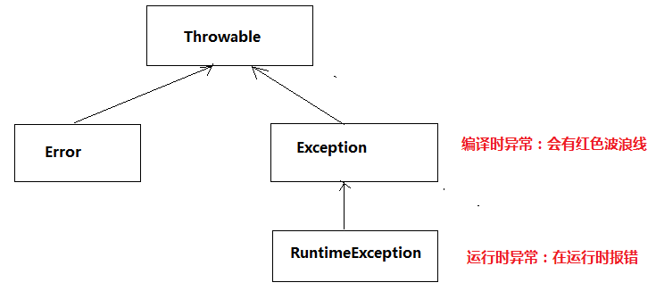
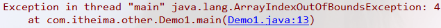
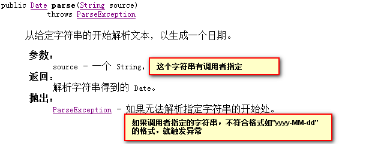
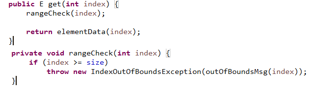

# File类

## 异常概述

异常指的是在程序**编译和运行**时期的一些不正常的状况。

Java语言的设计者把一些常见的异常封装成了对象，通过这些异常对象可以帮助描述异常的错误原因、错误行号等信息
```
ArrayIndexOutOfBoundsException    数组角标越界异常
NullPointerException    空指针异常
ArithmeticException  算数异常
开发人员看到这些异常信息，可以通过API查找异常产生的原因，帮助我们去解决问题。
```

## 异常的继承体系

```
Throwable异常的根类
    --Error
        非常严重的错误，无法解决
    --Exception
        可以解决的一些问题
        --RuntimeException的子类
            运行时异常,编译时期不会报错，可以处理，也可以不处理
        --Exception的直接子类
            编译时异常，在编译时期会有红色波浪线，必须处理( throws 或者 try...catch )
```

## 异常处理

> **JVM处理异常**

JVM处理方式就是 中断程序运行，并且在控制台打印输出错误信息：
```java
public class Demo1{
    public static void main(String[] args){
        int[] arr=new int[3];
        System.out.println(arr[4]);
    }
}
```


> **try...catch处理异常**

```java
//如下代码，处理异常
try{
    int[] arr=null;
    System.out.println(arr.length);
    System.out.println(9/0);
}catch (ArithmeticException e) {
    System.out.println("算数异常产生了："+e);
}catch (NullPointerException e) {
    System.out.println("空指针异常："+e);
}catch (Exception e) {
    System.out.println("未知的错误:"+e);
}
注意:捕获多个异常是，较大的异常需要放在后面
   try...catch 处理异常后，程序可以继续执行。
```

> **finally语句**

finally在try...catch后面使用， 不管异常是否发生finally语句中的代码，必须执行。
finally一般用来做释放资源的操作。
```java
//异常处理的建议先抛，代码写完整了再加try...catch，有多个异常一块try(提高代码
//的阅读性)
FileWriter fw=null;
try {
    fw=new FileWriter("a.tx");
    fw.write("hello");
    fw.write("java");
    fw.write("heheheh");
} catch (IOException e) {
    e.printStackTrace();
}finally{ //finally一般处理释放资源的操作
    try {
        if(fw!=null){
            fw.close();
        }
    } catch (IOException e) {
        e.printStackTrace();
    }
}
```

## Throwable的常用方法

Throwable是异常体现的根类，所有的异常对象都可以调用它的方法，了解下面几个方法

```java
String getMessage()
    返回异常的原因
String toString()
    复写Object方法，返回异常的类名+原因
void printStackTrace()
    直接将异常信息(类名+原因+位置)打印输出在控制台
代码演示：
    SimpleDateFormat sdf=new SimpleDateFormat("yyyy-MM-dd");
    try {
        Date str=sdf.parse("1992-09-08");//这里参数有可能，不符合yyyy-MM-dd的格式，
    } catch (ParseException e) {
        e.printStackTrace();//打印异常详细信息
    }
    //try..catch处理完成之后，后续代码可以继续执行
    System.out.println("over");
```

## 自定义异常
Java的API体系中已经给我们定义好了一些异常类，如NullPointerException、ArrayIndexOutOfBoundsException等。我们可以模仿这些异常自定义自己的异常


> NullPointerException的源码

不妨先看一下NullPointerException的源码，它怎么写我们就怎么写。

```java
public class NullPointerException extends RuntimeException {
    //序列号（可以不写、不管它）
    private static final long serialVersionUID = 5162710183389028792L;
    //空参数构造方法
    public NullPointerException() {
        super();
    }
    //有一个参数的构造方法
    public NullPointerException(String s) {
        super(s);
    }
}
```

> 自定义异常

对照着NullpointerException的写法，先继承RuntimeException或者Exception，就属于异常体系的一员。代码如下

```java
//继承Exception表示我们自定义的异常为编译时异常
class FalseMoneyException extends Exception{
    public FalseMoneyException(){
        super();//访问父类空参数构造方法
    }
    public FalseMoneyException(String msg){
        //访问父类有参数构造方法
        //把异常的信息msg传递给父类Exception
        super(msg);
    }
}
```

```java
class Demo{
    public static void main(String[] args) {
        String sale = sale(5);
        System.out.println(sale);
    }
    
    //如果moeny是3或者7,就参数一个异常对象
    public static String sale(int money) {
        String name=null;
        if(money==3||money==7)
            //当money的值是3,或者是7，就触发这个异常事件
            throw new FlaseMoneyException(money+"是一个假钱");
        }
        return name;
    }
}
```


## throw和throws的区别

> **throws**

在定义方法时，用于标记方法中有异常，由调用者处理异常.

API中有很多方法在定义的时候就已经加了throws声明存在异常，我们调用这些方法时就需要处理异常。

如下面是DateFormat类中的parse方法



```java
//我们去调用api中DateFormat类的parse方法时，就需要处理异常，如下
SimpleDateFormat sdf=new SimpleDateFormat("yyyy-MM-dd");
try {
    //这里参数有可能，不符合yyyy-MM-dd的格式，
    Date str=sdf.parse("1992-09-08");
} catch (ParseException e) {
    e.printStackTrace();
}
```

> **throw**

用在方法的内部，表示异常在什么条件下产生
我们不防翻阅一下ArrayList的源码，看一下它的数组索引越界是怎么产生的


如果调用get方法，索引>=size的就会产生IndexOutputBoundsExcepton(索引越界异常)
