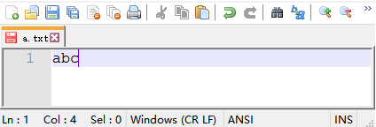

# 2.字节流
在学习字节流之前，首先还得从字节说起，1个字节是由8个bit位组成，每一个bit位用0或1表示。**计算机中最小的存储单位为1个字节**

在计算机的世界里，万物皆字节，包括文本、视频、图片、声音、甚至你使用的各种软件这些都是字节（也就是说计算机中所有你能看到和看不到的数据，最终都是由0和1的排列组合来存储的）

比如这里有一张美女图片，我们看到的是这样子^_^


计算机中存储的是酱紫@_@（一张图片字节很多，这里只截取了片段）


再比如有一个文本文件，里面写的是`'a','b','c'`三个字符，我们看到是这样子^_^



其实计算机存储的是酱紫@_@ （3字母分别对应3个字节）


接下来，我们学习的<font color='red'>**字节流可以直接读写任意文件中的字节**。</font> 我们先以文本文件为例，讲解一下如何通过字节流读取字节和写入字节。其他文件读取和写入是一模一样的，照葫芦画瓢就可以。

## 字节输入流
字节输入流是用来读取字节数据的。先来看一下字节输入流的继承体系，这样我们有一个总体的认识，学起来也更有条理。


先来学习FileInputStream类，这个类是专门用于读取文件中字节数据的便捷类。

来看下面一个案例，在C盘下有一个a.txt文件，路径为：`C:\\io\\a.txt`，内容如下


现在使用FileInputStream读取`C:\\io\\a.txt`文件中的字节。

> 一次读一个字节

先采用一次读取一个字节的方式，来读取`C:\\io\\a.txt`文件中的字节
先给大家介绍一个read()方法

    int read()
    表示从文件中一次读取一个字节，返回读到的那个字节；如果返回-1，表示读到文件末尾没有数据了。
```java
/*
需求：读取C:\\io\\a.txt文件中的字节

分析：
    由于在读取一个文件的时候，不知道有多少个字节，也不知道要读多少次，所以可以循环调用read()方法进行读取，直到返回值为-1为止。
*/
public class FisDemo1{
    public static void main(String[] args) throws IOException{
        //1.创建流对象,关联文件路径(注意：不能是文件夹路径)
        FileInputStream fis=new FileInputStream("C:\\io\\a.txt");
        //2.读取字节数据
        int b;
        while((b=fis.read())!=-1){
            System.out.println(b);
        }
        //3.关闭流
        fis.close();
    }
}
```
结果如下：
```
97
98
99
```
我们看到的是十进制的97,98和99，其实是`a,b,c`三个字符对应的编码值。（小扩展：这些编码值本来是二进制，只不过人看二进制很困难，所以十进制显示更直观）

> 一次读多个字节

接下来我们采用一次读取多个字节的方式，来读取`C:\\io\\a.txt`文件中的字节。文件内容如下


这里先要给大家讲一下`read(byte[] bs)`这个方法

    int read(byte[] bs)
    表示从文件中一次读取多个字节，把读取到的字节存入byte数组，并返回读取到的有效字节个数；
    如果返回-1，表示读到文件末尾没有数据了。


如上图所示，`C:\\io\\a.txt`文件中一共有9个字节，一次读取2个字节，前面4次每次都能读到2个字节，有效个数就是2，当读到第5次时只剩下一个字节，有效个数就是1.

```java
/*
需求：读取C:\\io\\a.txt文件中的字节
分析：
    由于在读取一个文件的时候，不知道有多少个字节，也不知道要读多少次，所以可以循环调用read(bs)方法进行读取，直到返回值为-1为止。
*/
public class FisDemo2{
    public static void main(String[] args) throws IOException{
        //1.创建流对象,关联文件路径(注意：不能是文件夹路径)
        FileInputStream fis=new FileInputStream("C:\\io\\a.txt");
        byte[] bs=new byte[2];
        //2.读取字节数据
        int len;
        while((len=fis.read(bs))!=-1){
            System.out.println(Arrays.toString(bs));
        }
        //3.关闭流
        fis.close();
    }
}
```
结果如下：
```
[97,98]
[99,100]
[101,102]
[103,104]
[105,0]
```

## 字节输出流
字节输出流是用来写字节数据的。下图是字节输出流的继承体系。


这里先学习FileOutputStream，它是专门用于往文件中写入字节的便捷类。
这里需要用到3个方法，先简单给大家介绍一下，然后通过案例给大家演示

```java
public void write(int n)
    一次往文件中写入一个字节
public void write(byte[] bs)
    一次往文件中写入一个字节数组
public void write(byte[] bs,int off,int len)
    一次往文件中写入一个字节数组的一部分
```

> 一次写入一个字节

往`C:\io\a.txt`文件中写入abc三个字符，采用一次写一个字节的方式。代码如下
```java
public class FosDemo1{
    public static void main(String[] args) throws IOException{
        //创建流对象，关联文件路径
        FileOutputStream fos=new FileOutputStream("C:\\io\\a.txt");
        //分三次，分别写入97、98、99三个字节
        fos.write(97);
        fos.write(98;
        fos.write(99);
        //释放资源
        fos.close();
    }
}
```

> 一次写入多个字节

往`C:\io\a.txt`文件中写入字节数据，采用一次写多个字节的方式。代码如下
```java
public class FosDemo1{
    public static void main(String[] args) throws IOException{
        //创建流对象，关联文件路径
        FileOutputStream fos=new FileOutputStream("C:\\io\\a.txt");
        //通过字节数组，一次性写入97、98、99三个字节
        byte[] bs={97,98,99};
        fos.write(bs);

        //把字符串转换为字节数组，也能写入
        fos.write("hello".getBytes());
        //\r\n表示换行，也需要转换为字节数组才能写入
        fos.write("\r\n".getBytes());

        byte[] bs1={97,98,99,100,101};
        //从bs1数组中从0开始写3个字节到文件中
        fos.write(bs1,0,3);

        //释放资源
        fos.close();
    }
}
```
运行代码，查看文件内容如下


## 字节流文件复制
通过以上的学习，我们知道FileInputStream可以用来读取文件中的字节，FileOutputStream可以用来往文件中写入字节。接下来，我们可以做一个文件复制的小程序了。原理如下


上图中每一个小方块看做是一个字节，每次使用FileInputStream读取2个字节，存入一个临时数组中，再把数组中的有效字节，写入目标文件中。注意，每次读取2个字节，读到最后可能只剩下1个字节，那么最后一次读取的有效字节个数就是1，只需要把数组中的前1个字节写入文件中，否则会有多余的无效数据。

为了便于理解，临时数组的大小定义为2，在实际开发时一般把临时数组的大小定义为1024或1024的整数倍，因为1024个字节正好是1KB，也就是说每次读写1KB的数据


我们以复制图片为例，把`C:\io\a.jpg`图片中的字节复制到`C:\io\b.jpg`文件中
```java
public class CopyDemo1{
    public static void main(String[] args) throws IOException{
        //源文件
        FileInputStream fis=new FileInputStream("C:\\io\\a.jpg");
        //目标文件
        FileOuputStream fos=new FileOutputStream("C:\\io\\b.jpg");

        //读写数据
        byte[] bs=new byte[1024];
        int len;
        while((len=fis.read(bs))!=-1){
            fos.write(bs,0,len);
        }

        //释放资源
        fos.close();
        fis.close();
    }
}
```

## 字节缓冲流
字节缓冲流是基于另一个字节流做一些功能增强，并且在内部创建一个缓冲区数组，来提高读写的效率。

    BufferedInputStream可以对InutStream的子类进行功能增强，提高读取字节的效率；
    BufferedOutputSteam可以对OutputStream的子类进行功能增强，提高写入字节的效率。

我们以复制图片为例，把`C:\io\a.jpg`图片中的字节复制到`C:\io\b.jpg`文件中
```java
public class CopyDemo2{
    public static void main(String[] args) throws IOException{
        //使用缓冲流对FileInputStream进行增强
        BufferedInputStream bis=new BufferedInputStream(new FileInputStream("C:\\io\\a.jpg"));
        //使用缓冲流对FileOuputStream进行增强
        BufferedOutputStream bos=new BufferedOututStream(new FileOutputStream("C:\\io\\b.jpg"))

        //读写数据
        byte[] bs=new byte[1024];
        int len;
        while((len=bis.read(bs))!=-1){
            bos.write(bs,0,len);
        }
		
        //释放资源
        bos.close();
        bis.close();
    }
}
```

