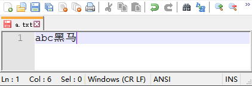
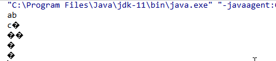
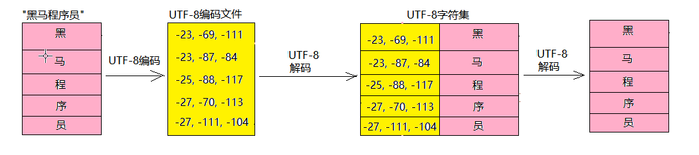
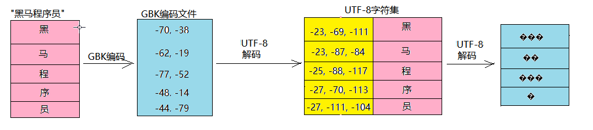

# 3.转换流
前面学习了字节流，通过字节流可以读写任意的文件，但是当使用字节流读写中文时，会存在乱码问题。

我们通过一个案例来演示，在`C:\io\a.txt`文件中有如下内容



使用字节流读取`C:\io\a.txt`，一次读取2个字节，并转换为字符串。
```java
public class IsrDemo1{
    public static void main(String[] args){
        FileInputStream fis=new FileInputStream("C:\\io\\a.txt");

        //一次读取2个字节
        byte[] bs=new byte[2];
        int len;
        while((len=fis.read(bs))!=-1){
            //把读取到的2个字节转换为字符串
            String str=new String(bs,0,len);
            System.out.println(str);
        }
    }
}
```
运行结果如下



要搞清楚字节流读取中文的乱码问题，我们得从字符编码和解码入手。
不同的字符集对汉字的编码方式是不一样的，简单了解几种常见的字符集（什么是字符集？别着急，马上就会讲到）

## 字符集

**先说一下什么是字符？**

字符(Character)是各种文字和符号的总称，包括各国家文字、标点符号、图形符号、数字等。如 `a` `中` `☺` `♣` `9`

**再说一下什么是字符集？**

字符集(Character set)是多个字符的集合。由于不同的国家和地区使用的字符和符号不同，所以字符集种类也比较多，每个字符集包含的字符个数也不同。常见的字符集有ASCII字符集、GBK字符集、Unicode字符集等。

计算机要准确的处理各种字符集文字，就需要进行字符编码（把每一个字符转编成一个二进制码），以便计算机能够识别和存储各种文字。

> ASCII字符集

ASCII字符集，全称为美国信息交换标准编码，它包含包含英文大小写字符、阿拉伯数字、西文符号等

适用于欧美国家计算机的文字处理

    编码方式：1个字节表示一个字符

> GB2312字符集

GB2312为全称《中国标准信息交换字符集-基本集》
，包含简化汉字及一般符号、数字、拉丁字母、日文假名、希腊字母、俄文字母、汉语拼音符号、汉语注音字母等

广泛应用于中国和新加坡计算机中的文字处理

    编码方式：1个字节表示一个字母；2个字节表示一个汉字


> Unicode字符集(万国码)

由于各个国家的文字和符号不同，产生了很多中字符集，每一种字符集的编码方式也不一样，不利于国际化。

Unicode支持现今世界各种不同语言文字和符号，它为每种语言中的每个字符设定了统一并且唯一的二进制编码，以满足跨语言、跨平台进行文本处理的要求。

Unicode字符集有3套编码方案，UTF-8、UTF-16和UTF-32，这几套编码方案我们不必深究。

**比较常用的是UTF-8，简单了解一下它的编码规则**

    UTF-8是一种针对Unicode的可变长度字符编码,用1到6个字节编码Unicode字符
    英文字母：1个字节表示
    简体汉字：3个字节表示

## 乱码问题产生的原因            
乱码问题是中国程序员永远无法避免的话题，因为表示中文和英文的字符集不是一种，采用的编码方式也不一样，不管你是读写文件，还是网络传输，还是数据库存储，只要涉及到汉字都有可能出现乱码问题。 **所有的乱码问题产生的原因都是一样的，那就是编码和解码采用的字符集不一致导致的。**

如：文本`"黑马程序员"`，采用UTF-8字符集编码写入文件，再用UTF-8字符集进行解码，编码和解码采用的字符集一致，就能显示正确的字。请看下图



再如：文本`"黑马程序员"`，采用GBK字符集编码写入文件，再使用UTF-8字符集进行解码，编码和解码采用的字符集不一致，就会显示乱码。请看下图



## 解决乱码问题
搞清楚了乱码问题产生的原因，再来解决乱码问题就很简单了。只需要知道文件是采用什么编码写的，就采用同样的编码进行读取即可。

Java给我们提供了两个转换流`InputStreamWriter`和`OutputStreamReader`分别用来指定编码写字符，和指定编码读字符。

如果你指定UTF-8编码写中文字符，它就会自动把一个中文字符转换为3个字节，并写入文件中；反之如果你采用UTF-8编码读取中文字符，它会将文件中的3个字节读取出来，并转换为字符。

下面我们演示使用OutputStreamWriter按照UTF-8编码往文件中写字符数据
```java
//采用UTF-8编码写入文件
public class OswDemo1{
    public static void main(String[] args){
        //创建输出流对象
        //第二个参数如果是"UTF-8"可以省略不写
        OutputStreamWriter osw=new OutputStreamWriter(new FileOutputStream("C:\\io\\a.txt"),"UTF-8");

        //写中文，会自动按照UTF-8编码把一个汉字转成3个字节，并写入文件中
        osw.write("黑马程序员");

        //写英文，会自动按照UTF-8编码把一个字母转为1个字节，并写入文件中
        osw.write("hello");

        //释放资源
        osw.close();
    }
}
```
下面演示使用InputStreamReader按照指定的UTF-8编码，读取文件中的字符数据
```java
public class IsrDemo1{
    public static void main(String[] args){
        //创建输入流对象
        //第二个参数如果是"UTF-8"可以省略不写
        InputStreamReader isr=new InputStreamReader(new FileInputStream("C:\\io\\a.txt"),"UTF-8");

        //一次读取多个字符
        char[] chs=new char[1024];
        int len;
        while((len=isr.read(chs))!=-1){
            //把字符数组的有效部分，转换为字符串
            String str=new String(chs,0,len);
            System.out.println(chs);
        }

        //释放资源
        isr.close();
    }
}
```

同理如果你指定GBK编码写中文字符，它会自动把一个中文字符转换为2个字节，并写入文件中；反之如果你采用GBK编码读取一个中文字符，它会将文件中的2个字节读取出来，并转换为字符。

演示使用OutputStreamWriter按照GBK编码往文件中写字符数据
```java
//采用UTF-8编码写入文件
public class OswDemo2{
    public static void main(String[] args){
        //创建输出流对象
        OutputStreamWriter osw=new OutputStreamWriter(new FileOutputStream("C:\\io\\b.txt"),"GBK");

        //写中文，会自动按照GBK编码把一个汉字转成2个字节，并写入文件中
        osw.write("黑马程序员");

        //写英文，会自动按照GBK编码把一个字母转为1个字节，并写入文件中
        osw.write("hello");

        //释放资源
        osw.close();
    }
}
```

下面演示使用InputStreamReader按照指定的GBK编码，读取文件中的字符数据
```java
public class IsrDemo2{
    public static void main(String[] args){
        //创建输入流对象
        InputStreamReader isr=new InputStreamReader(new FileInputStream("C:\\io\\b.txt"),"GBK");

        //一次读取多个字符
        char[] chs=new char[1024];
        int len;
        while((len=isr.read(chs))!=-1){
            //把字符数组的有效部分，转换为字符串
            String str=new String(chs,0,len);
            System.out.println(chs);
        }

        //释放资源
        isr.close();
    }
}
```

## 转换流复制文件
把`C:\io\gbk.txt`文件【GBK编码】，复制到 `C:\io\utf8.txt`文件【UTF-8编码】中

```java
public class CopyDemo{
    public static void main(String[]args){
        //创建输入流对象
        InputStreamReader isr=new InputStreamReader(
            new FileInputStream("C:\\io\\gbk.txt"),"GBK");

        //创建输出流对象
        OutputStreamWriter osw=new OutputStreamWriter(
            new FileOutputStream("C:\\io\\utf8.txt"),"UTF-8");
    
        //一次读写多个字符
        char[] chs=new char[1024];
        int len;
        while((len=isr.read(chs))!=-1){
            //写字符数组中有效的字符个数
            osw.write(chs,0,len);
        }

        //释放资源
        osw.close();
        isr.close();
    }
}
```
