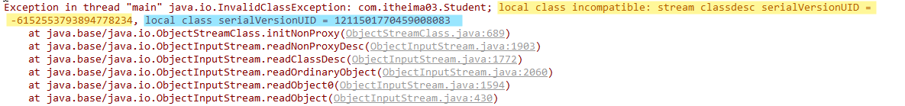
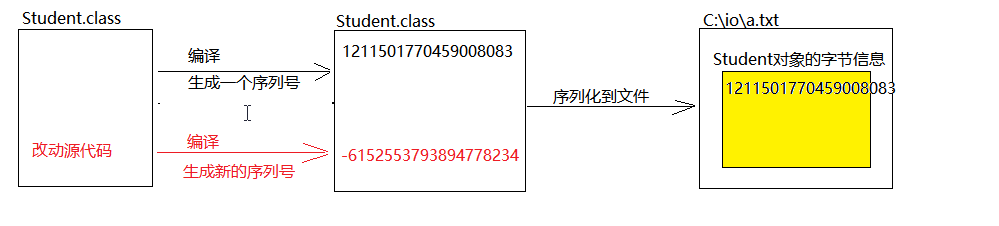

# 7.对象序列化流
在学习对象序列化流之前，我们先解释一下什么序列化和反序列化

    序列化：把对象当做字节写入文件
    反序列化：把文件中的对象读取出来

简单说对象序列化流就是用来写对象和读对象的。Java提供了ObjectOuputStream用来写对象；ObjectInputStream用来读对象。

    ObjectOutputStream是OutputStream的子类，写对象时需要依赖于FileOutputStream;

    ObjectInputStream是InputStream的子类，写对象时需要依赖于FileInputStream.

还需要注意的是Java语言规定，必须让序列化对象的类，实现一个名为`Serializable`的接口，才能被序列化。`Serializable`的接口不包含任何方法和字段，仅仅起到标记的作用。


**定义Student类并实现Serializable接口**
```java
//让Student类实现了Serializable
public class Student implements Serializable{
    //成员变量
    private String name;
    private int age;
    //构造方法
    public Student(){}
    public Student(String name,int age){
        this.name=name;
        this.age=age;
    }
    //...省略若干行代码...
}
```

## 序列化
把`Student`对象序列化到`C:\io\a.txt`文件中

```java
public class ObjectOutputStreamDemo{
    public static void main(String[] args){
        //创建流对象
        ObjectOutputStreamS oos=new ObjectOuputStream(new FileOutputStream("C:\io\a.txt"));

        //创建Student对象
        Student s1=new Student("孙悟空",500);
        oos.writeObject(s1);

        //释放资源
        oos.close();
    }
}
```
## 反序列化
从`C:\io\a.txt`文件中反序列化得到`Student`对象
```java
public class ObjectInputStream {
    public static void main(String[] args) {
        //反序列化流
        ObjectInputStream ois=new ObjectInputStream(new FileInputStream("day10-code\\a.txt"));
        //读取对象
        Student s2 = (Student) ois.readObject();
        System.out.println(s2);
        //释放资源
        ois.close();
    }
}
```


## 序列号问题
如果序列化后又改动了`Student`类文件，这个时候再反序列化就会出现序列号版本不一致的问题



> 序列号问题解析

如图，每次编译都会生成给字节码文件生成一个序列号，当序列化该类对象时，也会保存序列号信息。



如果改变了源代码会重新编码并且生成新的序列号，这时候反序列化，就会造成存储对象的序列号和新的序列号版本不一致，就会出现`InvalidClassException:`异常

> 解决序列号问题

解决序列号不一致的问题很简单，只需要把序列号固定下来就可以了。在`Student`类中加上下面的一句代码，重新序列化即可。
```java
public class Student implements Serializable {
    //固定序列号
    private static final long serialVersionUID = -123455678L;
    //成员变量
    private String name;
    private  int age;
    //....省略若干代码...
}
```
## 瞬态
如果有某个成员变量不想被序列化，可以使用`transient`瞬态关键字修饰(也别管瞬态是什么意思，就这么个读法)；

如我不想`Student`的`age`属性被序列化，就可以使用`transient`修饰`age`属性
```java
public class Student implements Serializable {
    //固定序列号
    private static final long serialVersionUID = -123455678L;
    //成员变量
    private String name;

    //age属性不被序列化
    private transient  int age;
    //....省略若干代码...
}
```
