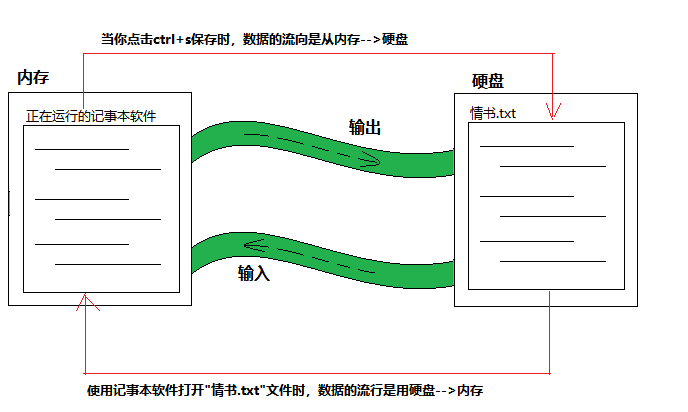

# 第10章 IO流

首先来给大家解释一下IO这个词，IO是Input和Output的缩写，分别表示输入和输出；再给大家解释一下“流”这个词，流其实指的是输入和输出对应的数据。**也就是说IO流是用来处理数据的输入和输出的** （类似于水流）

在你的电脑上主要用于存储数据的设备有内存和硬盘，他们是有区别的。

- 内存: 用于存储程序在运行过程中临时产生的数据，程序关闭数据自动释放。
- 硬盘：用于永久存储数据。

我们会发现内存和硬盘都可以存储数据，我们学习了IO流之后就可以让他们之间的数据流动起来。

```java
举个例子：
1. 比如你用记事本软件正给喜欢的女生写一封情书,你正在编辑的文字就保存在内存里，如果
突然停电了，内存中的数据就会全部丢失。也就是说你白写了(杠精们注意了，我说的是软件没
有自动保存功能)

2. 如果你在写情书的过程中，习惯性的按一下ctrl+s(保存)，数据就会从内存输出到硬盘，
即使停电了，下次打开也能看到所写的内容。
```

为了方便理解，我们还是画一张图吧




## IO流分类

IO流按照流向进行分类，可以分为输入流和输出流；也可以按照读写的数据来分类，可以分为字节流和字符流

### 按照流向分类

```java
- 输入流(读数据)：读取数据到内存
- 输出流(写数据)：写入数据到硬盘
```

```java
为了方便大家记忆给大家分享一个小技巧，用来区分输入流与输出流？

例如：假设你面前有一本书，你想看一下书里写了什么内容，你读书的过程就是输入流（就是
把书本上的文字输入到里的脑子里），再比如你现在脑子里想了一点事情，怕忘记了，你就会
把想的事情用笔写在纸上，你写字在纸上的过程就是输出流（把脑子里想的事情输出到纸上）
```

### 按数据类型分类

根据

```java
- 字节流(读写字节数据)
  - 字节输入流：读字节
  - 字节输出流：写字节
    
- 字符流(读写字符数据)
  - 字符输入流：读字符
  - 字符输出流：写字符
```

## IO流的继承体系

IO流的继承体系，根据字符流和字节流的不同，分为两个体系。


## 如何学习IO流

其实IO流的学习是很有规律的，只要掌握了规律，学习起来会有事半功倍的效果。大家在写IO流代码时候，只需要掌握3关键步骤就可以了。

```
第1步：创建流对象(搭桥)
第2步：读写数据(过桥)
第3步：释放资源(过河拆桥)
```