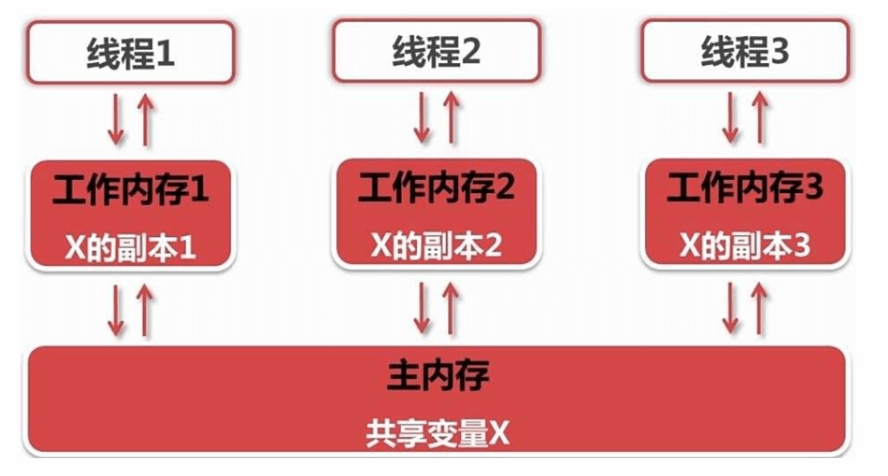

# 2.线程安全问题

假设有100张火车票，有3个窗口共同购买这100张票，换句话说就是这100张票被这3个窗口共享。如果我们用一个变量ticket表示这100张票，用3个线程表示3个购票窗口，每一个线程买一张票就是让ticket减1。 

```java
public class TicketRunnable implements Runnable{
    //一共有100张票
    private int ticket=100;
    //复写run方法
    @Override
    public void run(){
        //不断的卖票
        while(true){
            if(ticket>0){
                //为了演示问题更加明显，每次执行睡眠10毫秒
                try {
                    Thread.sleep(10);
                } catch (InterruptedException e) {
                    e.printStackTrace();
                }
                //获取线程名字
                String name = Thread.currentThread().getName();
                System.out.println(name+"正在卖..."+ticket+"号票");
                //每卖一张票，票数-1
                ticket--;
            }
        }
    }
}

//测试类
public class ThreadDemo3 {
    public static void main(String[] args){
        //创建一个线程的执行任务
        TicketRunnable tr=new TicketRunnable();
        //创建一个线程
        Thread t1 = new Thread(tr,"窗口1");
        t1.start();
        //创建第2个线程
        Thread t2 = new Thread(tr,"窗口2");
        t2.start();
         //创建第3个线程
        Thread t2 = new Thread(tr,"窗口3");
        t2.start();
    }
}
```

运行结果如下，我们发现有负号票，0号票，还有重复的票。这些数据都是不合理的，也就是说这个多线程的程序存在安全问题。


当多个线程在访问共享数据时，由于CPU执行的随机性，一个线程正在执行的时候，并没有执行完，执行权被其他线程抢走了，这个时候就有可能出现安全问题。 



既然我们知道产生安全问题的原因，是因为多个线程在操作共享数据数，相互争夺CPU的执行权导致的。如果我们能让一个线程执行完，下一个线程才能执行，这样安全问题不就迎刃而解了吗？Java给我们提供了同步代码块，同步方法和Lock锁来解决线程的安全问题。

## 同步代码块

下面是同步代码块的格式，当一个线程进入同步代码块执行，另一个线程就只能在外面等待，等同步代码块执行完了，另一个线程才能进来执行。

```java
//锁对象：可以是任意的一个对象，但是要保证唯一
synchronized(锁对象){
    //线程访问共享数据的代码
}
```

使用同步代码块改造上面卖票的代码

```java
public class TicketRunnable implements Runnable{
    //一共有100张票
    private int ticket=100;
    //使用Object对象当做锁对象
    Object obj=new Object();
    
    //复写run方法
    @Override
    public void run(){
        //不断的卖票
        while(true){
            //一个线程把synchronize内部的代码执行完了，另一个线程才能进来执行。
            synchronized(obj){
                if(ticket>0){
                    //为了演示问题更加明显，每次执行睡眠10毫秒
                    try {
                        Thread.sleep(10);
                    } catch (InterruptedException e) {
                        e.printStackTrace();
                    }
                    //获取线程名字
                    String name = Thread.currentThread().getName();
                    System.out.println(name+"正在卖..."+ticket+"号票");
                    //每卖一张票，票数-1
                    ticket--;
                }
            }
        }
    }
}
```


## 同步方法

当一个线程执行正在同步方法，另一个线程需要等这个方法执行完了才能执行。

```java
//synchronized修饰的方法是同步方法
public synchronized void 方法名(){
    ...
}
```

使用同步方法改造这个买票的案例

```java
public class TicketRunnable implements Runnable{
    //一共有100张票
    private int ticket=100;
    //使用Object对象当做锁对象
    Object obj=new Object();
    
    //复写run方法
    @Override
    public void run(){
        //不断的卖票
        while(true){
            this.method();
        }
    }
    
    //同步方法的锁对象是this
    public synchronized void method(){ 
        if(ticket>0){
            //为了演示问题更加明显，每次执行睡眠10毫秒
            try {
                Thread.sleep(10);
            } catch (InterruptedException e) {
                e.printStackTrace();
            }
            //获取线程名字
            String name = Thread.currentThread().getName();
            System.out.println(name+"正在卖..."+ticket+"号票");
            //每卖一张票，票数-1
            ticket--;
        }
    }
}
```


## Lock锁

Lock锁和synchronize的作用是一样的

```java
Lock lock=new ReentrantLock();
//上锁
lock.lock();
...中间是同步的代码...
//释放锁
lock.unlock();
```

使用Lock锁改造上面的代码

```java
public class TicketRunnable implements Runnable{
    //一共有100张票
    private int ticket=100;
    //创建锁对象
    Lock lock=new ReentrantLock()
    
    @Override
    public void run(){
       
        while(true){
           //加锁
           lock.lock();
                if(ticket>0){
                    //为了演示问题更加明显，每次执行睡眠10毫秒
                    try {
                        Thread.sleep(10);
                    } catch (InterruptedException e) {
                        e.printStackTrace();
                    }
                    //获取线程名字
                    String name = Thread.currentThread().getName();
                    System.out.println(name+"正在卖..."+ticket+"号票");
                    //每卖一张票，票数-1
                    ticket--;
                }
            //释放锁
            lock.unlock();
        }
    }
}
```

