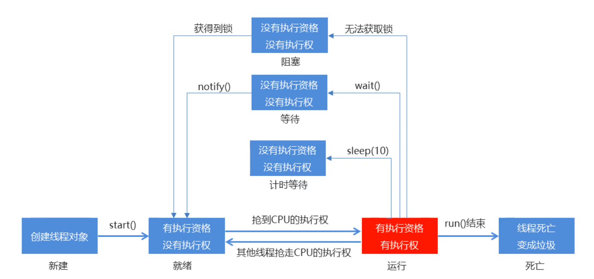
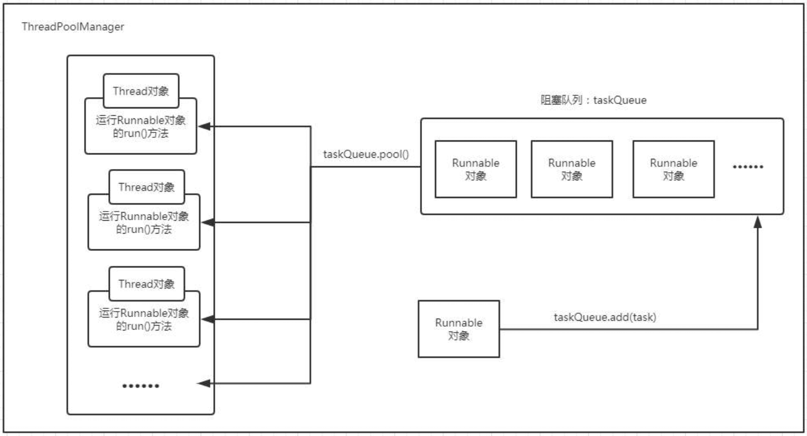
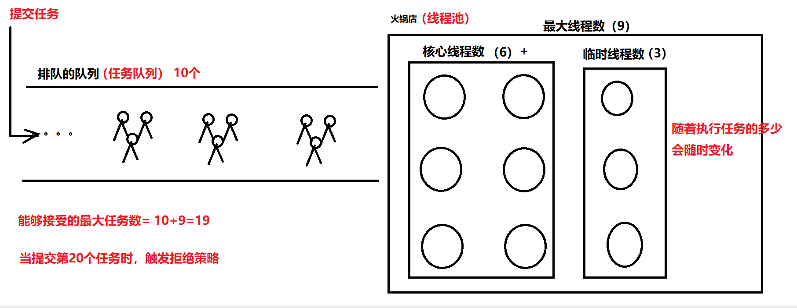

# 线程池

## 1.线程的状态

```java
NEW
	至今尚未启动的线程处于这种状态。 
RUNNABLE
	正在 Java 虚拟机中执行的线程处于这种状态。 
BLOCKED
	受阻塞并等待某个监视器锁的线程处于这种状态。 
WAITING
	无限期地等待另一个线程来执行某一特定操作的线程处于这种状态。 
TIMED_WAITING
	等待另一个线程来执行取决于指定等待时间的操作的线程处于这种状态。 
TERMINATED
	已退出的线程处于这种状态。 
```



## 2.线程池概述

线程是稀缺资源，如果被无限制的创建，不仅会消耗系统资源，还会降低系统的稳定性。合理的使用线程池可以更好的利用CPU的空闲时间，对线程进行统一分配，具体有以下几个好处

```java
- 降低资源消耗
- 提高响应速度
- 提高线程的可管理性
```


线程池是从JDK1.5之后引入的，把任务的提交和执行进行分离，只需要定义好任务，然后提交给线程池，而不用关心该任务是如何执行、被哪个线程执行，以及什么时候执行。 



## 3.常用的线程池

API提供了一个工具类叫Executors，可以用它的方法生成不同特点的线程池。

```java
public static  ExecutorService newCachedThreadPool() 
    创建一个可以根据需要创建新线程的线程池。最多可以创建int最大值的线程数量
public static ExecutorService newFixedThreadPool(int nThreads)  
    创建一个固定长度的线程池
public static ExecutorService newSingleThreadExecutor() 
 	创建单个线程的线程池
public static ScheduledExecutorService newScheduledThreadPool(int corePoolSize) 
     创建一个线程池，它可安排在给定延迟后运行命令或者定期地执行。 
```

> **newCachedThreadPool**方法为例，演示向线程池提交任务

```java
//创建默认线程池：
ExecutorService executorService = Executors.newCachedThreadPool();

//提交线程任务
executorService.submit(new Runnable() {
    @Override
    public void run() {
        System.out.println(Thread.currentThread().getName()+"执行了");
    }
});

//提交线程任务
executorService.submit(new Runnable() {
    @Override
    public void run() {
        System.out.println(Thread.currentThread().getName()+"执行了");
    }
});

//关闭线程池
executorService.shutdown();
```


> newFixedThreadPool代码演示

```java
ExecutorService service = Executors.newFixedThreadPool(2);
//提交第一个线程任务
service.submit(new Runnable() {
   @Override
   public void run() {
       System.out.println("线程1执行");
   }
});
//提交第二个线程任务
service.submit(new Runnable() {
   @Override
   public void run() {
       System.out.println("线程2执行");
   }
});
//提交第三个线程任务
service.submit(new Runnable() {
   @Override
   public void run() {
       System.out.println("线程3执行");
   }
});

//结束线程池
service.shutdown();
```

我们自己频繁的去创建和销毁线程比较消耗系统资源，同时也比较浪费时间。所以Java语言的API给我们提供了线程池的技术，帮我们解决这个问题。 

当创建一个线程池，其实就是创建了一个能够存储线程的容器，需要执行线程任务是，就从线程池中拿一个线程出来用，用完之后再还给线程池。 

## 4.ThreadPoolExecutor创建线程池

线程池可以理解为一个火锅店，店内可以6张桌子是常开的，如果客人比较多时，可以临时再开3张桌子，客人不多时就把这临时的3张桌子收起来。当客人继续增加时常开的桌子和临时的桌子都用完了，就会启用排队机制，其他任务就在阻塞队列中排队。 

```java
常开的6张桌子	--   	核心线程数
临时的3张桌子	-- 		临时线程数
店内最大桌子数 -- 	   最大线程数
排队通道	  -- 	 阻塞队列
```



```java
public ThreadPoolExecutor(int corePoolSize,
                          int maximumPoolSize,
                          long keepAliveTime,
                          TimeUnit unit,
                          BlockingQueue<Runnable> workQueue,
                          ThreadFactory threadFactory,
                          RejectedExecutionHandler handler)
参数解释：
    corePoolSize - 核心线程数。
    maximumPoolSize - 最大线程数。
    keepAliveTime - 临时线程存活的时间。
    unit - keepAliveTime 时间单位。
    workQueue - 阻塞队列。
    threadFactory -  创建线程的工厂。
    handler -  如果超过最大线程数，的拒绝方案。 
```

- 创建线程池的演示

```java
ThreadPoolExecutor poolExecutor=new ThreadPoolExecutor(
    6, //核心线程数
    9, //最大线程数
    3, //空闲时间
    TimeUnit.SECONDS, //时间单位：秒
    new ArrayBlockingQueue<>(10),
    Executors.defaultThreadFactory(), //默认的工厂对象，由工厂对象帮我们生产线程
    new ThreadPoolExecutor.AbortPolicy() //拒绝的方式
);
```

- 拒绝策略

当提交的线程任务超过了最大线程数 + 阻塞队列长度，就会触发拒绝策略。

```java
static class ThreadPoolExecutor.AbortPolicy 
          用于被拒绝任务的处理程序，它将抛出 RejectedExecutionException. 
static class ThreadPoolExecutor.CallerRunsPolicy 
          用于被拒绝任务的处理程序，它直接在 execute 方法的调用线程中运行被拒绝的任务；如果执行程序已关闭，则会丢弃该任务。 
static class ThreadPoolExecutor.DiscardOldestPolicy 
          用于被拒绝任务的处理程序，它放弃最旧的未处理请求，然后重试 execute；如果执行程序已关闭，则会丢弃该任务。 
static class ThreadPoolExecutor.DiscardPolicy 
          用于被拒绝任务的处理程序，默认情况下它将丢弃被拒绝的任务。 
```

