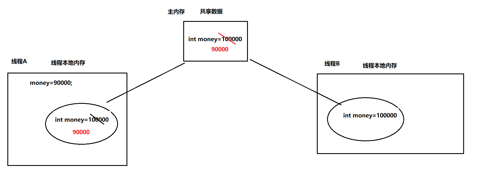
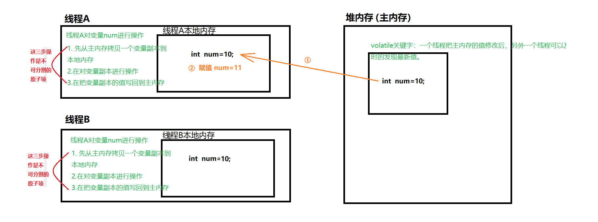
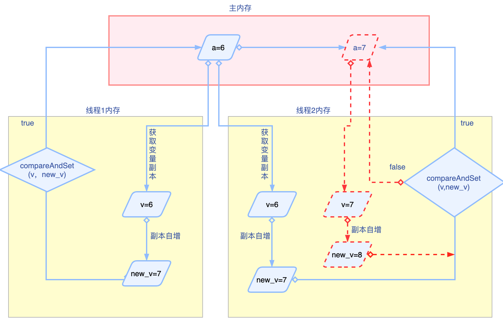

# 多线程高级

## 线程安全细节

### volatile 关键字

当多个线程在访问共享数据时，不是直接访问的主内存的数据，而是在线程本地内存创建了一个和主内存一样的变量副本，对副本进行赋值，然后在重新赋值给主内存。

 可能会出现多个线程临时存储的变量副本的值不一样，使用volatile修饰这个变量，就可以解决问题，强制让线程每次使用变量时，都从主内存中获取最新的值。




### 原子性

原子性指意思是多个操作是不可分割的原子项，他们要么同时成功，要么同时失败。 例如：当多线程在执行自增操作时，就不是原子性的。

```java
自增操作，count++为例，其实底层是要完成三个步骤(这三个步骤是不可分割的)
    1.从主内存拷贝一个变量副本到线程本地内存
    2.对变量副本进行操作
    3.把变量副本的值写回主内存

但是由于CPU的随机性，可能一个线程没有完成这个三个步骤，执行权被其他线程抢走了，就破坏了原子性。
```



### AtomicInteger类

直接使用int或者Integer对变量进行自增、修改、获取等操作，不能保证原子性，可能会出现线程安全的问题。

可使用synchronized来保证线程的安全性。这种方式解决问题的方式，是从悲观的角度出发，叫做悲观锁。


解决原子性的问题，Java提供了一系列的原子类。如AtomicInteger类就是其中的一个，它也表示整数，提供了一些方法可以对变量进行自增、获取、修改等操作，但是这些方法可以保证原子性，也能保证线程安全。

````java
public int incrementAndGet()  
    对AtomicInteger包装的整数，先自增再获取。  //等价于 int num=10;  int c = ++num;

public int getAndincrement()
    对AtomicInteger包装的整数，先获取再自增。  //等价于 int num=10;  int c= num++;

public int getAndAdd(int delta)  
    对AtomicInteger包装的整数，先获取再增加。  //等价于 int num=10;
    									  //       int temp=num; //先获取num的值
    									  //       num+=5; //再对num值增加5
public int addAndGet(int delta)  
     对AtomicInteger包装的整数，先增加再获取	  //等价于 int num=10; 
    									   //      num+=5; /对num增加5
    									   //      int temp=num; //赋值后的值
public int getAndSet(int newValue)  
      对AtomicInteger包装的整数，先获取再设置
````

AtomicInteger类保证原子性的原理如下图所示



## 常见的线程安全的类

```java
ArrayList和Vector
	ArrayList: 数组结构，线程不安全(效率高)
	Vector: 数组结构，线程安全的(效率低)

HashMap和Hashtable
	HashMap: 哈希表结构（数组+链表），线程不安全的(效率高)
	Hashtable: 哈希表结构（数组+链表），线程安全的(同步代码块，效率低)
	ConcurrentHashMap: 哈希表结构(数组+链表+红黑树)，线程安全的(同步代码块+CAS算法，效率高)
   
StringBuilder和StringBuffer
	StringBuilder: 线程不安全的(效率高)
	StringBuffer: 线程安全的(效率低)
```

### CountDownLatch类

使用场景：当需要某一个线程在其他线程执行完毕之后才执行。

```java
//第一个孩子
public class MyChildThread1 extends Thread {
    private CountDownLatch cdl;
    //利用构造方法，来给cdl赋值
    public MyChildThread1(CountDownLatch cdl) {
        this.cdl = cdl;
    }

    @Override
    public void run() {
        //1.孩子吃东西
        System.out.println("小刚吃完饺子了");
        //2.吃完说一声
        cdl.countDown();
    }
}
```

```java
//第二个孩子
public class MyChildThread2 extends Thread {
    private CountDownLatch cdl;

    //利用构造方法，来给cdl赋值
    public MyChildThread2(CountDownLatch cdl) {
        this.cdl = cdl;
    }

    @Override
    public void run() {
        //1.孩子吃东西
        System.out.println("小黄吃完饺子了");
        //2.吃完说一声
        cdl.countDown();
    }
}
```

```java
//妈妈线程，等待前面两个孩子线程执行完毕之后再执行。
public class MyMother extends Thread{
    private CountDownLatch cdl;
    //利用构造方法，来给cdl赋值
    public MyMother(CountDownLatch cdl) {
        this.cdl = cdl;
    }

    @Override
    public void run() {
        //1.先等待
        try {
            cdl.await();
        } catch (InterruptedException e) {
            e.printStackTrace();
        }
        //2.收拾碗筷
        System.out.println("吃完饭洗完");
    }
}
```

### Semaphore类

SemaPhore类用来控制正在执行的线程数量，相当于一个管理员的角色，它可以给线程发许可证，得到许可证的线程才能执行，没有得到许可证的线程就必须等待。通过SemaPhore的构造方法，可以指定有多少个线程获得许可。

```java
 public class MyRunnable implements Runnable{
    //创建对象，控制线程执行的数量为2
    Semaphore sp=new Semaphore(2); 
    @Override
    public void run(){
        try {
            //发同行许可
            sp.acquire(); 

            //线程执行的代码
            System.out.println(Thread.currentThread().getName()+"执行了");
            Thread.sleep(3000);

            //释放同行许可
            sp.release();

        } catch (InterruptedException e) {
            e.printStackTrace();
        }
    }
}
```

```java
public class Demo6 {
    public static void main(String[] args) {
        MyRunnable mr=new MyRunnable();

        for (int i = 0; i < 100; i++) {
            new Thread(mr,"线程"+i).start();
        }
    }
}
```

