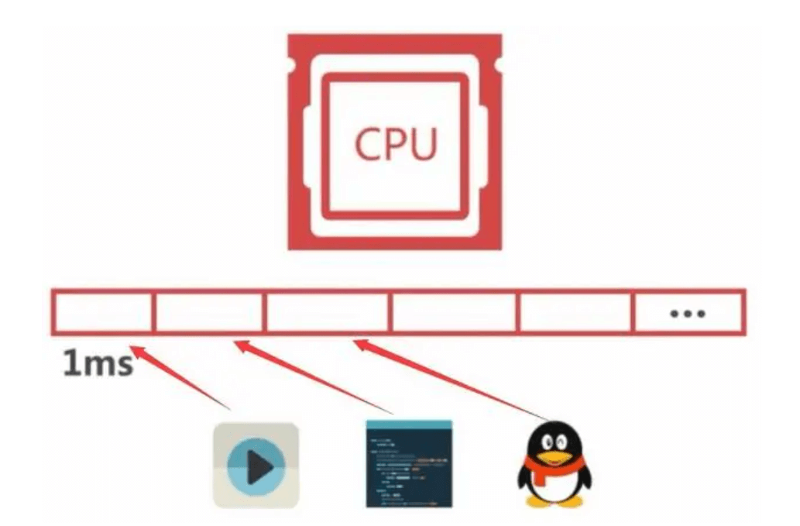

## 多线程概述

每个正在系统上运行的程序都是一个进程。每个进程包含一到多个线程，它负责在单个程序里执行多任务，这样的程序就叫做多线程程序。通常由操作系统]负责多个线程的调度和执行。

## 进程和线程

当我们打开一个程序的时候，这个程序就处于运行状态。正在运行的程序其实就是 **进程** 快捷键 `ctrl+shift+esc` 打开任务管理器可以看到正在运行的进程。也可以在这里结束进程。


当我使用迅雷下来的时候，可以同时下载几个软件。其实就是开了几条 **线程**。一个进程可以包含多个线程。迅雷就是一个多线程程序


## 线程的随机性

在一台计算机上可以有多个进程同时运行，而一个进程中又包含多个线程。由CPU来执行这些线程、而CPU执行线程是随机的，在极短的时间内多个线程之间做着高速的切换，以至于我们眼睛察觉不到，所以我们就认为多个线程在同时执行。



## Java对线程的支持

Java语言对线程的支持主要体现在`Thread`这个类及`Runnable`这个接口上，它们都属于java.lang包。无论是`Thread`类还是`Runnable`接口都有一个run方法，这个方法为我们提供了线程实际工

> Thread类

Thread用来表示线程，创建一个Thread对象就是一条线程。Java 虚拟机允许应用程序并发地运行多个执行线程。下面是Thread的类的常用方法

```java
public void start() 
	开启线程
public String getName()  
    获取线程名称
public void setName(String name)
    设置线程名称
public static void sleep(long millis)
    让线程休眠指定的毫秒值
public static Thread currentThread() 
 	获取当前正在执行的线程对象
```

> Runnable接口

Runnable是一个接口，该接口中只有一个run方法，用于实现线程任务。

```java
public void run()
    需要是实现类复写此方法，表示线程执行的任务。
```


## 创建线程

### 继承Thread创建线程

```java
1.写一个Thread的子类
2.复写run方法
3.创建子类对象
4.调用start()方法开启线程
```

写一个DownloadThread类，模拟下载线程。

```java
//模拟一个下载的线程
public class DownloadThread extends Thread{
  //复写run方法
  @Override
  public void run(){
    for(int i=0;i<100;i++){
      String name=getName();
      System.out.println(name+"...正在下载..."+i+"%");
    }
  }
}

public class ThreadDemo1{
  public static void main(String[] args){
    //创建一个线程对象
    DownloadThread dt1=new DownloadThread();
    dt1.setName("西游记");
    dt1.start();

    //创建另一个线程对象
    DownloadThread dt2=new DownloadThread();
    dt2.setName("大话西游");
    dt2.start();
  }
}
```

多运行几次，会发现两个线程打印的语句在交替执行，而且没有什么规律。下面是截取的片段。


### 实现Runnable方式

```java
1.写一个Runnable的实现类
2.复写run方法
3.创建Thread实现类对象，传递Runnable实现类对象
4.调用start()方法开启线程
```

写一个DownloadRunnable类，模拟下载线程的任务

```java
//模拟一个下载的线程
public class DownloadRunnable implements Runnable{
    //复写run方法
    @Override
    public void run(){
        for(int i=0;i<100;i++){
            String name = Thread.currentThread().getName();
            System.out.println(name+"...正在下载..."+i+"%");
        }
    }
}

public class ThreadDemo2{
  public static void main(String[] args){
    //创建一个线程的执行任务
    DownloadRunnable dr=new DownloadRunnable();
    //创建一个线程，取名"大话西游"
    Thread t1 = new Thread(dr,"大话西游");
    t1.start();
    //创建另个线程，取名"功夫"
    Thread t2 = new Thread(dr,"功夫");
    t2.start();
  }
}
```

多次运行，每次可能不太一样，但是多个线程也是交替执行的。


### 两种实现方式的区别

```java
观察上面的案例发现`extends Thread`方式，和`implements Runnable`方式得到的结果是一样的。它们有什么区别呢？

1. extends Thread方式:
	Java只支持单继承，如果一个类已经有了父类，就不能再继承Thread了。
2. implements Runnable
	Java支持多实现，在继承父类的同时也能实现 Runnable接口，还能实现其他接口。该方式更加灵活。
	Runnable接口把run方法从Thread线程类中剥离出来了，从而让线程和线程任务分离。
```


