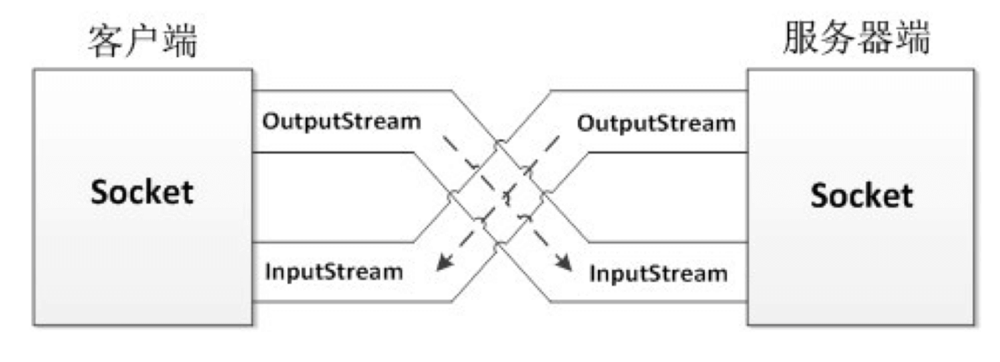
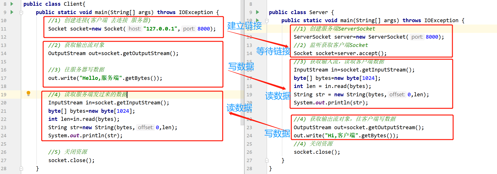

# 3.TCP通信案例

TCP通信需要有客户端和服务端，只有在客户端开启的情况下，客户端才能连接服务端。 客户端用Socket表示，服务端用ServerSocket表示。它们之间进行数据交互是通过流来交互的。客户端和服务端进行数据交互都是通过IO流实现的。



## TCP客户端

```java
public class Client{
    public static void main(String[] args){
        //1) 创建连接(客户端 去连接 服务器)
        Socket socket=new Socket("127.0.0.1",8000);

        //2) 获取输出流对象
        OutputStream out=socket.getOutputStream();

        //3) 往服务器写数据
        out.write("HelloWorld".getBytes());

        //4) 读取服务端发过来的数据
        InputStream in=socket.getInputStream();
        byte[] bytes=new byte[1024];
        in.read(bytes);

        //5) 关闭资源
        socket.close();
    }
}

```

## TCP服务端

```java
public class Server{
    public static void main(String[] args){
        //1) 创建服务端ServerSocket
        ServerSocket server=new ServerSocket(8000);
        //2) 监听获取客户端Socket
        Socket socket=server.accept();
        //3) 获取输入流，读取客户端数据
        InputStream in=socket.getInputStream();
        byte[] bytes=new byte[1024];
        in.read(bytes);
        //4) 获取输出流对象，往客户端写数据
        OutputStream out=socket.getOutputStream();
        out.write("写数据给客户端".getBytes());
        //4) 关闭资源
        socket.close();
    }
}
```

TCP通信必须先开启服务端，服务端代码执行到accpet方法时就会进入阻塞状态，等待客户端过来链接，当客户端和服务端链接了链接，就继续往下执行读取客户端发过来的数据。

