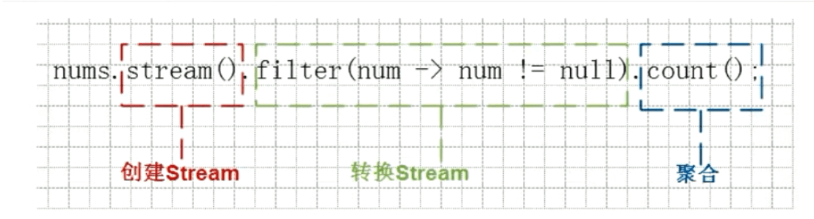

# Stream流式编程
Java 8引入了全新的Stream API。这里的Stream和I/O流不同。它提供一种对 Java 集合运算和表达的**流式编程方式**，大大提高Java程序员的生产力，让程序员写出高效率、干净、简洁的代码。
**少废话，咱们先来体验一把**
```java
//打印输出集合中，姓张并且者长度为3的元素
public class StreamDemo1 {
    public static void main(String[] args) {
        ArrayList<String> list=new ArrayList<>();
        list.add("张三丰");
        list.add("张无忌");
        list.add("大黑牛");
        list.add("牛蛋蛋");
        list.add("李敏");
        //打印输出集合中，姓张，或者长度为3的元素
        list.stream()
                .filter(s -> s.startsWith("张"))
                .filter(s -> s.length()==3)
                .forEach(s -> System.out.println(s));
    }
}
```
Stream API的操作分为三个步骤，**获取流  --->  转换流操作---> 最终操作**




## 获取流的方式
```java
public class StreamDemo2 {
    public static void main(String[] args) {
        //单列集合获取流
        List<String> list=new ArrayList<>();
        Stream<String> stream1 = list.stream();

        Set<String> set=new HashSet<>();
        Stream<String> stream2 = set.stream();

        //双列集合获取流
        Map<String,String> map=new HashMap<>();
        //获取【键】的流
        Stream<String> stream3 = map.keySet().stream();
        //获取【值】的流
        Stream<String> stream4 = map.values().stream();
        //获取【键值对】的流
        Stream<Map.Entry<String, String>> stream5 = map.entrySet().stream();

        //数组获取流皮皮
        String[] array={"毛毛","皮皮","虾虾"};
        Stream<String> stream6 = Stream.of(array);
    }
}
```
## forEach方法
Stream 提供了新的方法 'forEach' 来迭代流中的每个数据
```java
public class ForecahDemo {
    public static void main(String[] args) {
        Stream<String> stream=Stream.of("张无忌","张三丰","周芷若");
        stream.forEach(s -> System.out.println(s));
    }
}
```
## fliter方法
filter方法用于通过设置的条件过滤出元素
```java
public class FilterDemo {
    public static void main(String[] args) {
        Stream<String> stream=Stream.of("张无忌","张三丰","周芷若");
        //过滤以"张"开头的元素
        stream.filter(s -> s.startsWith("张"))
                //过滤长度为3的元素
                .filter(s -> s.length()==3)
                //遍历最终结果
                .forEach(System.out::println);

    }
}
```
## **count方法**
Stream流提供 count 方法来统计其中的元素个数
```java
public class CountDemo {
    public static void main(String[] args) {
        Stream<Integer> stream = Stream.of(1, 4, 5, 6, 7, 8, 9, 3, 4, 5, 6, 78);
        //先过滤，再求个数
        long count = stream.filter(integer -> integer % 2 == 0).count();
        System.out.println(count);
    }
}
```


## **limit方法**

limit 方法可以对流进行截取，只取用前n个
```java
public class LimitDemo {
    public static void main(String[] args) {
        Stream<Integer> stream = Stream.of(1, 4, 5, 6, 7, 8, 9, 3, 4, 5, 6, 78);

        //过滤获取偶数元素
        stream.filter(integer -> integer % 2 == 0)
                //截取前2个
                .limit(2)
                //遍历输出
                .forEach(integer -> System.out.println(integer));

    }
}
```


## **skip方法**
可以使用 skip方法 跳过指定个数获的元素，截取一个新流
```java
public class SkipDemo {
    public static void main(String[] args) {
Stream<String> original = Stream.of("张无忌", "张三丰", "周芷若");
        Stream<String> result = original.skip(2);
        System.out.println(result.count()); 
    }
}
```
## **map方法**
可以使用 map方法将流中的元素映射到另一个流中
```java
public class MapDemo {
    public static void main(String[] args) {
        Stream<String> original = Stream.of("10", "12", "18");
        Stream<Integer> result = original.map(Integer::parseInt);
    }
}
```
## **concat方法**
concat可以把两个流组合成一个流
```java
public class ConcatDemo{
    pblic static void main(String[] args){
        Stream<String> streamA = Stream.of("张无忌");
        Stream<String> streamB = Stream.of("张翠山");
        Stream<String> result = Stream.concat(streamA, streamB);
    }
}
```
## **sorted方法**
sorted方法用于对流进行排序
```java
Stream<Integer> stream = Stream.of(5, 23, 4, 5, 6, 7);
stream.sorted();

//stream.sorted((o1, o2) -> o2-o1).forEach(
//    integer -> System.out.println(integer));
```
## **collect收集到集合**
```java
ArrayList<String> list=new ArrayList<>();
list.add("张三丰");
list.add("张无忌");
list.add("大黑牛");
list.add("牛蛋蛋");
list.add("李敏");
//打印输出集合中，姓张，或者长度为3的元素
List<String> res1 = list.stream()
        .filter(s -> s.startsWith("张"))
        .collect(Collectors.toList());
```
## **toArray收集到数组**
```java
ArrayList<String> list=new ArrayList<>();
list.add("张三丰");
list.add("张无忌");
list.add("大黑牛");
list.add("牛蛋蛋");
list.add("李敏");
//打印输出集合中，姓张，或者长度为3的元素
String[] array = list.stream()
        .filter(s -> s.startsWith("张"))
        .toArray(value->new String[value]);
```

