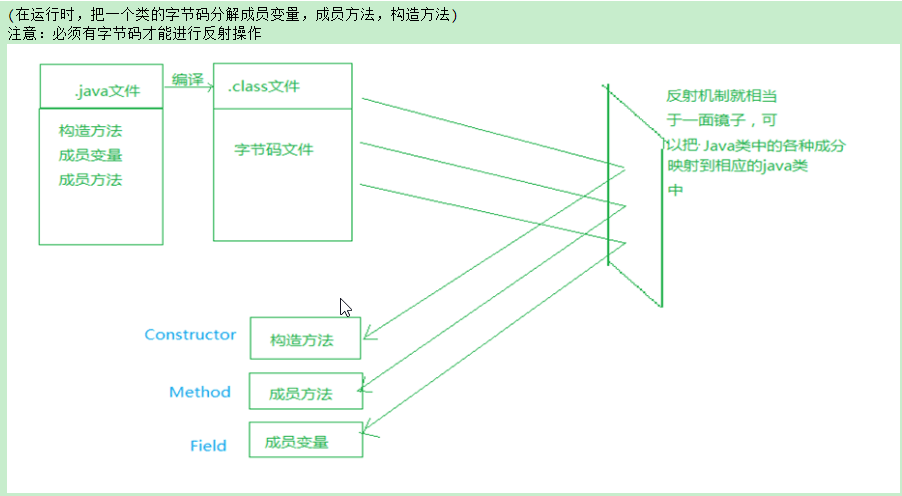

# 1.反射
Java的反射机制，首先得从Java字节码入手，为了方便理解给大家举个例子，如图我们可以把Java的反射机制看做是一个照妖镜，它可以让类的字节码（`Class`文件）现出原形，也就是获取到字节码的各个组成部分。



在Java的世界里万物皆对象，类的字节码和类的各个组成部分都是对象，而每一个对象都有与之对应的类，关系如下

|类的组成部分|类名|
|---|---|
|字节码|Class表示|
|成员变量|Field表示|
|构造方法|Constructor表示|
|成员方法|Method表示|

## 获取字节码
要去做反射的操作，首先第一步需要获取类的字节码，获取字节码有三种方式
> 类名.class

任何一个类都有字节码，甚至是基本类型也有字节码，格式如下
```java
//格式：类名.class
Class cls1=Student.class;
Class cls2=String.class;
Class cls3=int.class;
```
> Class.forName("包名.类名")

通过Class类的`forName("全类名");`也可以获取一个类的字节码，如下代码
```java
Class cls1=Class.forName("com.itheima.Student");
```
> 对象.getClass()

如果已经有了对象，通过对象的getClass()方法也可以获取字节码
```
Student stu=new Student();
Class cls1=stu.getClass();
```
**不管用哪种方式获取字节码，只要是同一个类，字节码就是同一个**


​    
## 反射的API方法

在Class类中提供了和反射相关的方法，这些方法的命名其实是很有规律，掌握了这些规律学习反射其实挺简单的。

先来学习几个单词，把这些单词按照规律组合起来，就是反射的各个功能方法。

|单词|含义|
|--|--|
|Field|成员变量|
|Constructro|构造方法|
|Method|成员方法|
|get|获取|
|Declared|使公开的，用于获取非public修饰的成员|

> 获取公有的Constructor、Field、Method

```java
1.反射获取构造方法(Constructor)
//获取一个构造方法
Constructor getConstructor(Class...cls)
//获取多个构造方法
Constructor[] getConstructors();

2.反射获取成员变量(Field)
//获取一个成员变量
Field getField(String name)
//获取多个成员变量
Field[] getFields()			

3.反射获取成员方法(Method)
//获取一个成员方法
Method getMethod(String methodname,Class...cls)
//获取多个成员方法
Method[] getMethods()
```

> 获取私有的的Constructor、Field、Method

```java
1. 反射获取构造方法(Constructor)
//获取一个构造方法
Constructor getDeclaredConstructor(Class...cls)
//获取多个构造方法
Constructor[] getDeclaredConstructors()

2. 反射获取成员变量(Field)
//获取一个成员变量
Field getDeclaredField(String name)
//获取多个成员变量
Field[] getDeclaredFields()

3. 反射获取成员方法(Method)
//获取一个成员方法
Method getDeclaredMethod(String methodname,Class...cls)
//获取多个成员方法
Method[] getDeclaredMethods()
```

反射的API方法命名，有下面一些规律，自己体会一下。

- 后缀带s的，表示获取多个；后缀不带s获取其中一个
- 方法名带有Declared的，表示可以获取私有修饰的成员

在做反射操作之前，先打一个预防针，可能你刚开始会觉得反射的代码很麻烦（确实很麻烦），先别管为什么要这么写，先学会这些API的方法用会，后面再给大家讲具体在什么场景下使用。

## 反射获取构造方法
有如下的Student类，有两个构造方法
```java
public class Student{
    private String name;
    private int age;
    //空参数构造方法
    public Student(){

    }
    //有参数构造方法
    public Student(String name,int age){
        this.name=name;
        this.age=age;
    }
}
```
下面通过反射的方式，来获取Student类的构造方法，并创建对象
```java
public class Demo1{
    public static void main(String[] args){
        //获取类的字节码
        Class clazz=Class.forName("com.itheima01.Student");

        //反射获取空参数构造方法
        Constructor c1=clazz.getContructor();
        //使用空参数构造方法创建对象，等价于 Object obj1=new Student();
        Object obj1=c1.newInstance();

        //反射获取有参数构造方法
        Constructor c2=clazz.getContructor(String.class,int.class);
        //使用有参数构造方法创建对象，等价于 Object obj2=new Student("张三“，18)l
        Object obj2=c2.newInstance("张三",18);

        /*
        还可以通过Class中的newInstance()方法，可以直接创建类的对象。
        底层依赖的是空参数构造方法，如果没有写空参数构造方法，则不使用该方法创建对象。
         等价于：Object obj3=new Student();
        */
        Object obj3=clazz.newInstance();

    }
}
```


## 反射获取成员变量
有如下的Student类，类中有两个成员变量，其中name是私有的，age是公有的
```java
public class Student{
  public String name;
  private int age;
}
```
采用反射的方式，创建Student对象，并给name和age赋值，然后获取name和age的值
```java
public class Demo2{
  public static void main(String[] args){
    //获取Student类的字节码
    Class clazz=Class.forName("com.itheima.Student");
    //反射方式创建Student对象，默认用Object接收
    Object obj=clazz.newInstance();
    //反射获取public修饰的name属性，用f1表示
    Field f1=clazz.getField("name");
    //反射获取private修饰的age属性，用f2表示
    Filed f2=clazz.getDeclaredField("age");
    
    //给obj对象的name属性，赋值为"张三"
    f1.set(obj,"张三"); 
    //给obj对象的age属性，赋值为20
    f2.setAccessible(true); //使age属性对外公开（取消私有权限）
    f2.set(obj,20);

    //获取obj对象的name属性值
    Object v1=f1.get(obj); 
    //获取obj对象的age属性值
    Object v2=f2.get(obj);
    System.out.println("对象地址："+obj);
    System.out.println("name属性值："+v1);
    System.out.println("age属性值："+v2);
  }
}
```

## 反射获取成员方法
有如下的Student类，类中有两个成员变量，其中`study()`是私有的，`eat(String food)`是公有的
```java
public class Student{
  public void eat(String food){
    System.out.println("学生正在吃..."+sub+"...食物");
  } 
  private void study(String sub){
    System.out.println("学生正在学习..."+sub+"...课程");
  }
}
```
使用反射的方式，获取`eat(String food)`方法和`study(String sub)`并调用
```java
public class Demo3{
  public static void main(String[] args){
    //获取Student类的字节码
    Class clazz=Class.forName("com.itheima.Student");
    //根据空参数构造方法创建Student对象，默认用Object接口
    Object obj=clazz.newInstance();

    //获取public修饰的eat(String food)方法
    //第1个参数: eat 表示方法名
    //第2个参数：表示eat方法的参数有一个，并且是String类型
    Method m1=clazz.getMethod("eat",String.class);
    //执行Student对象的m1方法，也就是eat方法
    //第1个参数：表示上面创建的Student对象
    //第2个参数：表示eat方法接收的实际参数
    //等价于： obj.eat("冰激凌");
    m1.invoke(obj,"冰淇淋");

    //获取private修饰的study(String sub)方法
    Method m2=clazz.getDeclaredMethod("study",String.class);
    //取消study方法的私有权限
    m2.setAccessible(true);
    //调用obj的m2方法，也就是study方法
    //第1个参数：表示上面创建的Student对象
    //第2个参数：表示study方法接收的实际参数
    //等价于： obj.study("语文");
    m2.invoke(obj,"语文");
  }
}
```

## 反射练习
通过properties配置文件加反射的方式，执行任意类中的任意方法

先写一个Game类
```java
public class Game{
  public void play(){
    System.out.println("游戏开始,杀杀杀，把自己杀死了，有Bug");
  }
}
```
再写一个新的NewGame类
```java
public class NewGame{
  public void show(){
    System.out.println("游戏开始,很愉快！！");
  }
}
```
下面是config.properties配置文件的内容
```properties
# classname表示类名
classname=com.itheima.test.Game
# method表示要执行的方法名
method=play
```

在测试类中读取config.properties配置文件，并且利用反射来执行配置文件中classname对应的类和method对应的方法。

```java
public class Test {
    public static void main(String[] args) throws Exception{
        //读取配置文件
        Properties pro=new Properties();
        pro.load(new FileReader("day01-code\\src\\config.properties"));

        //获取类名
        String classname = pro.getProperty("classname");
        //获取字节码
        Class clazz = Class.forName(classname);
        //通过字节码创建对象
        Object obj = clazz.newInstance();

        //获取方法名
        String method = pro.getProperty("method");
        Method m = clazz.getMethod(method);
        m.invoke(obj);
    }
}
```
执行的结果为：`开始玩游戏，杀杀杀，把自己杀死了....有Bug`


这时，当我们把config.properties改为下面的的内容
```
# 要加载的类
classname=com.itheima.test.NewGame
# 要执行的方法
method=show
```
测试类不用改动，就会根据配置文件自动执行NewGame类的show方法

执行结果为：`开始玩游戏，很愉快....`

