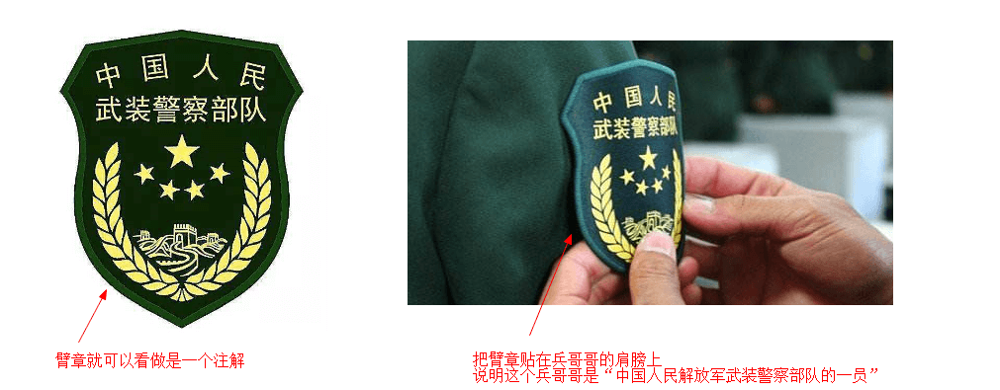
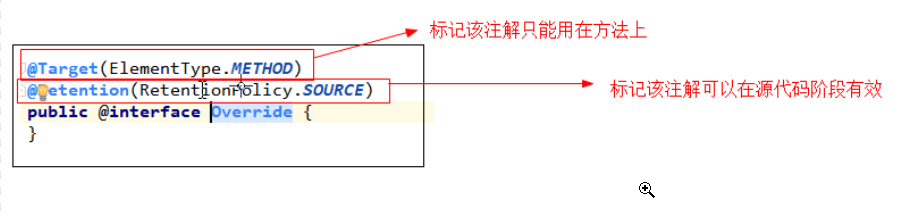
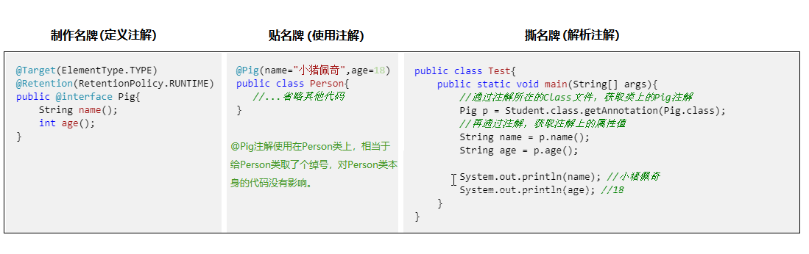

# 注解

注解刚开始学确实不太好理解，我尝试着用一些例子帮助大家理解，继续往下看，静下心来慢慢体会。

看到注解这个词，很容易让我们联想到注释，但是它和注释有很大的不同，注释是解释说明程序的文字，是给人看的；
但是注解是由代码组成的，有其特殊的语法（如类、接口等，注解也可以看做是一种特殊的数据类型）

我们可以把每一个注解看做是一个【标签】，并且每一个标签有不同的含义，如果把这个标签贴在某个的物体上，那么就认为这个物体具备这个标签的含义。



**注解就是用代码写的一种特殊的【标签】，它可以给类、成员变量、方法、接口等赋予一些额外的标记信息。但是并不影响代码的主要功能，只不过加上注解后多了一些额外的信息**


## 元注解
以上内容如果如果你看懂了，就知道注解就好比一个标签，有其特殊的含义，如臂章是用来标记军人的兵种、工牌用来标记员工的部门和职位...... 

好，坐稳了，现在要讲的**元注解就是进一步来约束注解的一种注解**（如臂章只能给军人佩戴，其他人佩戴就不合法；工牌只能给本公司的人佩】戴，凭证上岗）


在定义注解时，为了说明注解保留在那个阶段，以及可以使用的目标等（现在可能还看不懂，继续往下看）。

```java
@Target : 描述注解使用的目标（类、方法、变量...）
@Retention: 描述注解保留到那个阶段(SOURCE,CLASS,RUNTIME)
```
我们以用过的Java的内置注解`@Override`为例，我们看一下它的源码，学习注解是怎么定义的。
我们在 IDEA 或者 Eclipse 这样的高级编辑器中写代码，它们
会通过识别`@Override`注解来判断是否为合法的复写的方法。



```java
@Target 元注解 说明@Override 注解只能使用在方法上，所以我们在其他地方使用就是错误
的。
@Retention元注解，说明@Override 注解在源代码阶段有效，所以写代码的时候 IDEA 可以提供编译检查。
```

## Java 内置注解
Java5 之后引入的注解，并且提供了几个内置注解，下面介绍几个常用的注解，
其中`@Override`我们也经常用到

```java
@Override 用来标记方法是复写的父类方法
@Deprecated 用来描述一个方法或者类已过时
@SupperssWarnings 压制警告(在IDEA和Ecipse中的黄色波浪线，强迫症者了解一下)
@FunctionalInterface 描述一个接口为函数式接口
```


## 自定义注解

前面看了@Override 注解的定义，其实代码很简单。那么自己写一个注解也是可以的。步骤如下

- 新建一个注解@Pro;
- 然后用@Target 元注解说明一下使用目标；
- 使用@Retention 说明注解保留在哪个阶段；
- 在注解中写上几个属性，注解中的属性比较特殊属性名后面加上-对小括号（本质上它是一个方法，当做属性理解就可以了）。

```java
//定义一个注解Pro，就是定义一个标签。
//标签可以用在哪些地方，通过@Target指定
//标签可以保留到那个阶段，通过@Retention指定
@Target(ElementType.TYPE)
@Retention(RetentionPolicy.RUNTIME)
public @interface Pro {
    //属性列表--本质就是抽象方法的变形写法(省略的风public abstract和参数)
    String classname();  //属性为String类型
    String methodname();      //属性为基本类型
}
```
小提示：定义注解，就如同定义一个类，如果没有地方去使用它也不会自己执行。所以还需继续往下看，学习一下注解的使用

## 使用注解

在 Test 类中解析类上的注解，使用反射来获取注解提供的信息，并使用

```java
@Pro(classname = "com.itheima.test.Game",methodname = "play")
public class Test {
    public static void main(String[] args) throws Exception{
        //通过注解所在的Class文件，获取类上的Pro注解
        Pro pro = Test.class.getAnnotation(Pro.class);
        //再通过注解，获取注解上的属性值
        String classname = pro.classname();
        String methodname = pro.methodname();

        //再通过反射加载classname对应的类
        Class<?> clazz = Class.forName(classname);
        Object obj = clazz.getConstructor().newInstance();

        //通过字节码获取到methodname方法
        Method method = clazz.getMethod(methodname);
        //让方法执行
        method.invoke(obj);
    }
}
```

## 总结

玩注解分为 3 个步骤：**定义注解**、**使用注解**、**解析注解**。
这 3 个步骤有点像跑男里的“撕名牌”游戏




> 定义注解

注解使用@interface来定义 ，定义注解使用需要使用元注解说明注解使用的目标、保留的阶段，注解可以包含属性。


> 使用注解

按照定义注解规定的目标，把注解放在对应的代码上，有属性的话需要给属性赋值

> 解析注解

运行时注解可以用反射进行解析，检查时注解比较复杂后面专门进行讲解。

