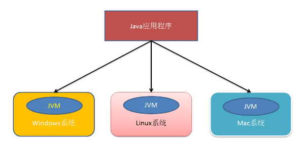
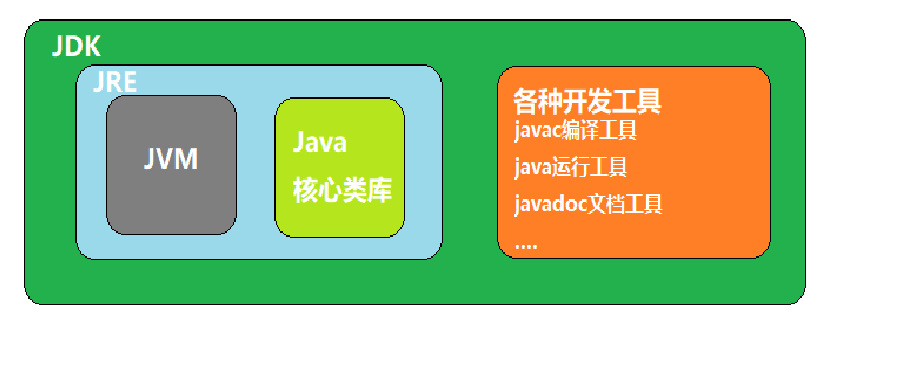
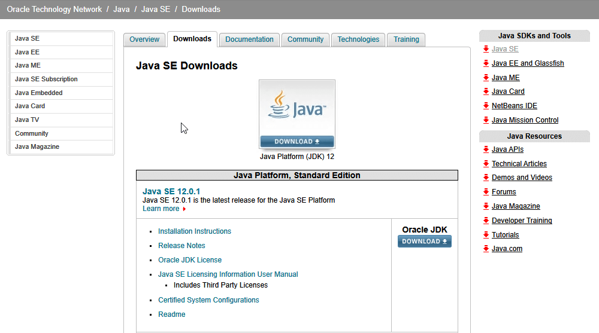
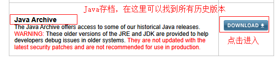
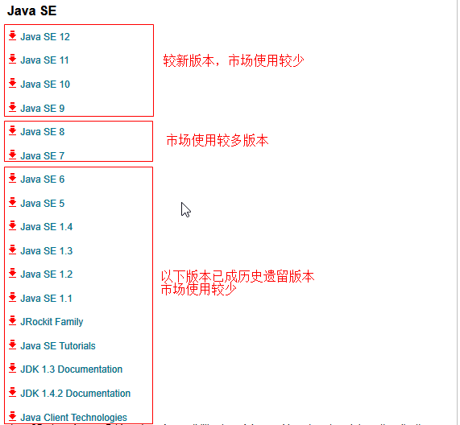
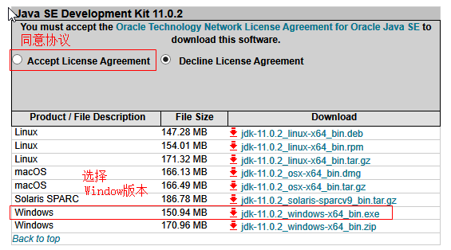
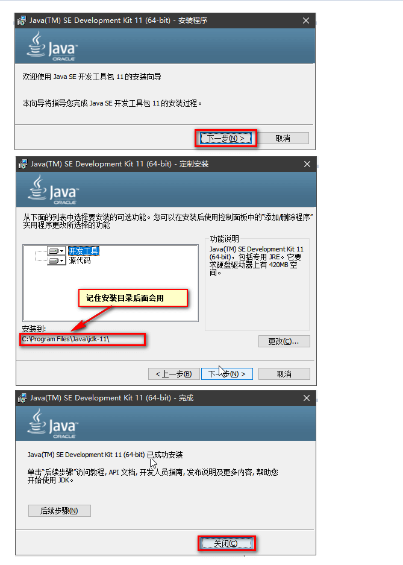
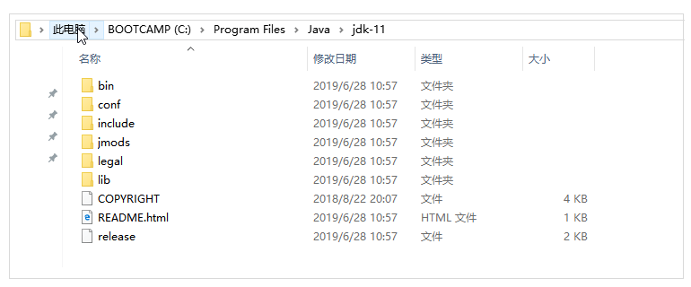
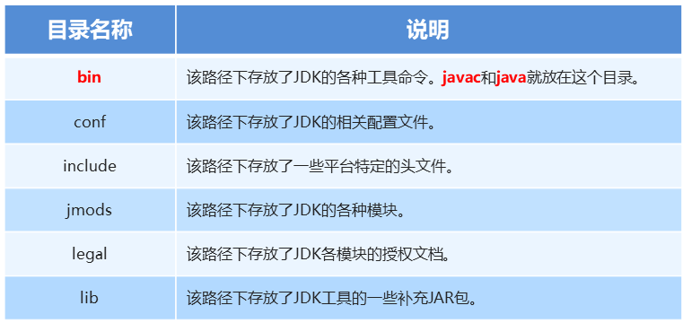

# 2.JDK的下载和安装

接下来我们就开始Java这门课程的学习，我们先了解一下Java语言的跨平台性

## 跨平台性

所谓跨平台性是指**用Java语言开发好的程序可以在多种操作系统上运行**，这种跨平台性依赖于Java虚拟机（简称JVM，它是在计算机内存中以软件的形式虚拟出来的一个计算机），Java程序运行在JVM之上。

只要在你的操作系统上，安装有对应版本的JVM软件，那么在你的电脑上就可以运行Java程序

Sun公司为开发者提供了开发Java程序所需要的开发工具包（Java Developer Kit，简称JDK）我们只需要在电脑上安装JDK，JVM就已经安装上了，同时还包含一些运行Java程序需要的核心类库

    小结一下：
    1.跨平台性
        使用Java语言开发好的程序可以在多种操作系统上运行
    2.JDK\JRE\JVM三者之间的关系
        JDK:Java开发工具包
        JRE:Java的运行环境
        JVM:Java虚拟机
        关系：JDK包含JRE、JRE包含JVM

## JDK下载
你可以到oracle的官网下载jdk [点击进入Oracle官网](https://www.oracle.com/technetwork/java/javase/downloads/index.html)，由于官网会经常更新，页面入口也会经常变动，这里主要给大家讲解下载时要注意的问题。安装包已经提前准备好

找到下载入口页面，页面中显示的是比较新的版本，一般没有要求不会使用最新版本。

页面向下滑动到最底部，进入Java存档页面，可以找到历史版本

选择你需要的JDK版本，这里我们选择Java SE 11

同意协议，选择Windows版本下载

注意在官网下载可能会需要你先登录，你注册一个账号再次尝试

## JDK的安装
接下来讲解一下JDK的安装，大家严格按照步骤进行安装，以免出现一些不必要的问题。

JDK安装完成之后，没有界面，也没有图标。我们开打开刚才记住的安装目录，查看一下

下面是各个目录的简要说明，了解即可

​    
​    

