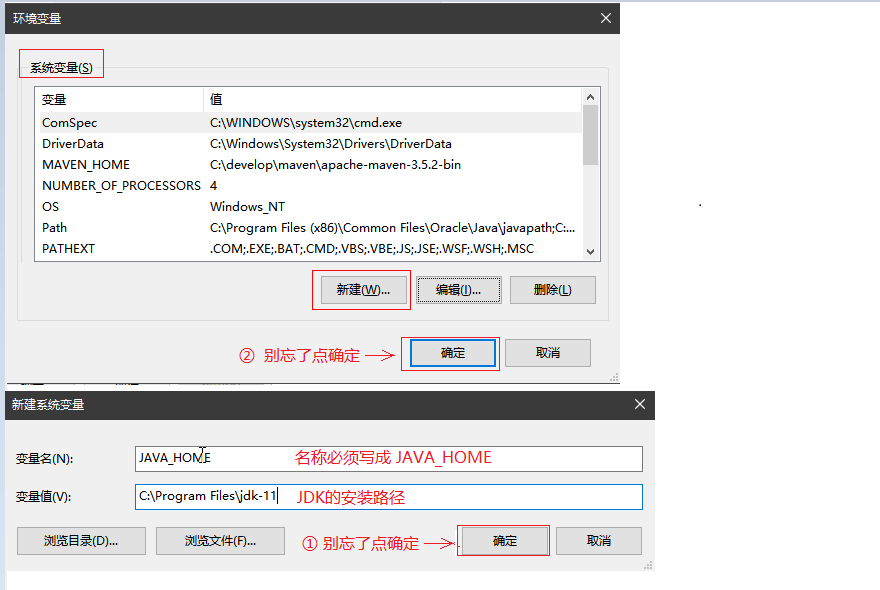
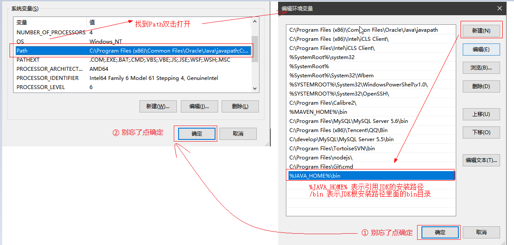

# 3.配置环境变量
安装好了JDK之后，接下来我们还需要做一个配置才能去做Java程序的开发。按照下面的步骤完成配置

> 找到JDK的安装路径

我的JDK安装默认路径下`C:\Program Files\jdk-11`，你需要看看自己装在哪里。

> 配置Path环境变量

按照下面的步骤，找到环境变量界面，并新建系统变量`JAVA_HOME`

    我的电脑-->右键属性-->高级系统设置-->环境变量

把`JAVA_HOME`的引用，添加到Path路径下

