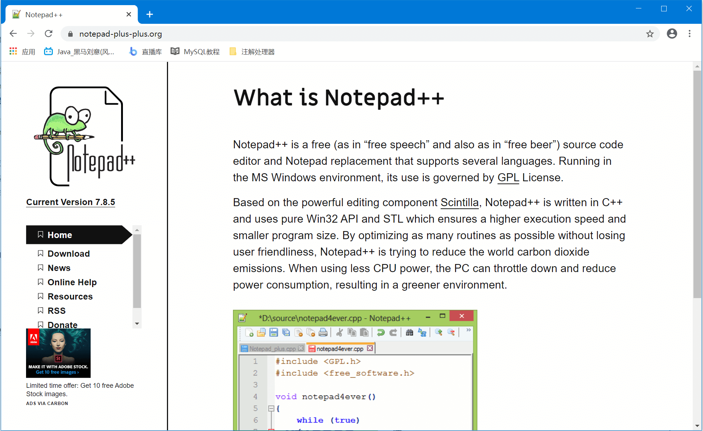
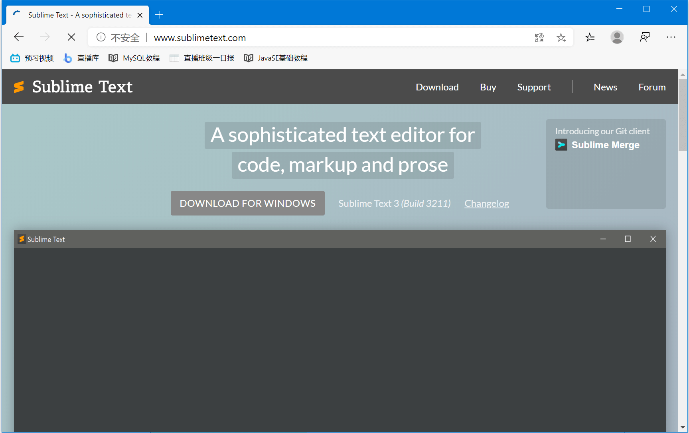
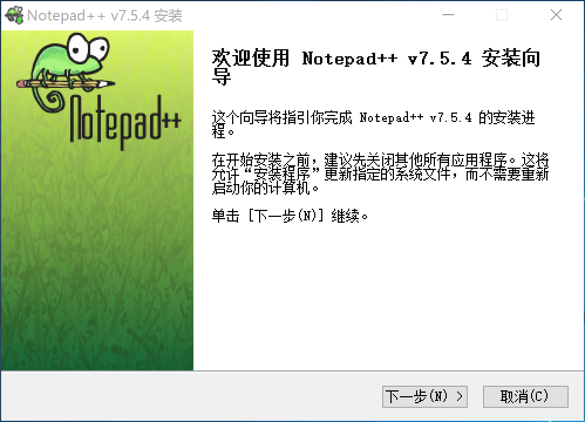
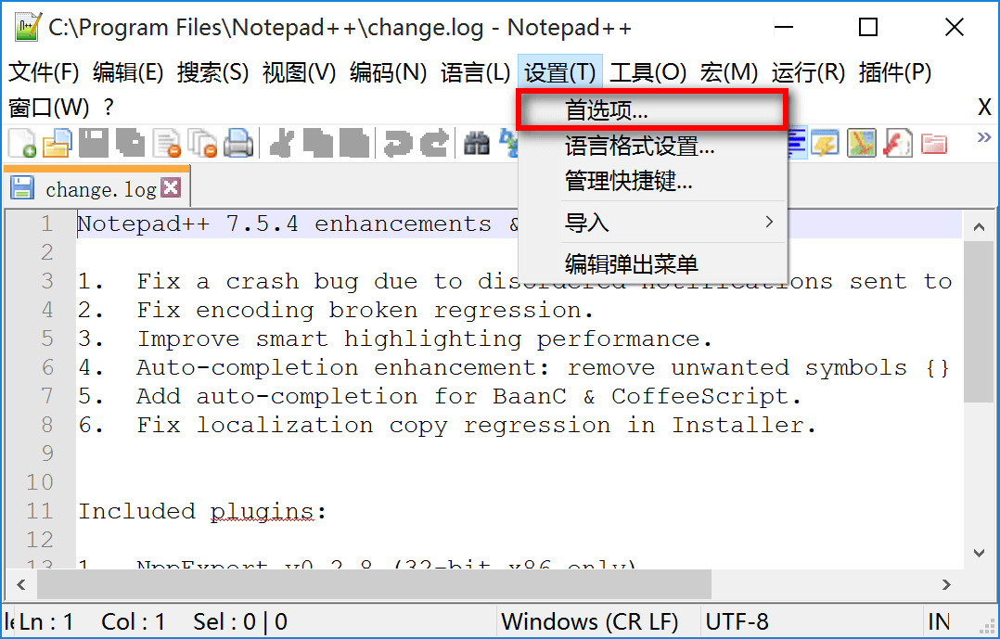
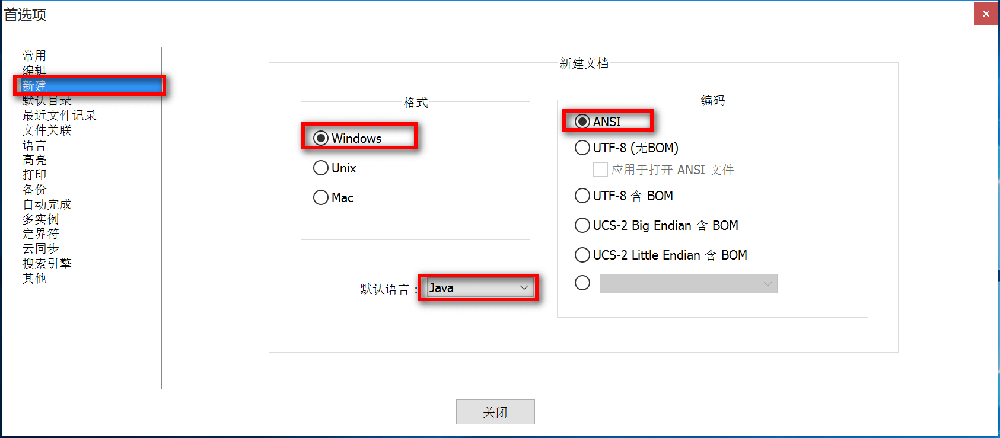

# 4.NotePad++安装
配置好环境变量之后，我们就可以写Java程序了，但是在哪里写呢？用windows自带的记事本就可以写，但是自带的记事本软件太简陋了，我们需要一个颜值更高，功能更强大的记事本软件。这里给大家推荐几款高级的记事本软件。

如果你是Windows操作系统，可以使用NotePad++  [点击下载](https://notepad-plus-plus.org)；

如果你是苹果本可以使用Sublime Text  [点击下载](http://www.sublimetext.com)

下面我们主要演示一在Windows操作系统上安装notePad++软件并配置；

## NotePad++安装和配置

安装就不用多说了，只需要一路下一步就可以了

安装好了之后，在菜单栏选择【设置】【首选项】

设置新建的文件默认为【Java文件】编码为【ANSI】

