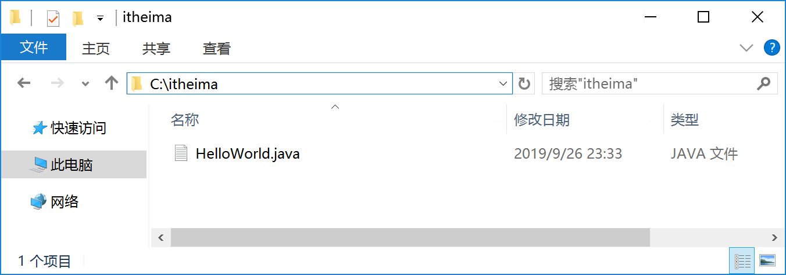
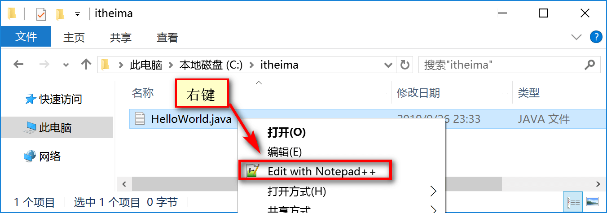
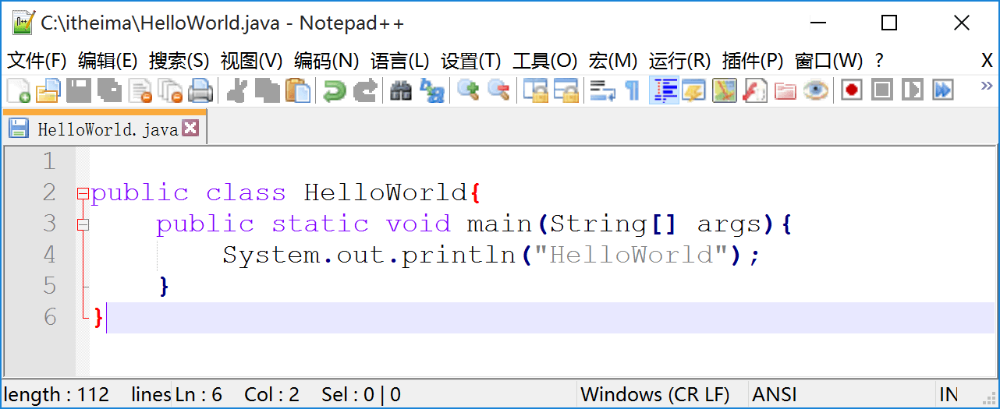
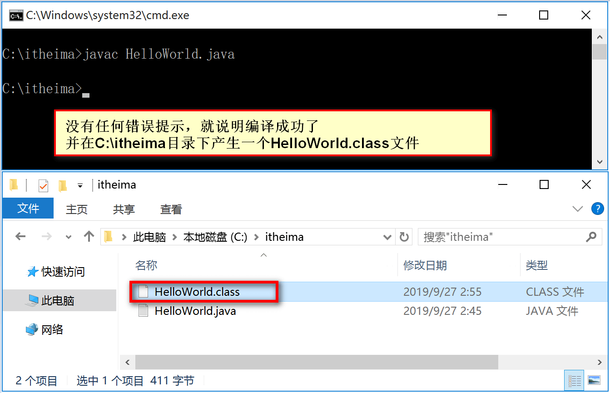
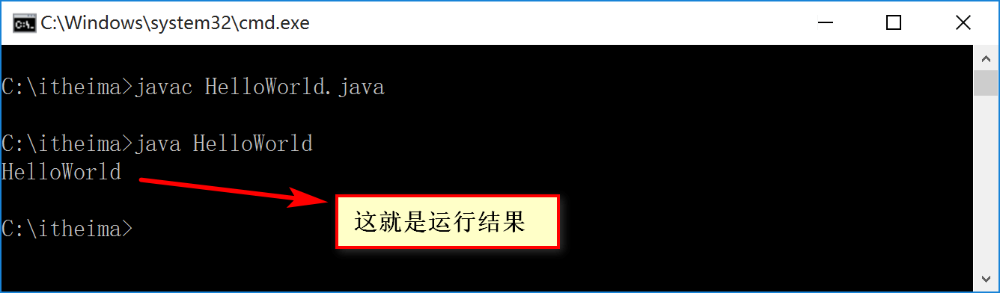

# 5.第一个Java程序
安装好了JDK配置好了环境变了之后，接下来就可以开发第一个Java程序了。一个Java程序的诞生需要经过三个步骤，先简单的给大家介绍一下每一个步骤是什么意思，然后再给大家演示。

```java
第一步：编写源代码
	Java的源代码扩展名是为.java的文本文件，编写源代码时必须严格遵守Java语法要求。
第二步：编译源代码
	Java源代码(.java)是给人看的，但是计算机并不认识，需要通过编译生成JVM能够解释的
	字节码文件。
第三步：运行程序
	JVM读取字节码，并解释成操作系统能够识别二进制机器码并交给CPU执行。
```

**第一步：编写源代码**

找一个比较干净的目录如`C:\itheima`，在该目录下新建一个`HelloWorld.java`文件




```
注意Windows系统文件的扩展名是默认是不显示的，当你新建一个文本文件默认扩展名为.txt，
如果想创建.java为扩展名的文件，需要把文件的扩展名打开才行。
```

接下来，把`HelloWorld.java`文件使用NotePad++软件打开




编写源代码如下




**第二步：编译源代码**

编译的目的是`HelloWorld.java`源文件翻译成JVM能够解释执行的`HelloWrold.class`字节码。一定要进入源文件所在的目录下完成编译操作。我的源文件在`C:\itheima`目录下

在控制台输入命令：`javac HelloWorld.java` **注意后缀有.java**




**第三步：执行程序**

把编译生成的`HelloWorld.class`字节码文件交给JVM解释执行。

在控制台输入执行命令：`java HelloWorld` **注意没有后缀.java**




