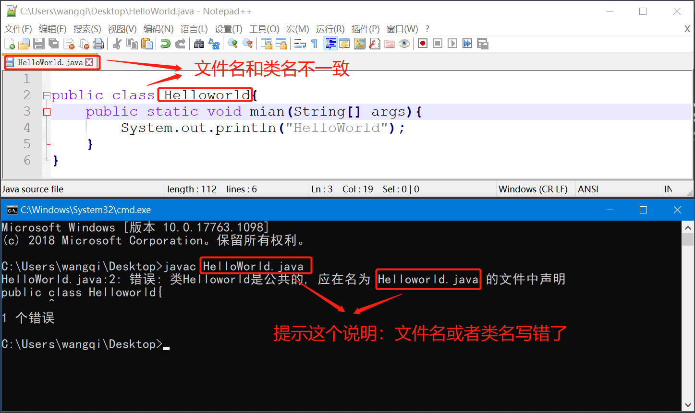

# 6.常见问题总结
在写第一个程序的时候，会经常遇到一些问题。在这里我们总结一下，大家比较常见的问题。

```java
1.jdk的bin目录要配置到path环境变量下，才可以在任意目录下使用javac命令

2.文件名称要和类名保持一致，否则会出错。
	如文件名是：HelloWorld.java
	类名就必须是： HelloWorld
3.代码严格区分大小写，否则也会出错。
	System不能写从system
	String不能写成string
	
4.主方法不能更改，否则也会出错。
	public static void main(String[] args){
		...
	}
5.标点符号必须全都是英文符号，否则会出错。
	
6.window系统默认是隐藏文件扩展名的，需要手动把文件扩展名打开，否则新建的文本文档
是.txt文件，编译时会导致找不到文件。
```


## 环境变量没有配置

在控制台输入javac命令无效，说明jdk的安装目录没有配置到path环境变量下。


## 文件名和类名不一致

Java源文件的名称和类名称(class后面跟的单词)要保持一致，否则会编译报错。




## 大小写字母写错了

Java程序中代码是严格区分大小写的，大小写不能混用。


## 主方法写错了

主方法是固定格式，不能把名称写错了，否则JVM找不到入口


## 标点符号写错了

在程序中所有的标点符号必须使用英文符号，否则会出错。


## 文件扩展名没打开

Windows默认是隐藏文件扩展名的，需要手动把文件扩展名打开。


再打开文件扩展名试一下，我们发现确实是一个txt文件

