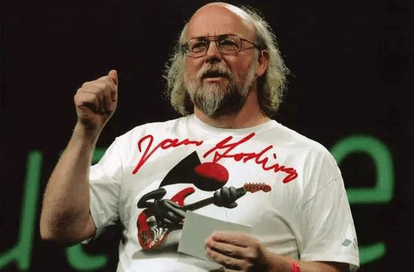

# 1.Java语言概述

## 计算机语言

在21世纪的今天，计算机已经非常普及，我们都知道计算机的功能非常强大，貌似只有我们想不到没有它做不到的事情。那么计算机天生就特别聪明吗？答案是否定的，相反计算机很笨，它自己不会思考，它需要程序员用一种特殊的语言教他如何去做事情。**这种人和计算机沟通的语言就是计算机语言**，而且这种沟通是单向的，通俗点讲就是，我让你干嘛你就干嘛！有点像军队的长官给士兵发号命令，军人以服从命令为天职，程序员就是那个长官，计算机就是士兵。

我们学习计算机语言主要学习2个内容，一个是【语法规则】一个是【实际应用】

> **语法规则**

计算机语言也是人设计的，他们在设计这么语言的时候必然就有一些规定，比如规定int表示整数，规定float表示小数，规定字符串用双引号括起来如`"HelloWorld"`等。这些规则就是语法，学习语法最重要的就是格式，没有为什么。

> **运用语法解决实际问题**

学习了计算机的语法之后，更重要的是运用这些语法解决实际问题。其实就是用这些代码来表达人的思维，让计算机按照人的意图去做事情。计算机语言有很多种，不管学习Java语言、C语言、还是python语言等都是这样的学习步骤。

## Java语言

Java语言是计算机语言的一种，由詹姆斯高斯林和其同事们共同研发，并在1995年正式推出。

我们简单来了解一下Java语言的发展历史，这里只记录一些重要的时间节点，不用记了解一下就可以了

- 1996年1月，Sun公司发布了Java的第一个开发工具包
- 1998年12月8日，第二代Java平台的企业版J2EE发布
- 1999年4月27日，HotSpot虚拟机发布，后来Sun JDK的默认虚拟机
- 2006年11月13日，Java技术的发明者Sun公司宣布，将Java技术作为免费软件对外发布
- 2009年，甲骨(Oracle)文公司宣布收购Sun
- 2011年7月，甲骨文(Oracle)公司发布了收购后的第一个版本JDK7
- 2013年9月，发布jdk8，新增了Lamdba表达式和其他特性