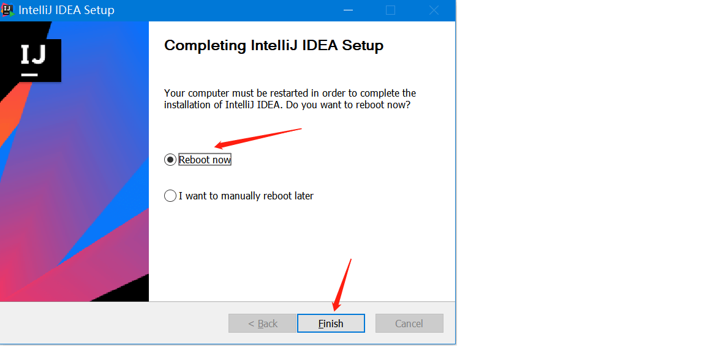

# 1.IDEA的下载和安装
## 下载

下载地址  [https://www.jetbrains.com/idea/](https://www.jetbrains.com/idea/)  去找DOWNLOAD就可以了。

## 安装

在官网下载好安装包之后，双击打开安装向导，点击Next下一步。

默认安装路径即可，Next下一步

选择64位启动，Next下一步

这一步不用管，直接install即可

等待安装进度条结束，就按安装完成了

第一次启动，不需要导入任何设置如图

选择主题，我选择白色主题，默认设置。

选择免费使用

