# 2.IDEA项目结构

在使用IDEA编写代码之前，先来学习一下idea的项目结构，因为你只有搞清楚Idea的项目结构才能更好的使用这个强大的工具完成你的Java项目开发，否则事倍功半得不偿失（这里要给大家说一下，很多同学看到别人在用，然后自己也盲目的使用，其实很多同学都忽略了一些细节导致很多莫名其妙的问题，可以说绝大多数同学使用都是错的）。所以建议大家，不管你前面自己有没有使用Idea这款开发工具，现在把它卸载了跟着我重新来学习怎么使用。

接下来，我们先认识一下什么时Idea的项目，项目本质上就是一个文件夹，项目结构就是文件夹包含哪些内容（如下图）

## 新建项目Project

首先我们要新建一个空的项目（其实就是一个空的文件夹），我给项目取名为`JavaSEV1.0`，保存在`C:\IdeaProjects\JavaSEV1.0`目录下。

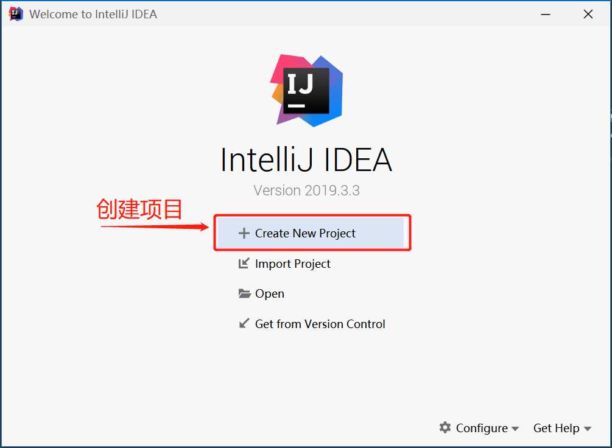

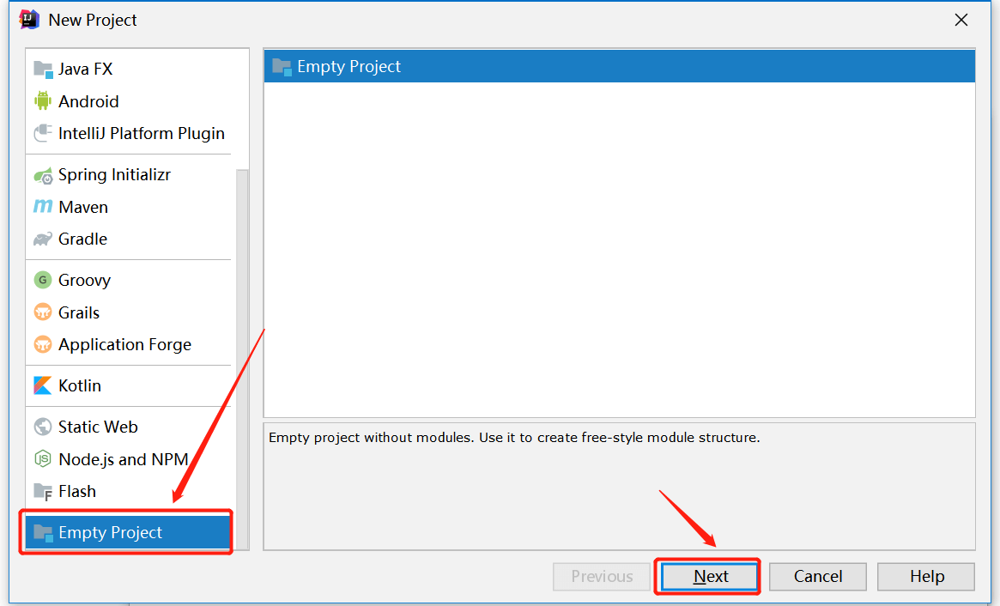

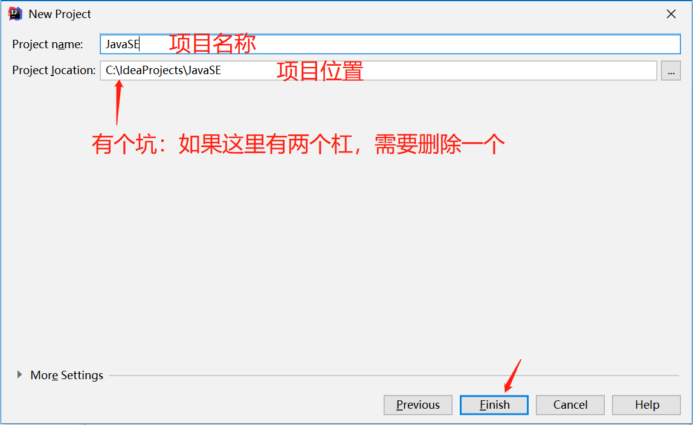

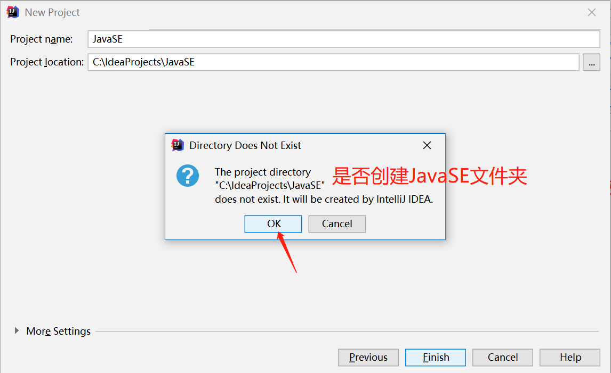

## 创建模块Module

创建好了项目之后马上会弹除一个框，让我们创建Module（模块）一个项目下可以包含多个Module，每个Module也是一个文件夹。

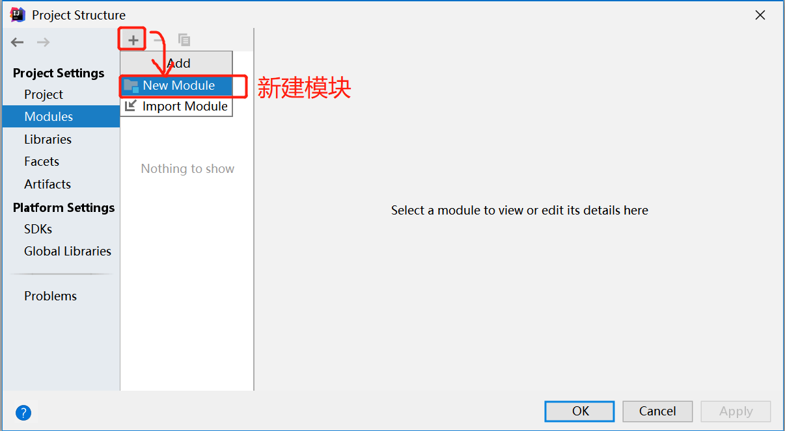

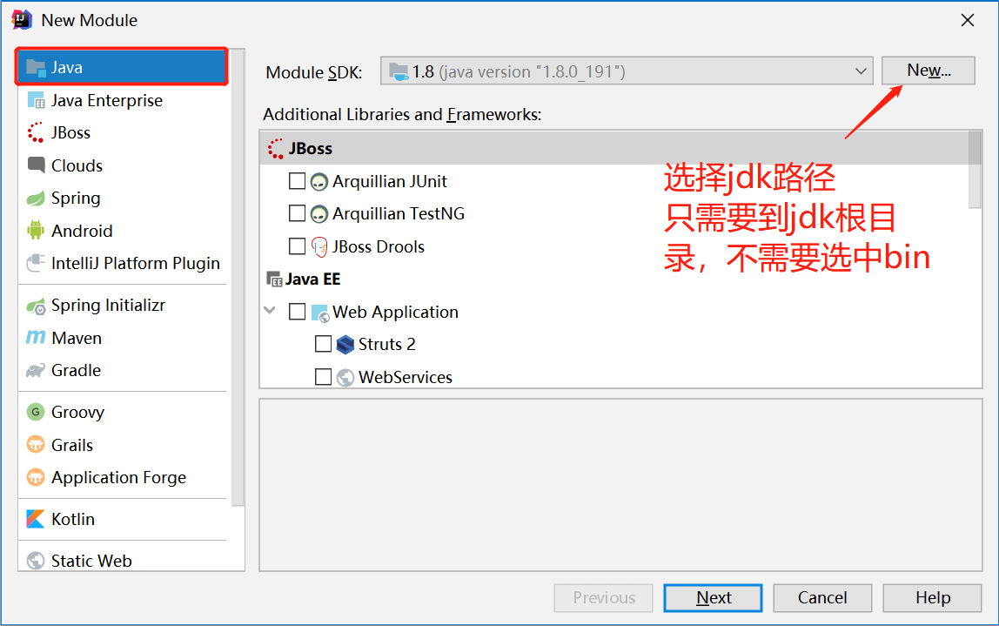

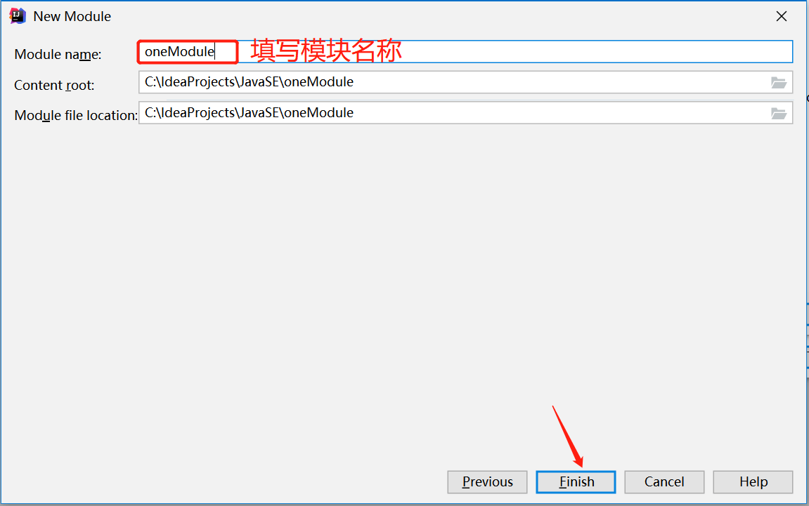

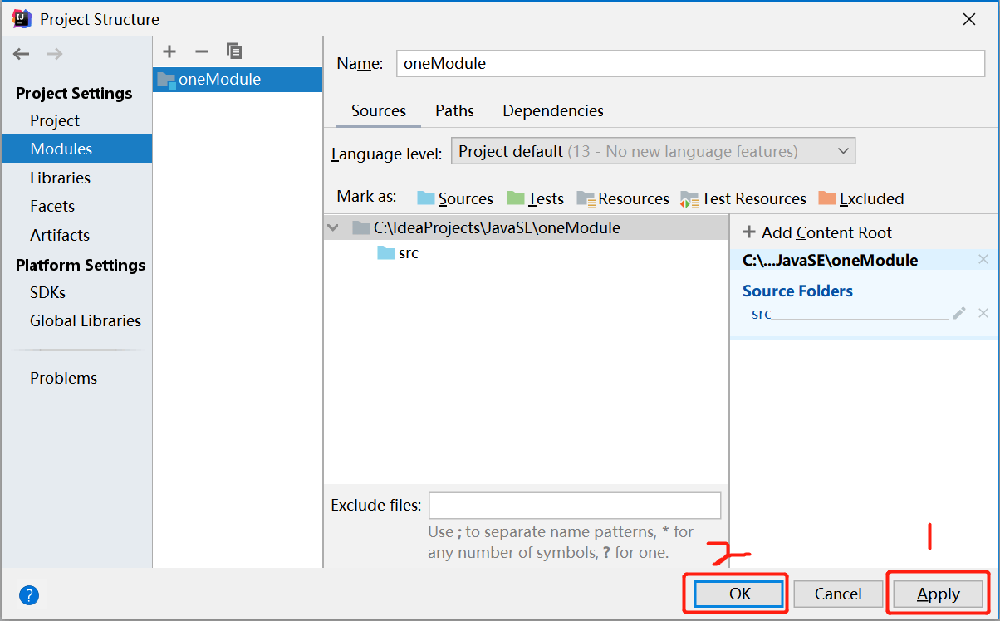

## 新建包Package

创建好了模块之后，接下来就需要在模块中创建包(package)，包其实也是文件夹，专门用来存放Java文件的文件夹。

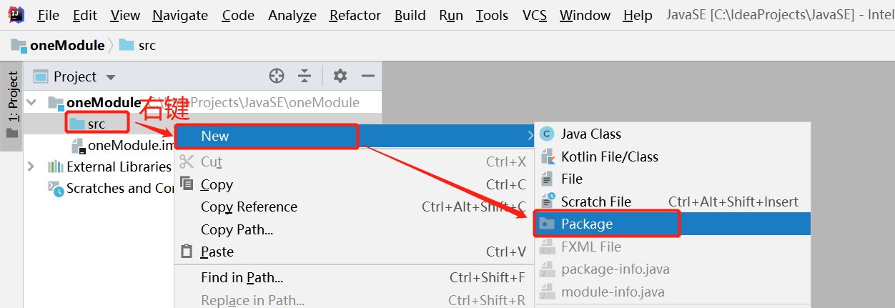

创建好了包之后，再到项目所在的目录下看看，如下图。

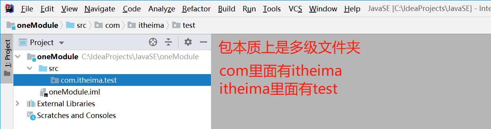

下面是在文件管理器中的项目、模块、和包的路径

## 新建类Class

包创建好了之后，接下来就需要在包中创建类，类就是平常我们写的`.java`文件，这里我们在`com.itheima.test`包中，创建一个`HelloWorld`类

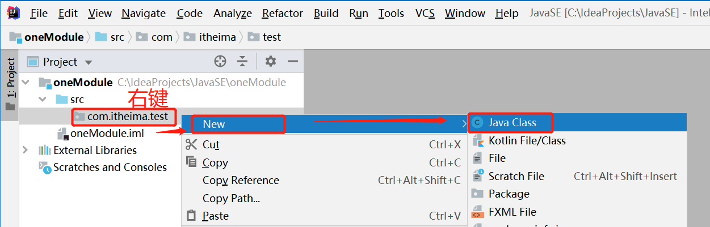

新建类完成后，就可以开始编写代码了.

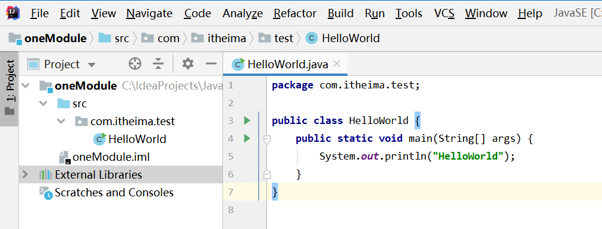

## 编译与运行

Idea在点击运行按钮时会自动编译，并把把字节码生成在项目的out目录下

下图中3个位置都可以直接点击鼠标运行程序。如下图

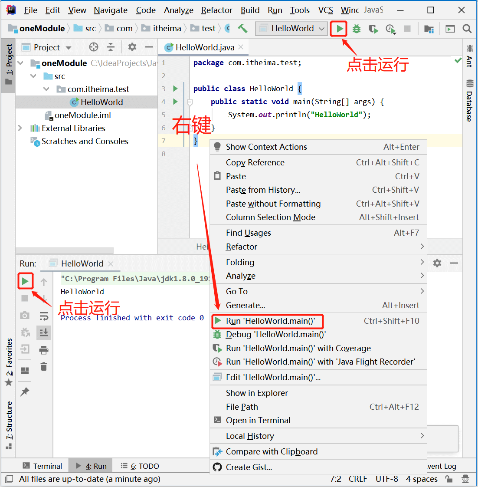

