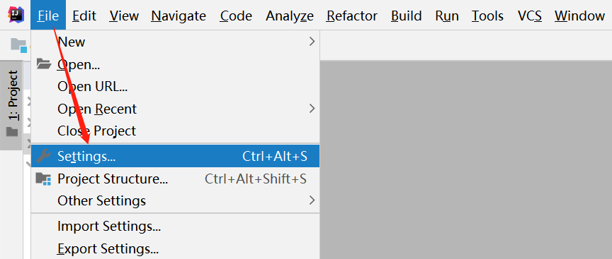
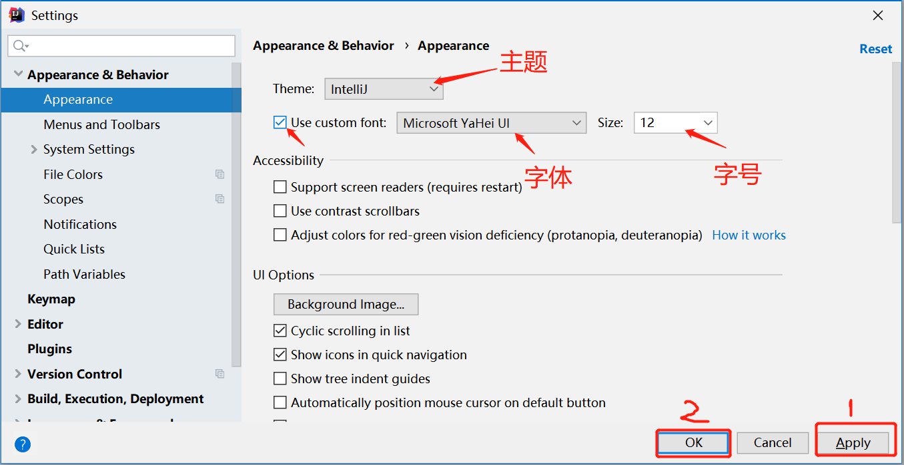
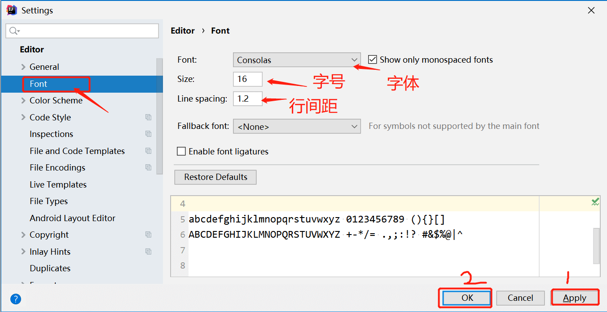
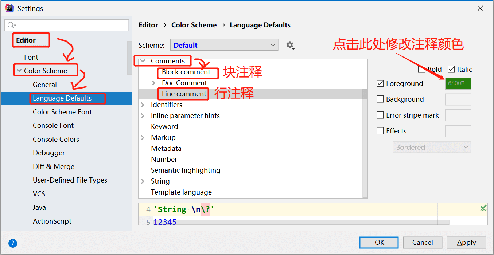
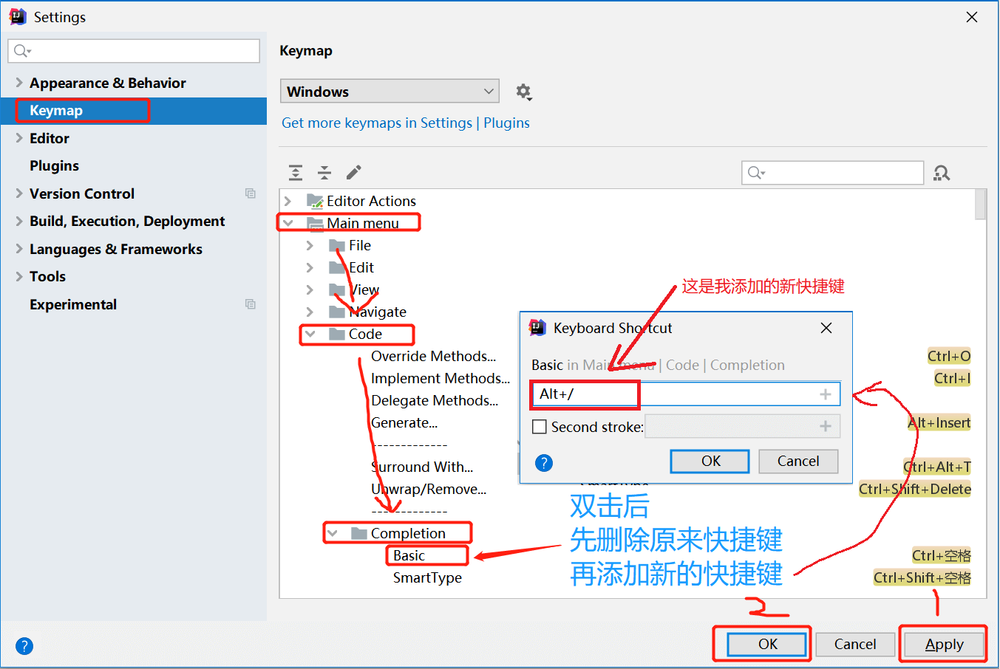

# 7.IDEA基本配置

刚刚打开IDEA的时候字体很小，接下来我们来演示一下设置代码的字体和大小。有关IDEA所有的设置，都是在【File】【Setting】下进行。

## 设置UI界面字体

## 设置代码字体

在设置界面找到【Editor】【Font】按照下图设置字体和字号。建议字体选择Consolas

## 设置注释颜色

默认的注释颜色是灰色，看起来不是很显眼。按照下图所示，修改注释颜色

## 设置快捷键

如果你的快捷键和其他软件的快捷键冲突，你可以安装下面的方式来修改快捷键。

