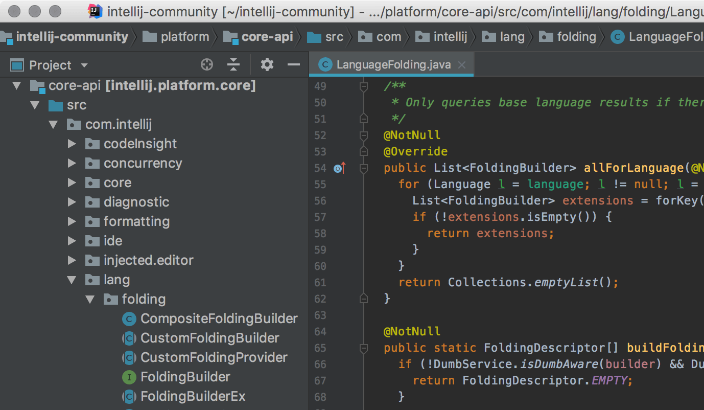

# 第2章 IDE集成开发工具

Intellij IDEA是JetBrains公司的一款java语言集成开发环境。IntelliJ IDEA在业界被公认为最好的java开发工具之一。它的旗舰版(Ultimate)本还支持HTML，CSS，PHP，MySQL，Python等。免费版(Community)只支持Java等少数语言。

Google有一款开发工具Android Studio就是基于IDEA的社区版(Community)进行定制的，专门用来开发Android应用。如果你是开发Android应用，就直接去Google官网下载Android Studio吧。如果你是做JavaEE项目开发，需要用到旗舰版(Ultimate)。

相对于记事本编写代码，IDEA的优点太多了

 - [x] 代码自动编译，点鼠标就能运行
 - [x] 记不住单词不要紧，有代码提示功能
 - [x] 有丰富的快捷键辅助完成代码编写
 - [x] 代码重构
 - [x] 规范性的代码能够自动完成
 - [x] 支持各种扩展插件

