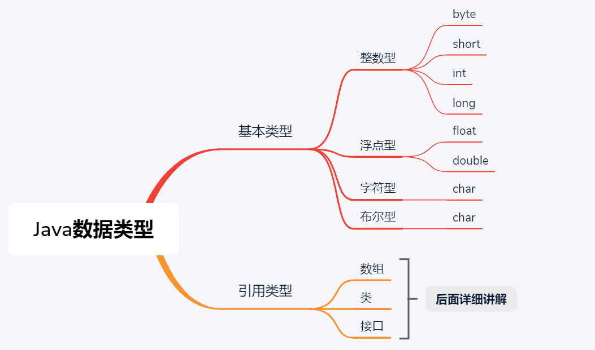

# 4.数据类型(DataType)
Java是一种强类型的语言，每一个数据都有严格的数据类型标识。接下来我们学习一下Java的数据类型。

## 数据类型分类
数据类型分为基本数据类型和引用数据类型，每一种数据类型都用不同的关键字标识。这里大家需要记住这些关键字以及它所表示的数据类型，因为你写代码会用到。

现阶段我我只学习基本数据类型，每一种基本类型的数据在内存中占用的空间不一样，取值范围也不一样。

每一种数据类型占用的字节数和取值范围如下。我们并不用去记忆每一种数据类型的取值范围，我们只需要记住每一种基本数据类型占用的字节数就可以了。

|数据类型|字节数|取值范围|
|---|---|---|
|byte | 1个字节|-128~127|
|short |2个字节|-32768~32767|
|int|   4个字节|-2^31~2^31-1|
|long | 8个字节|-2^63~2^63-1|
|float| 4个字节|1.4E-45~3.4028235E38|
|double|  8个字节|4.9E-324~1.7976931348623157E308|
|char | 2个字节|0~65535|
|boolean| 1个字节|true或false|

数据类型起到的作用，其实是限定一个数据的取值范围，在早期计算机内存较小的时候，选择合适的数据类型，能够有效的节省内存空间，但是当今的计算机内存都比较大，生活中常见的数据基本都是在int范围类，所以写程序如果没有明确指定整数用什么类型，用int类型就可以了。