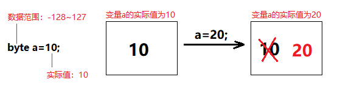

# 5.变量（Variable）
变量从字面上理解就是可以发生改变的量。变量的本质其实是内存中的一小片内存空间，用来存储一个数据，而这个空间的的数据可以在**一定范围**内发生改变（这里所说的一定范围，就是数据类型）



## 变量定义和使用

> 格式

```java
//单独定义变量
数据类型 变量名;
//定义变量并赋值
数据类型 变量名=初始值;
```
> 定义变量并使用

```java
public static VariableDemo1{
    public static void main(String[] args){
        //单独定义变量
        int a; 
        a=10; //给变量a赋值为10
        System.out.println("a的值："+a);
        a=20; //修改变量a的值为20
        System.out.println("a的值："+a);

        //定义变量并赋值
        int b=10;
        System.out.println("b的值："+b);
        b=20; //修改变量b的值为20
        System.out.println("b的值："+b);
    }
}
```
## 变量的细节问题

> 变量的初始值

变量没有赋值，不能够直接使用

```java
public class VariableDemo2{
    public static void main(String[] args){
        //指定定义了变量，没有赋值
        int a; 
        //没有赋值的变量，不能直接使用
        System.out.println(a); //编译报错
    }
}
```

> 变量的作用域

作用域指的是变量所在的`{}`范围内，一个变量定义在哪个`{}`范围内，就只能在哪个范围内有效。看如下代码
```java
public class VariableDemo3{
    public static void main(String[] args){
        //变量a的作用域为 第3行~13行
        int a=10;
        {
            //变量b的作用域为 第5行~9行
            int b=20;
            System.out.println(b); //正确
        }
        System.out.println(a); //正确
        //这里超过了变量b定义的{}范围
        System.out.println(b); //编译报错
    }
}
```

> 同一行定义多个变量

可以在一行定义多个相同类型的变量，代码如下
```java
public class VariableDemo4{
    public static void main(String[] args){
        //a和b都是int类型，值分别为3和4
        int a=3,b=4;
        System.out.println(a);
        System.out.println(b);
    }
}
```