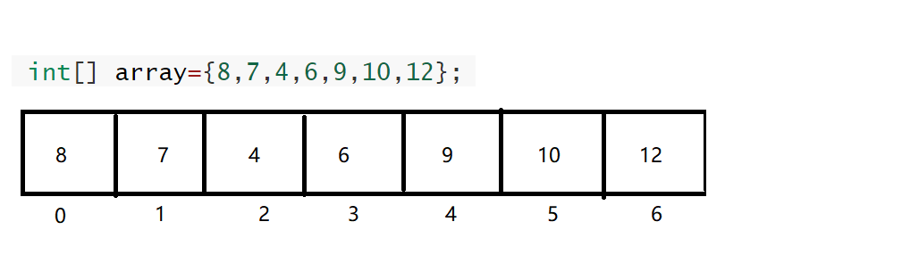
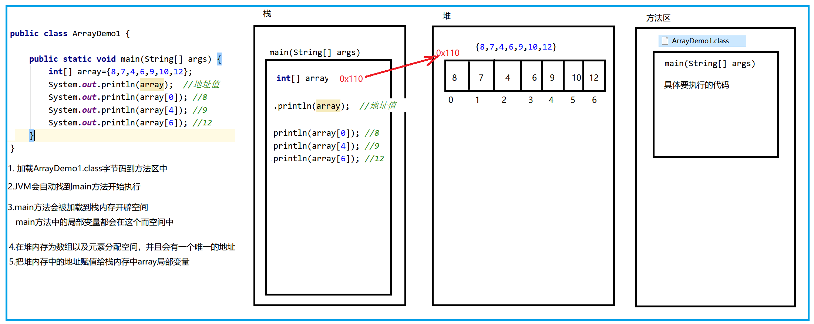
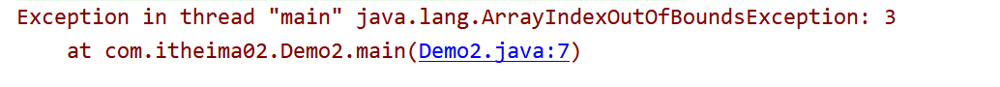
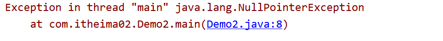

## 数组的概念

数组是用来存储多个数据的容器，有下面几个特点。

```java
- 元素类型是一致的
- 长度是不可变的
```

如下图中，一包烟是一个数组，一篮子鸡蛋一个数组，一间教室也是一个数组。


## 数组的格式

```java
//格式1：数据类型[]  数组名 = new 数据类型[长度];
int[] arrayA=new int[3];

//格式2：数据类型[]  数组名 = new 数据类型[]{元素1,元素2,元素....};
int[] arrayB=new int[]{10,20,30};

//格式3：数据类型[]  数组名 = {元素1,元素2,元素....};
int[] arrayC={10,20,30};
```

<font color='red'>注意Java中定义数组也沿用的C语言的格式，但是不推荐能看懂就行</font>

```java
int arrayA[]=new int[3];
int arrayB[]=new int[]{10,20,30};
int arrayC[]={10,20,30};
```


## 数组的元素访问

在数组中每一个元素都有一个索引与之对应，这个索引其实就是一个从0开始的整数



```java
int[] array={8,7,4,6,9,10,12};
System.out.pritnln(array);  //地址值
System.out.println(array[0]); //8
System.out.println(array[4]); //9
System.out.println(array[6]); //12
```


## 数组的内存图

Java把内存分为栈、堆、方法区主要的三个区域

```java
栈：存储局部变量(定义在方法中的变量)
堆：存储new出来的数据(数组就是new出来的)
方法区：存储字节码相关信息(编译后生成的class文件)
```



## 数组的常见问题

### 数组索引越界

数组的索引最小值是0，最大值是长度-1，超过这个范围就会越界。



```java
异常的含义：
	在Demo2.java的第7行出现了数组索引越界的错误
	7索引越界了
```

### 空指针异常

当一个数组的名称赋值为null时，而去访问他的元素或者长度



```java
异常的含义：
	在Demo2.java的第8行出现了空指针异常
```

## 数组的常见操作

### 数组的遍历

遍历就是把数组中的元素一个一个的获取出来

```java
int[] array={10,20,30,40};
//array.length: 数组的长度
for(int i=0;i<array.length;i++){
    System.out.println(array[i]);
}

遍历数组的快捷键：数组名.fori  自动完成数组变量的for循环
```

### 数组元素求和

```java
/*
1.定义一个求和变量sum
2.遍历所有需要求和的数据
3.把需要求和的数据和sum累加
*/
int[] array={10,20,30,40};

int sum=0;
for(int i=0;i<array.length;i++){
    sum+=array[i];  
}
System.out.println("所有元素的和为："+sum);
```


### 数组求最值

```java
/*
打擂台的思路：
	1.把数组中0索引元素假设为最大值max(有一个人擂台)
	2.遍历其他元素和max进行比较(其他人和擂主比武)
		如果其他元素>max，就把其他元素赋值给max(擂主换人)
	3.循环结束之后，最终max就是最大值(最终的擂主)
*/
int[] array={8,20,7,29};
//把数组中0索引元素假设为最大值max(有一个人擂台)
int max=array[0];
//遍历其他元素和max进行比较(其他人和擂主比武)
for(int i=1;j<array.length;i++){
    //如果其他元素>max，就把其他元素赋值给max(擂主换人)
    if(array[i]>max){
        max=array[i];
    }
}
System.out.println("数组中元素的最大值为："+max); 
```


