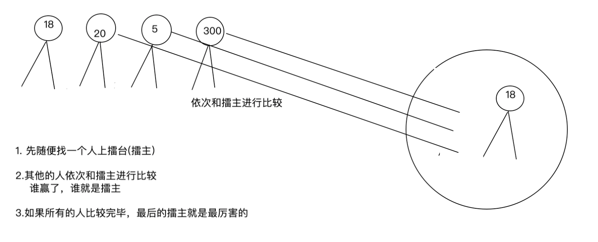
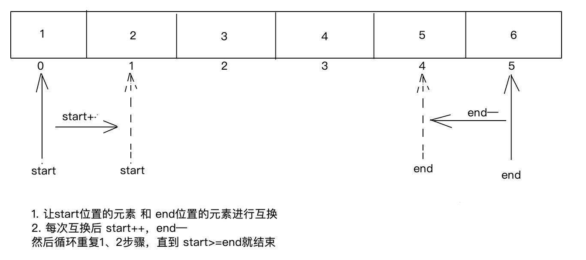

# 数组练习

学习完了数组的基本格式以及元素访问之后这些语法内容之后，更重要的是运用数组来解决一些具体问题。

我们通过下面几个案例，把前面学习的流程控制语句也巩固一下。

## 按格式遍历数组

```java
/*
需求：定义一个int类型的数组，按要求打印输出元素。如：[1,2,3,4,5]
*/
public class ArrayTest1{
  public static void main(String[] args){
    int[] array={1,2,3,4,5};
    //先无条件打印一个“[”,不用换行
    System.out.print("[]");
    for(int i=0;i<array.length;i++){
      if(i!=array.length-1){
        System.out.print(array[i]+" ");
      }else{
        System.out.println(array[i]+"]");
      }
    }
  }
}
```

## 数组元素求和

之前给大家讲过，求和问题的思路都是一样的，我们把求和问题的思路在复习一遍

```java
- 1.定义一个计数器（使用一个变量表示）
- 2.循环判断每一个数据，在满足需求的条件下计数器累加
- 3.循环结束之后，计数器的值就是个数
```

```java
public class ArrayDemo1 {
    public static void main(String[] args) {
      	//预先准备好一个数组
        int[] array={11,22,33,44,55,66};
      
        //定义求和变量
        int sum=0;
      	//循环遍历所有需要求和的数据(数组中的元素)
        for (int i = 0; i < array.length; i++) {
          	//让元素和sum累加
            sum+=array[i];
        }
        System.out.println("元素的和为："+sum);
    }
}
```

## 数组求最值

求最值的问题，可以参考打擂台的场景，如下图



```java
求最大值思路：
- 1.假设数组中的第一个元素为最大值max(擂主)
- 2.遍历后面的每一个元素和max比较，把较大的元素值重新赋值给max(擂主换人)
- 3.循环结束，max就是所有元素的最大值(最后站在台上的擂主)
```

```java
public class ArrayDemo2{
    public static void main(String[] args){
        int[] array={20,30,100,90,80,50};
        //假设数组中的第一个元素为最大值max
        int max=array[0];
        // 遍历后面的每一个元素和max比较,把比max大的值赋值给max
        for(int i=1;i<array.length;i++){
            if(array[i]>max){
                max=array[i];
            }
        }
        System.out.println("最大值为："+max);
    }
}
```

## 数组元素反转

把一个数组中的元素反转，做法有很多种；这里给大家介绍一种比较好理解的做法，为了方便大家理解还是用图形的方式来讲解。



```java
public class ArrayDemo3 {
    public static void main(String[] args) {
       int[] array={1,2,3,4,5,6};

       //使用for循环的方式，对元素进行收尾互换
       for(int start=0,end=array.length-1;start<=end;start++,end--){
           //让array[start]和array[end]互换位置
           int temp=array[start];
           array[start]=array[end];
           array[end]=temp;
       }

        //输出数组中的元素
        for (int i = 0; i < array.length; i++) {
            System.out.println(array[i]);
        }
    }
}
```

## 数组元素查找

数组元素查找也是一种比较常见的操作，就是从数组中查找某个元素第一次出现的索引（如果有重复元素，只需要查找第一个即可）

讲这道题的目的不仅仅只局限于这一道题的结果，主要是想让大家知道这类查找问题的思路是怎样？大家把重点放在思路上面，以后遇到同类型的问题能到联想到这里的解决方案。

如：注册用户名，需要先查找用户名是否存在（找到了就存在，找不到就不存在）

```java
public class ArrayDemo4 {
    public static void main(String[] args) {
        //数组中预先存储了一些人名
        String[] array={"马云","马化腾","马克斯","马尔扎哈"};
      	
      	//键盘录入一个姓名，查询在数组中是否存在
      	Scanner sc=new Scanner(System.in);
      	String name=sc.nextLine();
      
      	//先定义一个变量index初始值为-1，人为规定-1表示没有找到查找的元素
        int index=-1;
        for (int i = 0; i < array.length; i++) {
          	//如果找到元素
            if(array[i].equals(name)){
               //把元素的索引赋值给index，原来index的值-1就被更改为具体的索引了。
               index=i;
               break;//跳出循环
            }
        }
				//根据index是否等于-1来判断元素是否存在
        if(index==-1){
            System.out.println(name+"元素不存在");
        }else{
            System.out.println(name+"元素的索引为："+index);
        }
    }
}
```

