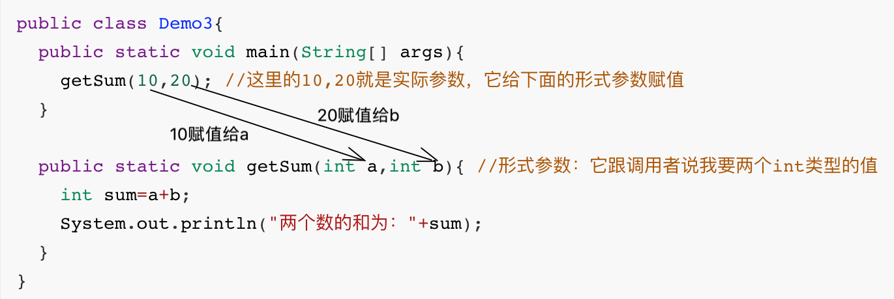
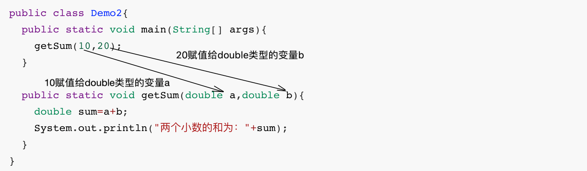

# 2.方法的参数

接下来我们要学习的内容是方法的参数，给方法加上参数，可以让方法调用更加灵活。

首先我们要搞清楚两个概念**，形式参数和实际参数**

```java
- 形式参数：定义方法时（）中的参数
- 实际参数：调用方法时（）中的参数

【关系：实际参数和形式参数是一个萝卜一个坑的关系】
	实际参数：萝卜
	形式参数：萝卜坑
```


通过下面的案例来演示，主要大家要区分出**形式参数和实际参数的区别**



**注意下面几个问题**

```java
- 1.形式参数有几个，实际参数必须有几个（不能多也不能少）
- 2.形式参数是什么类型，实际参数就必须是什么类型
- 3.实际参数的数据范围可以比形式参数小，但是不能比形式参数大。
  如：形参double,实参double也可以是int
```




