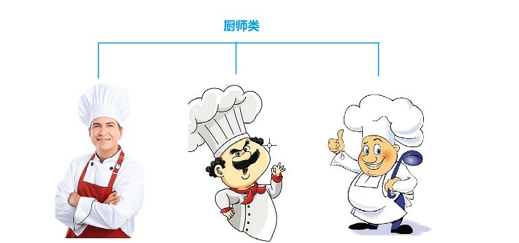
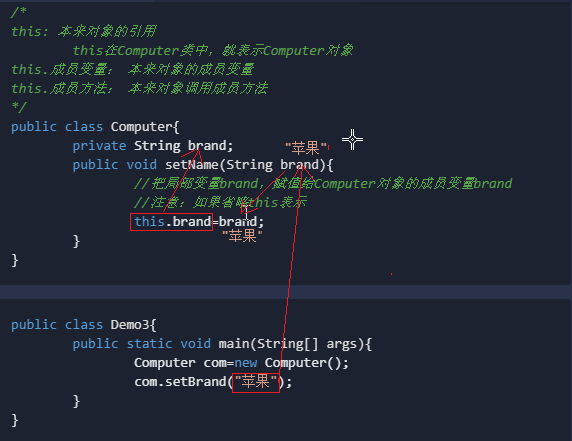
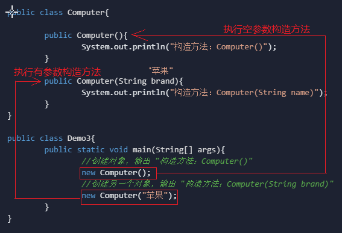

# 1.类与对象

## 类与对象

我们知道面向对象思想之后，接下来就要把这种面向对象的思想用Java语言的表达出来，怎么表达呢？

比如说我想吃饭，可以找厨师做饭，那“厨师”这个现实生活中的事物如何用Java代码来表达出来呢？要实现这个目的，咱们要引入一个重要的概念 —— 类与对象

咱们先不去想类和对象到底是什么意思？我先卖一个关子，给大家提一个问题，谁来描述一下你心目中的厨师长什么样？具备什么技能？ 没猜错的话大家脑海中厨师的画面大概就是下面的样子。从图片我们发现，不管是卡通形象的厨师，还是真实形象的厨师，他们都有一些共同的属性和行为，如都穿白大褂、戴高帽子、都会做饭。我们就把符合这些相同属性和行为的事物归为一类——**厨师类**；而每一个符合这些属性和行为的个体称为**厨师对象**




再比如，下图中有一个苹果电脑、5768元，有一个华为电脑、5288元。不管是**苹果电脑**还是**华为电脑**，都有品牌和价格2个属性，那么它们也可以归为一个类——**电脑类**；而每一个具体的电脑个体就是**电脑对象**


综上所述

- 类是对具有相同属性和行为的事物的统称
- 对象是某一类事物的具体实例


## 定义类

虽然我们知道类和对象的关系了，那么类用Java代码怎么来写一个类呢？先给大家写一个格式

```java
//类名：表示你要描述的事物(如电脑)
public class 类名{
	成员变量 //表示该事物具备的属性(如电脑有品牌、价格、颜色等)
	成员方法 //表示事物具备的行为(如电脑能打游戏、看电影等)
}
注意：类名、变量名、方法名都需要见名知意，比如我想定义一个【电脑类】我可以取类名为
【Computer】
```

然后我们还要想一想电脑有那些属性和行为，我们用代码来演示一下

```java
/*
电脑类的属性和行为
    属性：品牌(brand)、价格(price)、颜色(color)
    行为：玩游戏(playGame)
*/
public class Computer{
	String brand; //品牌
	int price; //价格
	String color; //颜色

	//玩游戏
	public void playGame(){
		System.out.println("玩游戏");
	}

	//看电影
	public void watchMovie(){
		System.out.println("看电影");
	}
}
```

## 创建对象 

Computer类定义好了之后，我们还不能够直接运行，因为还没有创建Computer对象（相当于我们设计好了图纸，还没有生产出商品来）。于是我们需要再写一个测试类，创建电脑对象，才能使用它。

 怎么创建电脑对象呢？也有固定的格式。

```java
//创建对象的格式：类名 对象名=new 类名();
Computer com=new Computer();
//使用对象的属性：对象名.属性名
com.brand; //对象的品牌
//调用对象的行为：对象名.方法名();
com.watchMovie(); //对象的看电影功能

小技巧：这里的"."你可以理解为汉语中的“的”。
```

```java
public class Demo1{
	public static void main(String[] args){
		//创建一个电脑对象
		Computer com1=new Computer();
		//给电脑贴上logo，标上价格
		com1.brand="苹果";
		com1.price=5768;
		System.out.println("品牌："+com1.brand);
		System.out.println("价格："+com1.price);
		//使用苹果电脑玩游戏的功能
		com1.playGame();

		System.out.println("-------------");

		//创建另一个电脑对象
		Computer com2=new Computer();
		//给另一台电脑贴上logo，标上价格
		com2.brand="华为";
		com2.price=5288;
		System.out.println("品牌："+com2.brand);
		System.out.println("价格："+com2.price);
		//用华为电脑玩游戏的功能
		com2.playGame();
	}
}
```


## Java封装性概述

我们现在会定义一个类了，也会创建对象了，但是这个代码并不是很完美，我给大家演示一个在生活中不可思议的效果。改动一下代码

```java
com1.price=-5768;
```

一运行，我们发现神奇的效果出来了，苹果电脑的价格是负数，也就是说到倒贴钱把电脑送给你了，这怎么得了！如果我是电脑经销商绝对不允许这样的事情出现，砸了也不卖，我必须阻止别人随意的去更改电脑的价格，即使要修改也得经过我的授权。这里提到授权这个词，也就是授予你什么权利，你才能干什么事情。


Java的封装性就是通过这种授权的方式来实现的。所谓封装就是把不需要让别人知道的细节隐藏，只公开一些固定的访问方式即可。

给大家举一个生活中的例子，帮助大家理解


你用的笔记本电脑，厂家在生产电脑时，把内部的细节用一个壳子包裹起来，你是不能够直接看到里面的东西的，但是这个壳子并没有封死，它还给我们提供了键盘、鼠标、USB接口等通用的方式与电脑进行交互。

厂家为了电脑的安全，把不需要让你知道的内部细节隐藏起来，就是一种封装。完全封死了也不行，那就是一个铁疙瘩，还需要提供公共的访问方式，键盘、鼠标、USB接口等就是给使用者提供的操作电脑的方式

类似这样封装的例子还有很多，大家可以放开脑洞想想，只要把握住两点就可以了。

```
1. 把不需要让别人知道的内部细节隐藏
2. 对外提供公共的访问方式
待会我们去写代码完成Java代码的封装，也就是这两步。
```

## Java封装性实现

前面我们讲到，实现Java的封装就两个步骤

```
1. 把不需要让别人知道的内部细节隐藏
2. 对外提供公共的访问方式
```

**怎样隐藏内部细节呢？**

使用private关键字私(私有的意思)，我们可以把成员变量都用private修饰，private修饰的成员变量或者成员方法，只能在本来中被调用，我们试一下。

```java
public class Computer{
	private String brand;
	private String color;
	private int price;
}
public class Demo1{
	public static void main(String[] args){
		Computer com=new Computer();
		//下面代码报错：Computer的成员变量被private修饰，只能在本来中被调用。
		com.name="苹果";
		com.color="白色";
		com.price=5768;
	}
}
```

私有的变量不能直接被外界调用，相当于被封装起来了；还需要给外界提供公共的访问方式，其他类才能够使用。

**怎样提供公共的访问方式呢？很简单，照做就可以了**

```
快捷键：alt+insert或者fn+alt+insert 自动生成getXxx和setXxx方法
```

```java
public class Computer{
	private String brand;
	private String color;
	private int price;
	
	//给成员变量brand设置值
	public void setBrand(String brand){
		this.brand=brand;
	}
	//获取成员变量brand的值
	public String getBrand(){
		return brand;
	}
	...其他的两个属性，也需要有对应的setXxx和getXxx方法，此处省略...
}
```

setXxx()和getXxx()是一种固定的写法，setXxx()是用于给成员变量设置值的方法，getXxx()是用于获取成员变量的值的方法；调用者使用公开的getXxx和setXxx方法，去访问封装好的数据即可。

```java
public class Demo2{
	public static void main(String[] args){
		Computer com=new Computer();
		//给电脑设置品牌
		com.setBrand("苹果");
		//给电脑设置颜色
		com.setColor("白色");
		//给电脑设置价格
		com.setPrice(5788);

		//获取电脑的品牌,用brand变量保存（变量名可以改）
		String brand=com.getBrand();
		//获取电脑的颜色,用color变量保存（变量名可以改）
		String color=com.getColor();
		//获取电脑的价格,用price变量保存（变量名可以改）
		String price=com.getPrice();
	}
}
```

## this关键字

我们发现在getXxx和setXxx方法中，有一个this关键字，这是什么意思呢？

```
this: 本类对象的引用
	this在Computer类中，就表示Computer对象
this.成员变量： 本类对象的成员变量
this.成员方法： 本类对象调用成员方法

一般用于在同一个类中，区分成员变量和局部变量重名的情况
```

我们以setBrand(String brand)为例进行讲解，其他都是一样的，看下图



## 构造方法

同学们，我们现在学习了在一个类中可以定义成员变量、成员方法。其实一个标准类的组成除了成员变量、成员方法还有构造方法，接下来咱们学习一下构造方法。

学习构造方法掌握下面几个要点即可

**1. 构造方法的格式**
	

```java
public 类名(){

}
```

**2. 构造方法是干什么用的？**

```
构造方法是用来创建对象的，每次创建对象构造方法就会执行。
```

**3. 可以有多个构造方法**

```
一个类可以定义多个参数不一样的构造方法，也就是说有多种创建对象的方式
```

接下来咱么来做一个试验，代码执行流程如下



我们发现，每次new对象，会根据参数的不同，来执行对应的构造方法。

**注意事项**

```
如果在一个类中，一个构造方法都不写，系统将会默认送你一个空参数的构造方法(方便你创建对象)
```

