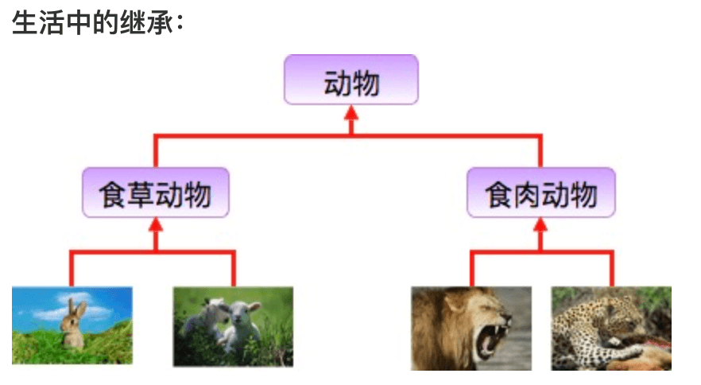
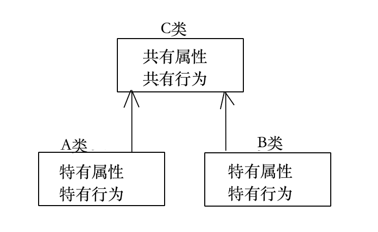

# 3. 继承和抽象

接下来我们学习继承，我们从下面的这张图来入手给大家讲解。



从上图中我们会发现，动物和兔子都是食草动物，我们就可以把吃草的动物归为一类叫做；狮子和豹子都是食肉动物，也可以把吃肉的动物归为一类；而不管食草动物还是吃肉动物，都可以归为动物类。动物学家通过对动物进行分类，方便人类学习和研究动物的习性和特征。


Java中的继承能够让类与类之间产生关系，提高代码的复用性。如果A类和B类有一些共性的属性和行为，就可以把这些共性的属性和行为抽取到一个C类中，让A继承C，B也继承C，这样A类和B类就具备了C类的属性和行为，同时A类和B类还可以有自己特有的属性和行为。



## Animal类

描述动物类共性的行为和属性

```java
//抽象类Animal
public abstract class Animal{
	//成员变量表示属性
	private String variety;//品种
	private String color;//颜色
	private int age;//年龄
	//空参数构造方法
	public Animal(){}
	//有参数构造方法
	public Animal(String variety,String color,int age){
		this.variety=variety;
		this.color=color;
		this.age=age;
	}
	//呼吸：我把呼吸定义成一个具体方法(ps:为了告诉你抽象类中可以有具体方法)
	public void breath(){
		System.out.println("所有动物都会呼吸");
	}
}
```

## 定义Dog类

Dog类 `extends` Animal类，共性的属性和行为Dog类中就不用写了。

```java
//Dog 继承 Animal，必须复写Animal的抽象方法
public class Dog extends Animal{
	//Dog虽然继承Animal，但是创建Dog对象还是得看Dog的构造方法
	public Dog(){}
	//有参数构造方法
	public Dog(String variety,String color,int age){
		super(variety,color,age); //访问父类构造，给成员变量赋值
	}

	@Override
	public void eat(){
		System.out.println("狗吃骨头");
	}
}
```

## 定义Cat类

Cat类 `extends` Animal类，共性的属性和行为Dog类中就不用写了。

```java
//Cat 继承 Animal，必须复写Animal的抽象方法
public class Cat extends Animal{
	//Cat 虽然继承Animal，但是创建Cat 对象还是得看Cat 的构造方法
	public Cat (){}
	//有参数构造方法
	public Cat (String variety,String color,int age){
		super(variety,color,age); //访问父类构造，给成员变量赋值
	}

	@Override
	public void eat(){
		System.out.println("猫吃小鱼");
	}
}
```

## 测试类

程序的入口仅用于创建对象调用方法

```java
public class Demo2{
	public static void main(String[] args){
		//利用空参数构造创建Dog对象
		Dog dog=new Dog();
		dog.setVariety("哈士奇");//给dog对象设置品种为"哈士奇"
		dog.setColor("黑白");//给dog对象设置颜色为"黑白"
		dog.setAge(2);//给dog对象设置年龄为2岁
		//调用get方法获取dog对象的属性值
		System.out.println(dog.getVaritey()+"..."+dog.getColor()+"..."+dog.getAge());
		System.out.println("----------------------");
		//利用有参数构造创建对象，并赋值
		Cat cat=new Cat("布偶猫","白色",3);
		//如果想显示dog对象的的属性值，就调用get方法并输出
		//调用get方法获取cat对象的属性值
		System.out.println(cat.getVaritey()+"..."+cat.getColor()+"..."+cat.getAge());
	}
}

```