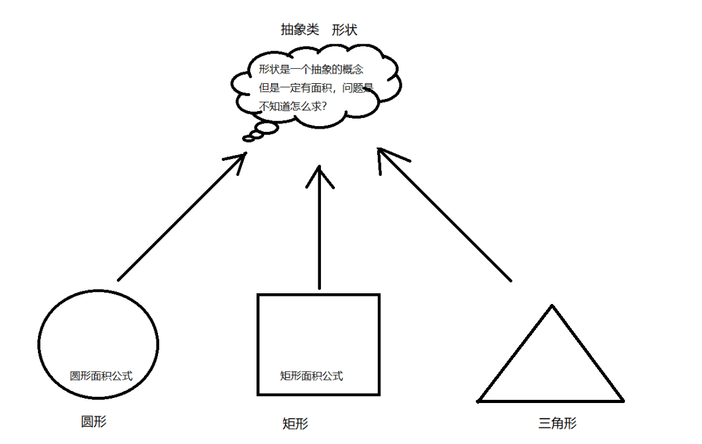

# 4.抽象

接下来我们学习一下抽象，抽象这个词不太好解释，我们用一个例子给大家解释，还是看图吧。



在这张图中圆形、矩形、和三角形就是一个具体的概念，而形状就是一个抽象的概念。我们可以把形状看做是一个抽象类，形状一定能求面积，但是由于不具体所有求面积的方法也无法具体化，那么这个方法就 叫做抽象方法。

而下面的圆形、矩形、和三角形可以看做是形状的子类，这些子类也都有求面积的方法，但是它们就可以具体化了，这就是子类重写父类方法。接下来用代码来演示一下

```java
//抽象类和抽象方法都需要被abstract修身
public abstract class Shap{
    //求形状的面积
    public abstract double getArea();
}

//圆形
public class Circle extends Shap{
    //半径
    private int r;
    //构造方法给成员变量赋值
    public Circle(int r){
        this.r=r;
    }
    
    @Override
    public double getArea(){
        return 3.14*r*r;
    }
}

//圆形
public class Rect extends Shap{
    //宽
    private int width;
    //高
    private int height;
    
    //构造方法给成员变量赋值
    public Rect(int width,height){
        this.width=width;
        this.height=height;
    }
    
    @Override
    public double getArea(){
        return width*height;
    }
}

//测试类
public class Demo1{
    public static void main(String[] args){
        //创建半径为5的圆形
        Circle c=new Circle(5);
        double s1=c.getArea();
        System.out.println("圆形的面积为："+s1);
        
        //创建宽为5，高为10的矩形
        Rect r=new Rect(5,10);
        double s2=r.getArea();
        System.out.println("矩形的面积为："+s2);
    }
}
```

抽象类有下面的几个特点

```java
1.抽象类不能创建对象(也叫实例化)
2.抽象类中可以有抽象方法也可以有非抽象方法
3.一个具体类继承抽象类必须重写所有的抽象方法
4.一个抽象类继承抽象类可以不用重写抽象方法
```

