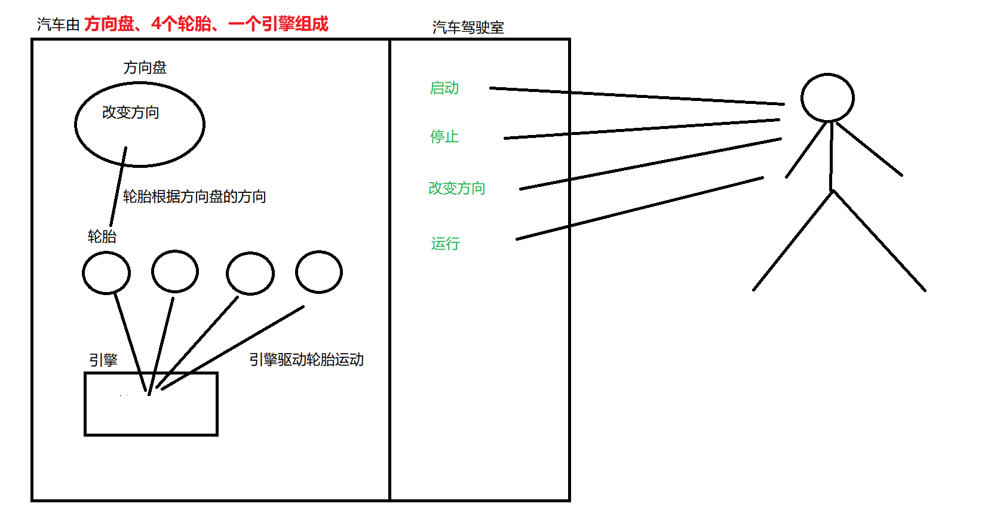

# 7.综合案例

面向对象是一种非常实用的软件开发方法，前面讲到的面向对象的知识点中，相关概念也很多，可能有部分学容易混淆。接下来我们通过一个综合案例来复习一下面向对象中有关类于对象、继承、抽象、接口、多态等知识点的关系。 

**面向对象编程其实就是把同一类事物的属性和方法归纳到合适的类中，然后让各种类的对象互相配合通过沟通完成特定功能**

```java
如1：公司里的员工有不同的职位，不同职位的员工的工作内容不一样，
	的员工他们都有工号、工资等属性，还有工作的行为。
	就是由这些不同职位的员工相互配合维持着公司的正常运转。

如2：一辆汽车是由很多零配件组成的，而每个零配件可以是由不同的厂家生产的，
	每个零配件的功能也都不一样，就是由这些零配件的相互配合才能维持汽车的正常运
	行。

【总上所述：】
	我认为面向对象的编程，也可以换一个说话叫"物件导向"，就是根据你的需求，
	分析中需求中有哪些"物件"，采用合适的方式组织这些"物件"使其更工作配合加合
	理。而这里的"物件"指的就是对象。
```


## 案例需求

采用面向对象的思维设计项目的案例

```java
现在我们准备造一辆汽车，由一个发动机，四个轮子，还有一个方向盘组成。
要求如下：
    1)当司机按住点火开关时，汽车发动机启动；
    2)当司机踩油门时，发动机带动四个轮子驱使往前跑。
    3)当司机打方向盘时，汽车会根据方向盘的方向拐弯形式。
        如：司机向左打方向盘，汽车向左行驶
    4)当司机按住熄火开关时，汽车发动机停止工作，同时汽车停止运行。
```

## 需求分析

```java
按照前面提到的"物件导向"理论，可以把需求中提到的每一个"物件"看做是一个对象。
	四个"轮子"、"发动机"、"方向盘"都是对象，"汽车"本身也是 一个对象。

每一个对象的就对应一个类，类的功能和属性如下
	1)发动机类
		属性：发动机状态
		功能1:启动
		功能2:停止
		功能3:发动机驱动轮子转动
	
	3)方向盘类
		属性：当前方向
		功能：改变当前方向
	
	2)轮子类
		功能：按照方向盘的方向运动
		
	4)汽车类
		功能1：点火，调用方法机启动的方法
		功能2：熄火，调用发动机停止的方法
		功能3：打方向盘，调用方向盘改变当前方向的方法
		功能3: 运行，调用发动机驱动轮子转动的方法

对于司机而言只关注于汽车的四个功能如何使用，对于汽车的内部原理不用知道。
```



## 代码实现

> 方向盘类

```java
public class SteeringWheel {
    //方向盘可能的方向：直行，左，右
    public static final int GOSTRAIGT = 0;
    public static final int LEFT = 1;
    public static final int RIGHT = 2;

    //当前方向,默认直行
    public static int currentDirection=SteeringWheel.GOSTRAIGT;

    //改变方向盘方向
    public void setCurrentDirection(int currentDirection) {
        this.currentDirection = currentDirection;
    }
}
```

> 轮胎类

```java
public class Wheel {
    //轮子根据方向盘方向运行
    public void run(){
        switch (SteeringWheel.currentDirection){
            case SteeringWheel.GOSTRAIGT:
                System.out.println("轮子直线运行");
                break;
            case SteeringWheel.LEFT:
                System.out.println("轮子向左运行");
                break;
            case SteeringWheel.RIGHT:
                System.out.println("轮子向右运行");
                break;
        }
    }
}
```

> 发动机类

```java
public class Engin {
    //发动机状态
    private boolean running;
    //设置发动机状态
    public void setRunning(boolean running) {
        if(running){
            System.out.println("引擎已经启动");
        }else{
            System.out.println("引擎已经停止");
        }
        this.running = running;
    }
    //引擎驱动轮胎运行
    public void driver(ArrayList<Wheel> list){
        if(running){
            for (int i = 0; i < list.size(); i++) {
                Wheel wheel = list.get(i);
                wheel.run();
            }
        }else {
            System.out.println("引擎还未启动，请启动后再运行");
        }
    }
}
```

> 汽车类

```java
public class Car {
    private Engin engin;
    private ArrayList<Wheel> list;
    private SteeringWheel steeringWheel;

    //创建汽车对象时，发动机、轮胎、以及方向都已经初始化好
    public Car() {
        //初始化发动机
        this.engin = new Engin();
        //创建轮子对象,4个轮子放在一个集合中
        this.list=new ArrayList<>();
        list.add(new Wheel());
        list.add(new Wheel());
        list.add(new Wheel());
        list.add(new Wheel());
        //创建方向盘
        steeringWheel=new SteeringWheel();
    }

    //汽车启动
    public void strat(){
        //设置发动机状态为true
        engin.setRunning(true);
    }

    //汽车熄火
    public void stop(){
        //设置发动机状态为false
        engin.setRunning(false);
    }

    //汽车运行(这是四驱车)
    public void run(){
        //引擎驱动四个轮子运行
        engin.driver(list);
    }

    //改变方向
    public void changeDirection(int direction){
        steeringWheel.setCurrentDirection(direction);
    }
}
```

> 测试类

对于司机而言只关注汽车暴露给外界的功能（启动、停止、运行、改变方向），汽车的内部原理不知道也能开。

```java
public class Demo {
    public static void main(String[] args) {
        //创建汽车
        Car car=new Car();
        //启动引擎
        car.strat();
        car.changeDirection(SteeringWheel.GOSTRAIGT);
        //踩油门
        car.run();

        System.out.println("---------");
        //改变方向
        car.changeDirection(SteeringWheel.LEFT);
        car.run();

        //停止引擎
        car.stop();
    }
}
```


