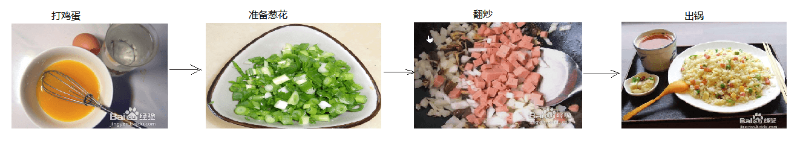

# 第7章 面向对象

同学们，今天我们学习的内容叫做面向对象。学习面向对象会涉及到很多专有的名词，比如类与对象、继承、抽象、接口、多态、封装等等，很多人在学习时过于关注这些名词的概念，会觉得概念很多很绕，就说面向对象很难，其实不是这样的，那是你没有掌握学习方法，我们在学习面向对象的时候，我会尽量的用一些形象话的贴近生活的例子去理解，如果你把这些生活案例理解了面向对象的学习就没什么问题。

## 面向对象思想

首先我们来了解一下什么是面向对象思想？这里说的思想，你可以理解为解决问题的方式。比如说我想吃蛋炒饭，这是我的目的，为了实现这个目的，我们有不同的解决问题的方式。

如果我是一个勤快的人，自己动手做蛋炒饭，你需要先打鸡蛋——准备葱花——放油——在锅里翻炒——最后出锅，一碗香喷喷的蛋炒饭就做好了。以上做蛋炒饭的过程就是一种面向过程的思想，关注点在做事情的过程，中间的每一个环节都必须清清楚楚才能把事情做好。




如果你根本不会做饭，也想吃蛋炒饭怎么办呢？看下面这张图，很熟悉吧！我们可以找一个小摊，跟师傅说来一碗蛋炒饭，等一小会蛋炒饭就做好了。像这种让别人帮你做事情的思想就是一种面向对象的思想，这里的厨师就是对象，它具备帮你炒饭的能力，当你想吃饭的时候找这个厨师对象就可以了。


假设用以上两种方式做的蛋炒饭味道都是一样的，那么那种方式更简单一些呢？答案肯定是第二种。我们会发现面向对象的思想有下面几个特点

```java
- 1.面向对象让复杂的问题简单化了
- 2.面向对象把我们从执行者变为指挥者
- 3.面向对象可以把细节的过程隐藏
```

其实生活中符合面向对象思想的例子无处不在，同学们可以放开你的脑洞想一想，你可以说：”xxx是一个对象，它具备xxx功能，当我们想做什么事情的的时候，就这个对象帮我们做事情”。