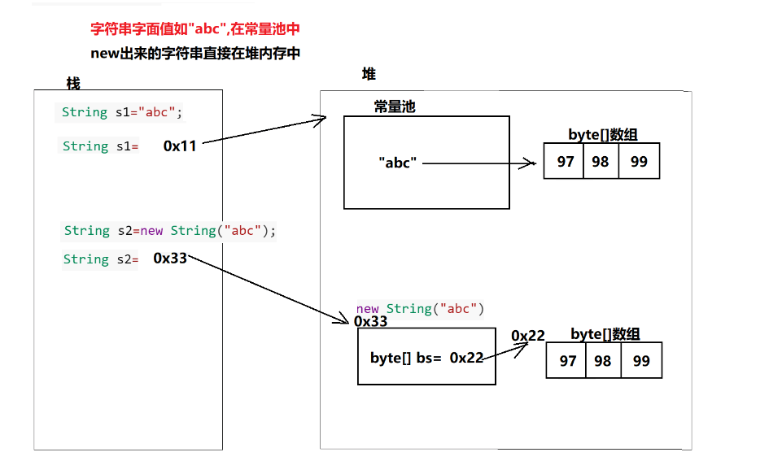

# String类概述
**String** 表示字符串，所有的字符串字面值都是常量（如`"abc"`,`"hello"`），也是字符串的对象。
## 字符串对象有两种形式
` String s1="abc"` 这就是一个字符串对象
`String s2=new String("abc") `这也是一个字符串对象

两种创建对象的区别，少废话看图


```java
String s1="abc";//s1变量，存储的是"abc"在常量池中的地址值
String s2=new String("abc");//s2变量，存储的是new String("abc")在堆内存中的地址值
```

## String的构造方法

String提供了多种创建对象的方式，举例如下

```java
//创建一个空的String对象，等价于""
String s1=new String();
//创建一个String对象，值为"abc"
String s2=new String("abc");
//创建一个String对象，值为"abc"。
byte[] bs={97,98,99}
String s3=new String(bs);
//创建一个String对象，值为"abcdefg"
char[] chs={'a','b','c'，'d','e','f','g'};
String s4=new String(chs);
//创建一个String对象，值为"bcdef"
String s5=new String(chs,1,6);
```

## String的常用方法

对于字符串的操作有很多，如获取字符串的长度、判断字符串以什么开头、判断字符串是否包含子串等等。

### 获取功能

```java
public int length()  
    获取字符串的长度
public char charAt(int index)  
    获取字符串中指定位置的字符
public String substring(int start,int end)
    截取字符串中从start开始，到end结束的子字符串
public String substring(int start)
    截取字符串中从start开始，到末尾的子字符串
public int indexOf(String str)
    获取字符串中参数字符串的索引
```

### 替换和分割

```java
public String replaceAll(String regex,String news)  
    使用正则表达式替换字符串
public String[] split(String regex)
    使用正则表达式切割字符串
```

### 转换功能

```java
public char[] toCharArray()
	把字符串转换为字符数组
public String toUpperCase()
    把字符串转换为大写
public String toLowerCase()
    把字符串转换为小写
```

### 判断功能

```java
public boolean equals(Object s)
    比较字符串的内容是否相等
public boolean equalsIgnoreCase(String s)
    比较字符串的内容是否相等,忽略大小写的
public boolean startsWith(String str)
    判断字符串以什么开头
public boolean endsWith(String str)
    判断字符串以什么结束
```

### 其他功能

```java
public String trim()
    去掉字符串的前面和后面的空白
public int compareTo(String str)
    按照字典顺序判断两个字符串谁在前谁在后。根据几个正数，负数和0进行判断
        返回正数：此字符串在参数字符串后面
        返回负数：此字符串在参数字符串前面
        返回0：和参数字符串相等
举例看下面代码
public class Demo{
    public static void main(String[] args){
    	//trim()方法演示：去掉前后空白
		String str="  hello world  "
		String newStr=str.trim();//去掉前后空白
		System.out.println(newStr);//hello world

		//compareTo方法演示：比较字符串字典顺序
		String s1="abc";
		String s2="bbc";
		int num=s1.compareTo(s2);//比较字符串字典顺序
		System.out.println(num);//结果为-1，表示按照字段顺序"abc"在"bbc"之前
    }
}
```


## String相关练习题 
### 练习1 
```java
/*
*需求：计算字符串中大写字母、小写字母、数字字符、其他字符出现的次数
*/
public class Test1{
    public static void main(String[] args){
        String str="aabbccddee123";
        int small=0;//小写字母
        int big=0;//大写字母
        int num=0;//数字字符 
        int other=0; //其他字符
        //遍历字符串中的字符
        for(int i=0;i<str.length();i++){
            char ch=str.charAt(i);
            if(ch>='a' && ch<='z'){
                small++;
            }else if(ch>='A'&& ch<='Z){
                big++;
            }else if(ch>='0' && ch<='9'){
                num++;
            }else{
                other++;
            }
        }
        System.out.println("大写字母："+big);
        System.out.println("小写字母："+small);
        System.out.println("数字字符："+num);
        System.out.println("其他字符"+other);
    }
}
```

### 练习2

```java
/*
需求：获取字符串中"java"出现的次数
分析：
1. 使用indexOf查找字符串中"java"第一次出现的索引index
2. 如果index!=-1就表示找到一个"java"，同时计数器自增
3. 使用substring截取从index后面的字符串，继承查找。
4. 直到index==-1,就说明后面没有"java"可以查找了
*/
public class Test2{
    public static void main(String[] args){
        String str="hellworldjavaadsfbjavahhheejavammmjavahegjavahello";
        //计数器
        int count=0;
        int index;//"java"的索引
        while((index=str.indexOf("java"))!=-1){
            count++;
            str=str.substring(index+"java".length());
        }
        System.out.println("java出现的次数为："+count);
    }
}
```

### 练习3

```java
/*
需求： 把字符串中首字母变为大写，其他的变为小写
1. 获取首字母，使用toUpperCase变为大写
2. 获取其他字符，使用toLowerCase变为小写
3. 把步骤1和步骤2，拼接起来即可
*/
public class Test3{
    public static void main(String[] args){
    	String str="hello,welcome To Java";
        //获取首字母,变为大写
        String s1=str.substring(0,1).toUpperCase();
        String s2=str.substring(1).toLowerCase();
        String s=s1+s2;
        //打印结果
        System.out.println(s);
    }
}
```
