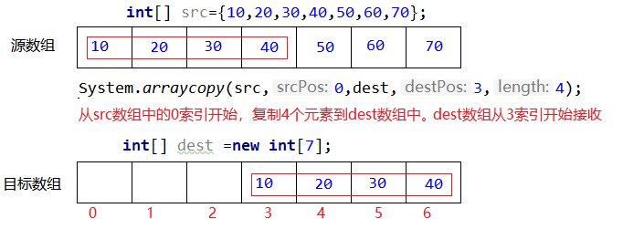

# System类
System表示系统类，提供了一些标准输入、输出的方法。以及获取系统相关属性的方法，复制数组等操作。
​
## 常用方法

```java
public static long currentTimeMillis()
    获取当前的系统时间毫秒值
public static void arraycopy(Object src, int srcPos, Object dest, int destPos, int length)
	复制源数组中指定的元素到目标数组中
	src: 源数组
	srcPos: 源数组起始位置
	dest: 目标数组
	destPos: 目标数组起始位置
	length: 复制元素的个数
```

下面是arraycopy方法的图解


## 代码演示
```java
public class Demo1{
  public static void main(String[] args){
    
    int[] src={10,20,30,40,50,60,70};
    int[] dest=new int[7];
    //从src数组中的0索引开始，复制4个元素到dest数组中，dest数组总3索引开始接收
    System.arraycopy(src,0,dest,3,4);

  }
}
```
