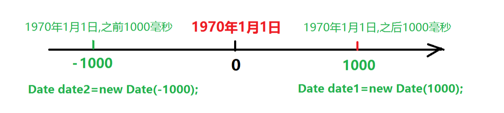

# Date类
Date表示日期类，表示一个特定的时间。
## 构造方法
创建Date对象的时候需要指定一个时间的毫秒值，如果不指定就是
```java
//创建一个Date对象，表示当前系统时间
Date date1=new Date();
//创建一个Date对象，参数表示指定的时间距离1970年的毫秒值。
Date date2=new Date(1000*60); //1000*60表示1分钟
```


## 常用方法
```java
public void setTime(long time)
  设置Date表示的时间毫秒值
public long getTime()
  获取Date对象表示的时间毫秒值
```
## 代码演示
```java
public class Demo1{
  public static void main(String[] args){
    //创建当前时间的对象
    Date date1=new Date();
    //获取当前时间的毫秒值
    System.out.println(date1.getTime());

    //创建距离1970年1月1日时间之后1小时的Date对象
    Date date2=new Date(1000*60*60);
    //获取date1对象时间的毫秒值
    System.out.println(date2.getTime());
  }
}

```
