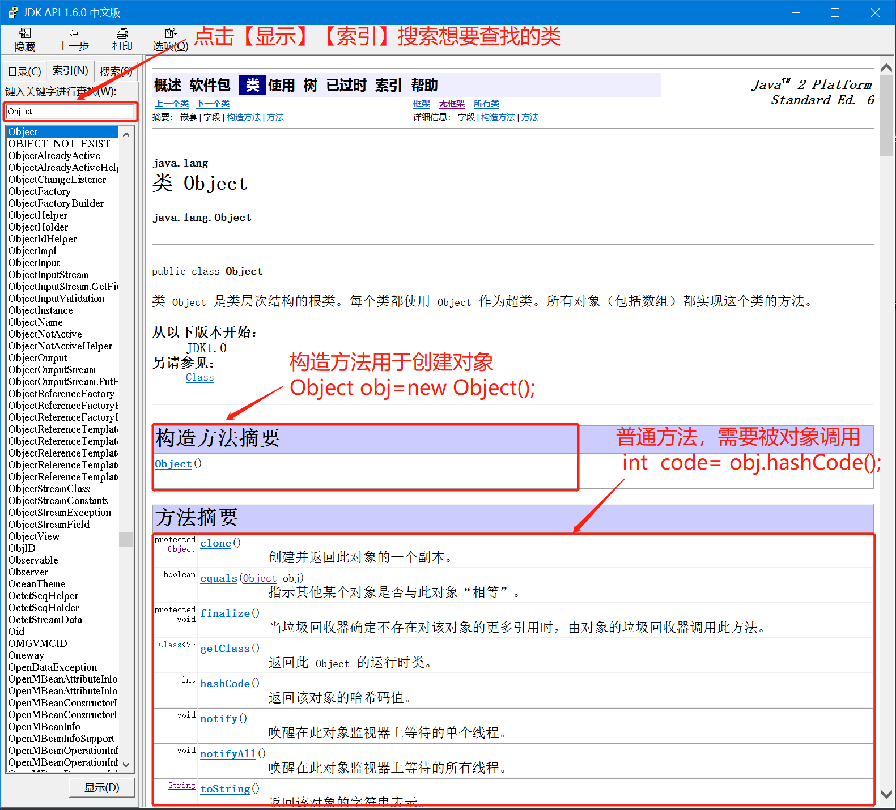

# 第8章 常见对象API

为了让开发者编写程序更加方便，Java语言提供了很多内置的类，并且每一个类为解决一些常见的需求，提供了若干个现成的方法给开发者使用。下面列举一些常见的类，以及它的作用。

- 当你想做一些基本数学运算时可以找Math类

- 当你想对文件进行操作时可以找File类
- 当你想生成随机数时可以找Random类
- 当你想进行键盘录入时可以找Scanner类
- 当你想表示时间时可以找Date类
- 当你想对时间进行格式转换是可以找DateFormat类

以上只是列举了一些常见的类，后面都会一一讲到。像这样的类还有很多很多，为了方便开发者学习，Java官方提供了一个文档（我们把这个文档叫做API文档），这个文档中收录了所有JDK中已经有的类，并且每一个类代表什么含义、每一个类中有哪些方法以及调用这个方法有什么作用，都有详细的解释。我们学习API其实就是学习这些常见的类 以及类中的方法的使用。

