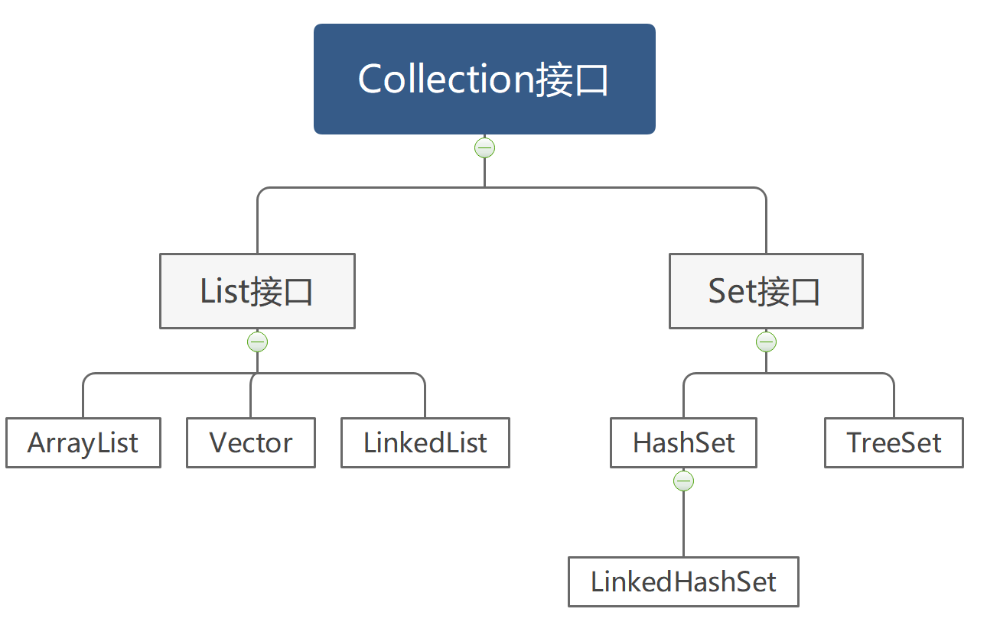

# 1.Collection集合

Collection是单列集合的根接口，该接口中定义了所有单列集合中必须要有的方法。任何一个Collection接口的实现类都有对这些方法进行实现。



下面我们就来学习一下这些方法的作用以及如何使用。

```java
public boolean add(E e)
    添加元素到集合末尾
public boolean addAll(Collection c)
    往集合中添加另一个集合中的元素。
public boolean remove(Object o)
    删除集合中指定的元素，如果删除成功返回true.
public boolean contains(Object o)
    判断集合中是否包含指定元素。如果包含返回true,不包含返回false.
public boolean isEmpty()
    判断集合是否为空(当集合长度为0时，即为空)。如果为空返回true,不为空返回false.
public void clear()
    清空集合中的元素
public int size()
    获取集合的长度(元素个数)
public Iterator iteartor()
    获取集合的迭代器
public Object[] toArray()  
    把集合转换为数组
```

由于接口里面的方法都是抽象的并不能直接使用，所以我们不得不找一个实现类来演示。这里使用ArrayList来做演示。


## 增删改查

```java
//<String>：表示集合中的元素是String类型
Collection<String> coll=new ArrayList<>();
//增加元素
coll.add("孙悟空");
coll.add("猪八戒");
coll.add("沙和尚");
coll.add("唐三藏");
System.out.println(coll); // [孙悟空,猪八戒,沙和尚,唐三藏]

//删除元素
coll.remove("孙悟空");
System.out.println(coll); // [猪八戒,沙和尚,唐三藏]

//判断是否包含"孙悟空"
boolean b1=coll.contains("孙悟空");
System.out.println(true); //false,因为前面已经删除“孙悟空”了

//判断集合是否为空
boolean b2=coll.isEmpty();
System.out.println(b2);//false,集合中还有元素

//清空集合
coll.clear(); 

//获取集合的长度
int length=coll.size();
System.out.println(length); //0 

//再次判断集合是否为空
boolean b3=coll.isEmpty();
System.out.println(b2);//true,集合中已经没有元素了.

//演示把集合转换为数组,数组中的元素类型会自动提升为Object类型。
Object[] array=coll.toArray();
//
```


## 迭代器遍历

迭代其实就说获取的意思，迭代器就是用来从集合中获取元素的一种方式。

```java
//<String>：表示集合中的元素是String类型
Collection<String> coll=new ArrayList<>();
//增加元素
coll.add("孙悟空");
coll.add("猪八戒");
coll.add("沙和尚");
coll.add("唐三藏");

//获取集合的迭代器
Iterator<String> it=coll.iterator();
//判断是否有元素可以迭代
while(it.hashNext()){
    //获取下一个元素
    String str=it.next();
    System.out.println(str); //打印元素
}
```

