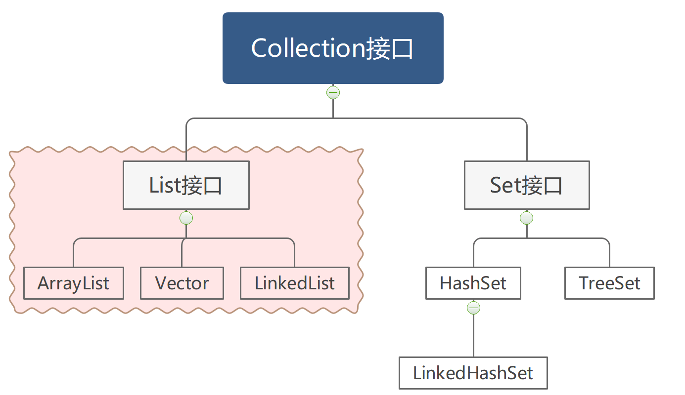
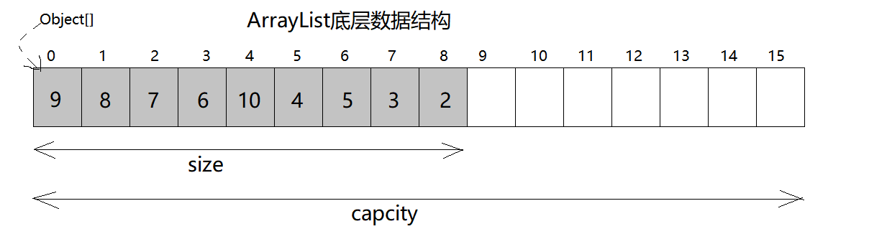
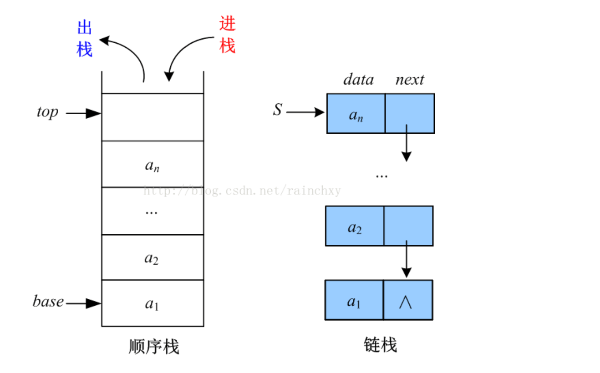

# 2.List集合

学习完Collection集合体系中共性的方法之后，接下来我们来学习它的子接口List中特有的方法以及List接口的常用实现类。



Java的API中明确说明List集合（指的是List接口以及它的所有实现类）是有索引的、元素可以重复的、有序的集合。也就是说List集合可以根据索引对元素进行精确的控制，例如在指定索引位置添加元素、删除元素、修改元素、查询元素等等。

## List接口特有方法

```java
public void add(int index,E e)
    在集合的指定索引位置添加元素
public E remove(int index)
    从集合中删除指定索引的元素
public E set(int index,E e)
    修改集合中指定索引的元素为新的元素。
public E get(int index)
    获取集合中指定索引的元素
```

## ArrayList集合

ArrayList类的底层数据结构是数组，按照数组的原理对List接口中的方法进行了实现。

```java
数组结构的特点是：查询快、增删慢
【数组简介】
	数组的每一个元素都有索引，只要通过索引就可以对元素进行增、删、改、查的操作。
```



当创建一个ArrayList对象时，底层其实会初始化一个容量为16的数组，随着向 ArrayList 中不断添加元素，其容量也自动增长。

> **集合中存储整数**

```java
public class ArrayListDemo1{
    public static void main(String[] args){
        //创建ArrayList集合对象
        List<Integer> list=new ArrayList<>();
        //顺序添加元素
        list.add(9);
        list.add(8);
        list.add(7);
        list.add(6);
        System.out.println(list); //[9,8,7,6]

        //在1索引位置添加元素
        list.add(1,3); //在1索引位置添加元素3
        System.out.println(list); //[9,3,8,7,6]

        //删除2索引位置的元素
        list.remove(2);
        System.out.println(list); //[9,3,7,6]

        //获取3索引的元素
        Integer num=list.get(3);
        System.out.println(num); //6

        //遍历集合中的元素
        for(int i=0;i<list.size();i++){
            //获取i索引位置的元素
            Integer e=list.get(i);
            System.out.println(e); 
        }
    }
}
```

> **集合中存储自定义对象**

集合中的存储的元素也可以是自定义的类型，例如往集合中添加若干个Student对象

```java
public class Student{
    private String name;
    private int age;
    
    public Student(String name,int age){
        this.name=name;
        this.age=age;
    }
    
    @Override
    public String toString() {
        return "Student{" +
                "name='" + name + '\'' +
                ", age=" + age +
                '}';
    }
}
```

```java
public class ArrayListDemo2{
    public static void main(String[] args){
         //<Student>表示集合中的元素是Student对象
        List<Student> list=new ArrayList<>();
        list.add(new Student("孙悟空",20));
        list.add(new Student("猪八戒",18));
        list.add(new Student("沙和尚",21));
        list.add(new Student("唐三藏",23));

        //遍历集合中的元素，每一个元素是一个Student对象
        for(int i=0;i<list.size();i++){
        	Student stu = list.get(i);
            System.out.println(stu); //底层会自动调用toString()方法
        }
    }
}
```


## LinkedList集合

LinkedList集合底层是链表结构，按照链表结构的特点对List接口中的方法进行了实现。

```java
链表结构的特点是：查询慢、增删快
【链表简介】
	链表是由一个一个的节点组成，一个节点通过地址指向下一个节点，类似于一条链子。		LinkedList集合中的每一个元素其实就是链表中的一个节点。
```


LinkedList类还为集合在开头和结尾提供了便捷的操作方法，而且这些方法有统一的命名规则，方便开发者调用。

```java
public void addFirst(E e)  
    在集合开头添加元素
public void addLast(E e)
    在集合结尾添加元素
public E removeFirst() 
    移除第一个一个元素
public E removeLast()
    移除最后一个元素
public E getFirst()
    获取第一个元素
public E getLast()
    获取最后一个元素
```

利用以上方法，可以使用LinkedList集合来模拟栈结构

```java
栈结构的特点是：先进后出
【栈结构简介】
	1)栈结构就像一个子弹夹，子弹夹中的子弹就是元素
	2)先放进去的元素在栈底，后放进去的元素在栈顶。
	3)每次添加、获取元素时，只能操作栈顶的元素。
```



LinkedList类中还提供了两个用于进栈和出栈的方法。

```java
public void push(E e)
   	将元素推入此集合的栈顶。换句话说，就是将元素添加到集合开头的位置
public E pop()
    从集合的栈顶处弹出一个元素。换句话说，移除并返回此列表的第一个元素。 
```


