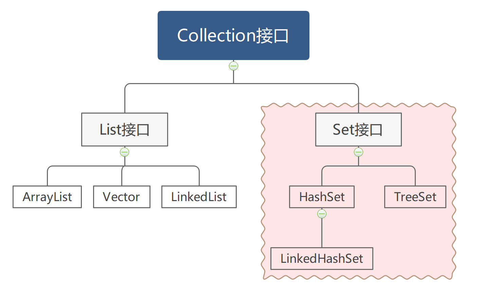
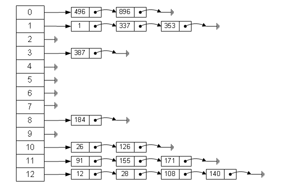
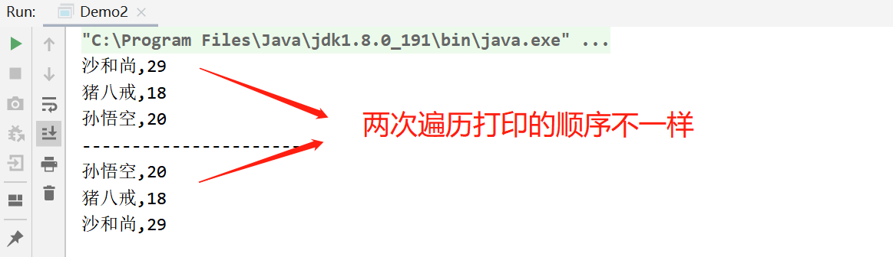
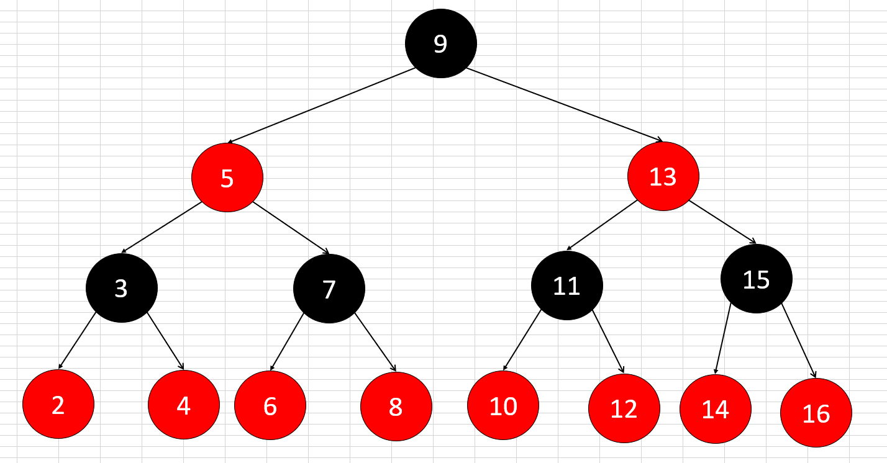
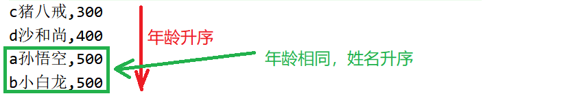

# 3.Set集合

接下来我们来学习Collection体系中的另一个子接口Set以及它的实现类。查看API文档发现，Set相对于Collection而言没有什么特有方法，也就是说Set集合中的方法都是复写的Collection的方法。



Set集合和前面其他集合的使用方式都是一样的，无非就是增、删、改、查以及遍历等功能，你写代码时只需要改一个类名称就可以了。但是我们要知道每一种集合的底层对增、删、改、查等功能的实现方式是不一样的。

## HashSet集合

HashSet集合底层是哈希表结构，它不保证元素的迭代顺序，不能包含重复的元素。



哈希表实现起来比较复杂，数据结构已经被封装到了HashSet的内部，这里我们仅仅了解一下底层原理和特点即可。

```java
哈希表特点：不保证元素的迭代顺序，也不能包含重复的元素。
【哈希表简介】
	哈希表是由数组+链表组成的一种数据结构，当往HashSet集合中添加元素时，原理如下
	1.先计算元素的hashCode值，再把哈希值转换为数组的索引i
	2.如果i索引位置为null，就在i索引位置该创建一个节点
	3.如果i索引位置不为null，就判断i索引位置的元素和即将添加的元素hash值是否一样。
	4.如果hash值相同，继续让i索引的元素和即将添加的元素用equals进行比较
	5.如果hash值和equals比较都相同，就认为元素重复。
	6.如果hash值相同，equals比较不同，以链表的形式链接到一起。

【HashSet如何保证元素唯一性】
	1.复写元素的hashCOde方法
	2.复写元素的equals方法
```

了解了HashSet集合的特点之后，我们往HashSet集合中添加Student类型，为了保证元素的唯一性，就必须复写hashCode和equals方法。IDEA这样的集成开发工具提供了很方便的快捷键可以自动生成复写代码。

```java
public class Student{
    private String name;
    private int age;
    
    //...此处省略构造方法、get和set方法...

    //只要name和age一样，那么equals方法就返回true
    @Override
    public boolean equals(Object o) {
        if (this == o) return true;
        if (o == null || getClass() != o.getClass()) return false;
        Student student = (Student) o;
        return age == student.age &&
                Objects.equals(name, student.name);
    }

    //只要name和age一样，那么hashCode值就一样。
    @Override
    public int hashCode() {
        return Objects.hash(name, age);
    }
}
```

```java
public class HashSetDemo1{
    public static void main(String[] args){
        Set<Student> set=new HashSet<>();
        //添加元素到集合
        set.add(new Student("孙悟空",20));
        set.add(new Student("猪八戒",18));
        set.add(new Student("沙和尚",29));
        set.add(new Student("孙悟空",20));
        
        //迭代器遍历集合
        for(Student s:set){
            System.out.println(s.getName()+","+s.getAge());
        }
    }
}
```

## LinkedHashSet

LinkedHashSet集合是HashSet的子类，它和HashSet的区别就是LinkedHashSet能保证元素的迭代顺序，其他特点和用法都是一样的。所以这里就不做赘述了，通过代码演示一下他们区别

```java
public class HashSetDemo2{
    public static void main(String[] args){
         Set<Student> set1 = new HashSet<>();
        //添加元素到集合
        set1.add(new Student("猪八戒", 18));
        set1.add(new Student("孙悟空", 20));
        set1.add(new Student("沙和尚", 29));
        set1.add(new Student("孙悟空", 20));

        //迭代器遍历集合
        for (Student s : set1) {
            System.out.println(s.getName() + "," + s.getAge());
        }

        System.out.println("----------------------");

        Set<Student> set2 = new LinkedHashSet<>();
        //添加元素到集合
        set2.add(new Student("孙悟空", 20));
        set2.add(new Student("猪八戒", 18));
        set2.add(new Student("沙和尚", 29));
        set2.add(new Student("孙悟空", 20));
        for (Student s : set2) {
            System.out.println(s.getName() + "," + s.getAge());
        }
    }
}
```




## TreeSet集合

TreeSet的底层是红黑树数据结构，由于红黑树的结构比较复杂，一时半会也很难理解，这里就不详细展开了，有兴趣的同学可以买一本数据结构的书学习一下。下图是红黑数的结构图，它也二叉树排序树，观察下图不难发现有如下特点。

```java
1.任意一个节点都是一个元素，每一个元素最多有2个分支
2.每一个元素的左边，都是比这个元素小的数据
3.每一个元素的右边，都是比这个元素大的数据

当遍历元素时从最左边的元素开始，按照左、中、右的顺序获取元素，就可以按照从小到大顺序把所有元素获取出来。
```




>  **自然排序**

通过查看API和源码会发现Integer和String都实现了一个排序的接口Comparable，该接口中有一个compareTo方法，用于对元素进行比较。每次往TreeSet集合中添加元素时会自动调用compareTo方法，根据该方法的返回值是负数、正数、或者0来决定把这个元素放在树的左边，右边还是不存储。

下面以在集合中存储String和Integer类型的数据，演示一下使用TreeSet集合对元素的自然排序。

```java
public class TreeSetDemo1{
    public static void main(String[] args){
        //创建TreeSet集合对象,存储String类型元素
        Set<String> set1=new TreeSet<>();
        set1.add("aaa");
        set1.add("ccc");
        set1.add("bbb");
        //遍历集合
        for(String s:set1){
            System.out.println(s); //打印元素分别是 aaa,bbb,ccc
        }
        
        System.out.println("--------------");
        
        //创建TreeSet集合对象,存储Integer类型元素
        Set<Integer> set1=new TreeSet<>();
        set1.add(8);
        set1.add(6);
        set1.add(7);
        //遍历集合
        for(Integer s:set2){
            System.out.println(s); //打印元素分别是 6,7,8
        }
    }
}
```

在TreeSet集合中存储Integer对象和String对象可以自动排序，那是因为Integer和String已经实现了Comparable接口。

同理我们可以让自定义的Student类型实现Comparable接口，复写compareTo方法，同样也能让Student对象按照指定规则进行排序。

```java
public class Student implements Comparable<Student>{
    private String name;
    private int age;
    //构造方法，get和set方法
    
    @Override
    public int compareTo(Student o){
        //按照年龄的升序排列
        int num=this.age-o.age;
        //如果年龄相同，按照姓名排序
        if(num==0){
            num=this.name.compareTo(o.name);
        }
        return num;
    }
}
```

定义测试类，在TreeSet集合中存储Student对象

```java
public class TreeSetDemo2{
    public static viod main(String[] args){
        Set<Student> set=new TreeSet<>();
        //往TreeSet集合中添加Student对象
        set.add(new Student("a孙悟空",500));
        set.add(new Student("b小白龙",500));
        set.add(new Student("c猪八戒",300));
        set.add(new Student("d沙和尚",400));
		//遍历集合
        for(Student s:set){
            System.out.println(s.getName()+","+s.getAge());
        }
    }
}
```

运行结果如下




如果Student类没有实现Comparable接口，就会出现下面的异常。


> **自定义比较器器排序**

Java的API中还提供了一个Compartor接口，用于对两个元素进行比较，而具体比较规则需要我们自己实现。TreeSet提供了一个构造方法，在创建TreeSet对象时传递一个自定义的Compartor实现类对象，也可以让元素进行排序。这种排序方法叫做自定义比较器排序。

使用自定义Comparator实现类，对TreeSet元素进行排序。

```java
public class TreeSetDemo3{
    public static void main(String[] args){
        //创建TreeSet集合，指定自定义比较器
        Set<Student> set=new TreeSet<>(new Comparator<Student>(){
            @Override
            public int compare(Student o1,Student o2){
                //按照年龄的升序排列
                int num=this.age-o.age;
                //如果年龄相同，按照姓名排序
                if(num==0){
                    num=this.name.compareTo(o.name);
                }
                return num;
            }
        });
        
        //添加Student对象元素
        set.add(new Student("a孙悟空",500));
        set.add(new Student("b小白龙",500));
        set.add(new Student("c猪八戒",300));
        set.add(new Student("d沙和尚",400));
    }
}
```

运行结果如下


