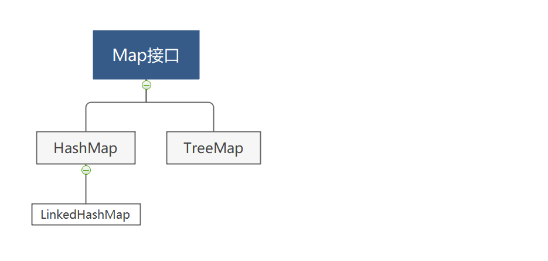
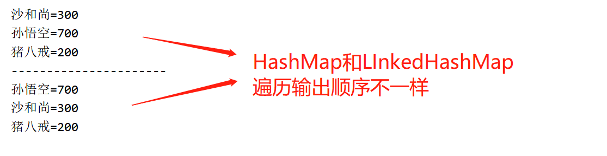
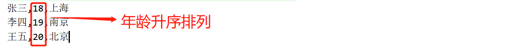

# 5.Map体系结构

Map集合（Map以及Map的实现类）是双列集合，集合中的元素是以【键-值对】的形式存在的。下图是Map集合的体系结构。



上面每一种集合的用法其实是一样的，因为它们的方法都实现自Map接口。我们只要学习Map接口中的方法就可以了。

## Map常用方法

```java
public V put(K key, V value)  
    往Map集合中添加键值对.返回被覆盖键的值,如果键相同.把值修改了
public V remove(Object key)
    根据键删除键值对.返回被删除的值
public void clear()   
    清空集合中的元素
public int size()
    获取集合中【键值对】的个数
public V get(Object key)  
    根据键获取值
public Set<K> keySet()  
    获取所有键的集合
public Collection<V> values()
    获取所有值的集合
public Set<Map.Entry<K,V>> entrySet()
    获取所有的【键值对】
public boolean containsKey(Object key)
    判断键是否存在
public boolean containsValue(Object value)  
    判断值是否存在
public boolean isEmpty()
    判断集合中是否有元素
```


## HashMap

HashMap底层数据结构是哈希表，前面讲到HashSet底层结构也是哈希表。其实这样两个集合本质上是一样的。为什么这么说呢？查看源码会发现，当使用HashSet的add方法添加元素时，内部是在调用HashMap的put方法，元素当做HashMap的键来存储。所以HashSet元素的特性，和HashMap键的特性是完全一样的。

```java
HashSet如何保证元素唯一性
	先判断元素的hashCode值和集合中元素是否一致
	再使用equals判断元素和集合中已有元素是否相同
	如果hashCode和euqals都相同，则认为元素重复。
	【为了保证元素唯一，需要复写元素hashCode和equals方法】

HashMap如何保证键的唯一性
	先判断键的hashCode值和集合中元素是否一致
	再使用equals判断键和集合中已有的键是否相同
	如果键的hashCode和euqals与集合中的键相同，则认为元素重复。
	【为了保证元素唯一，需要复写键的hashCode和equals方法】

```

> **keySet()遍历**

调用keySet()方法先得到Map集合中所有的键，然后再通过get方法根据键获取值。

```java
public class MapDemo1{
    public static void main(String[] args){
        Map<String,Integer> map =new HashMap<String,Integer>();
        map.put("李四", 6000);
        map.put("张三", 7889);
        map.put("张三", 7000);
        map.put("王五", 9000);
        //获取所有的键
        Set<String> keys=map.keySet();
        //遍历键的集合
        for(String key:keys){
            //通过键.获取值
            String value=map.get(key);
            System.out.println(key+"="+value);
        }
    }
}

```

> **enterySet()遍历**

entrySet()方法可以获取到所有的【键值对】组成的Set集合，键值对用Map.Entry<K,V>表示，其中K表示键的类型，V表示值得类型。

```java
public class MapDemo2{
    public static void main(String[] args){
        //在Map集合中存储自定义对象Student作为键，String作为值
        HashMap<Student,String> map=new HashMap<Student,String>();
        //添加键和值
        map.put(new Student("张三",18), "武汉");
        map.put(new Student("王五",20), "北京");
        map.put(new Student("李四",19), "南京");
        map.put(new Student("张三",18), "上海");
        //使用entrySet方法遍历map集合.Student作为键
        Set<Entry<Student, String>> entrys = map.entrySet();
        for (Entry<Student, String> entry : entrys) {
            Student key = entry.getKey();
            String value = entry.getValue();
            System.out.println(key+"...."+value);
        }
    }
}
```


## LinkedHashMap

LinkedHashMap是HashMap的子类，用法和HashMap类似。区别就是HashMap中的键是无序的，而LinkedHashMap的键是有序的。

```java
public class MapDemo3{
    public static void main(String[] args){
        Map<String, Integer> map1 = new HashMap<>();
        map1.put("孙悟空", 500);
        map1.put("沙和尚", 300);
        map1.put("猪八戒", 200);
        map1.put("孙悟空", 700);
        //获取所有的键
        Set<String> keys1 = map1.keySet();
        //遍历键的集合
        for (String key : keys1) {
            //通过键.获取值
            Integer value = map1.get(key);
            System.out.println(key + "=" + value);
        }

        System.out.println("----------------------");

        Map<String, Integer> map2 = new LinkedHashMap<>();
        map2.put("孙悟空", 500);
        map2.put("沙和尚", 300);
        map2.put("猪八戒", 200);
        map2.put("孙悟空", 700);
        //获取所有的键
        Set<String> keys2 = map2.keySet();
        //遍历键的集合
        for (String key : keys2) {
            //通过键.获取值
            Integer value = map2.get(key);
            System.out.println(key + "=" + value);
        }
    }
}
```



## TreeMap

TreeMap底层是红黑数结构，它可以对键进行排序。前面的TreeSet集合底层就是TreeMap

所以TreeSet元素的特点和TreeMap键的特点是完全一样的。

```java
//定义Student类实现 Comparable<Student>接口，让学生具备可以排序的规则。
public class Student implements Comparable<Student>{
    private String name;
    private int age;
    //构造方法，get和set方法
    
    @Override
    public int compareTo(Student o){
        //按照年龄的升序排列
        int num=this.age-o.age;
        //如果年龄相同，按照姓名排序
        if(num==0){
            num=this.name.compareTo(o.name);
        }
        return num;
    }
}

//定义测试类
public class MapDemo4{
    public static void main(String[] args){
        Map<Student,String> map=new TreeMap<>();
        //添加键和值
        map.put(new Student("张三",18), "武汉");
        map.put(new Student("王五",20), "北京");
        map.put(new Student("李四",19), "南京");
        map.put(new Student("张三",18), "上海");
        //使用entrySet方法遍历map集合.Student作为键
        Set<Entry<Student, String>> entrys = map.entrySet();
        for (Entry<Student, String> entry : entrys) {
            Student key = entry.getKey();
            String value = entry.getValue();
            System.out.println(key+"...."+value);
        }
    }
}
```

运行结果如下

