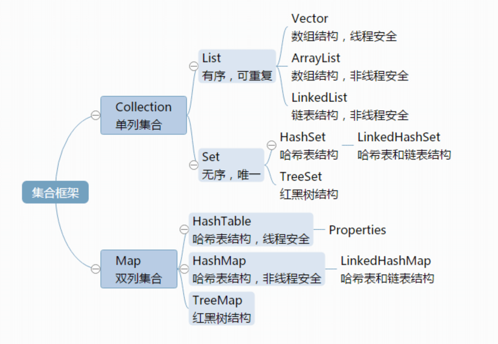

# 第9章 集合框架

计算机语言中有一个特别重要的容器就是数组，但是数组在Java中的长度是不可变的，如果想要存储任意个数的数据，用同一个数组是做不到的。对于不懂算法和数据结构的小白来说，就有很大的局限性。


这个问题Java在设计之初就考虑到了，所以Java的API中提供了一套完整集合体系，其实就是针对不同场景下提供的容器类以及方法，我们只要会使用这些类和方法就能很方便的完成增、删、改、查等功能。


Java的集合体系分为单列集合（Collection体系）和双列集合（Map体系）



>  单列集合

Collection接口是单列集合的根接口，该接口中定义了一些单列集合必须要有的方法。然后由实现类根据各自的数据结构来实现这些方法。

```java
Collection接口
	-- List接口：有索引、有序、元素不唯一
		-- Vector
		-- ArrayList
		-- LinkedList
	-- Set接口：无索引、无序、元素唯一
		-- HashSet
			-- LinkedHashSet
		-- TreeSet
```

> 双列集合

Map接口是双列集合的根接口，该接口中定义了一些双列集合必须要有的方法。然后由实现类根据各自的数据结构来实现这些方法。

```java
Map接口
	-- Hashtable
		-- Properties
	-- HashMap
		-- LinkedHashMap
	-- TreeMap
```


