# SQL语句基础

## SQL概述

> 什么是SQL

  Structured Query Language：结构化查询语言
	其实就是定义了操作所有关系型数据库的规则。每一种数据库操作的方式存在不一样的地方，称为“方言”。

> SQL通用语法

    1. SQL 语句可以单行或多行书写，以分号结尾。
    2. 可使用空格和缩进来增强语句的可读性。
    3. MySQL 数据库的 SQL 语句不区分大小写，关键字建议使用大写。
    4. 3 种注释
    	* 单行注释: -- 注释内容 或 # 注释内容(mysql 特有)
    	* 多行注释: `/* 注释 */`

> SQL分类

    1) DDL(Data Definition Language)数据定义语言
    	用来定义数据库对象：数据库，表，列等。关键字：create, drop,alter 等
    2) DML(Data Manipulation Language)数据操作语言
    	用来对数据库中表的数据进行增删改。关键字：insert, delete, update 等
    3) DQL(Data Query Language)数据查询语言
    	用来查询数据库中表的记录(数据)。关键字：select, where 等
    4) DCL(Data Control Language)数据控制语言(了解)
    	用来定义数据库的访问权限和安全级别，及创建用户。关键字：GRANT， REVOKE 等


## DDL操作数据库

操作数据库无非就有四种方式  C(Create 创建数据库)、R(Retrieve 查询数据库)、U(Update 修改数据库)、D(Delete 删除数据库)

**都需要通过sql语句来完成，不用记，需要的时候会按照格式套用即可**

> 创建数据库语法

```sql
-- 创建数据库基本格式
create database 数据库名称;
-- 创建数据库，判断不存在，再创建
create database if not exists 数据库名称;
-- 创建数据库，并指定字符集 sql格式
create database 数据库名称 character set 字符集名;
```

```sql
-- 创建db1数据库，判断是否存在，并制定字符集为gbk
create database if not exists db1 character set gbk;
```


> 查询数据库

```sql
-- 查询所有数据库的名称
show databases;
```

```sql
-- 查询某个数据库的字符集:查询某个数据库的创建语
show create database 数据库名称;
show create database db1;
```

> 修改数据库

```sql
-- 修改数据库的字符集
alter database 数据库名称 character set 字符集名称;
-- 修改db1数据库 的字符集为 utf8
alter database db1 character set 字符集名称;
```

> 删除数据库

```sql
-- 删除指定数据库
drop database 数据库名称;
-- 删除`db1`数据库
drop database db1;
```

```sql
-- 判断数据库存在，再删除
drop database if exists 数据库名称;
-- 判断db2数据库是否存在，再删除
drop database if exists db2;
```

> 使用数据库

```sql
-- 查询当前正在使用的数据库名称
select database();
```


```sql
-- (切换)当前使用的数据库
use 数据库名称;
-- 切换到db1数据库后，再查询当前使用的数据库
use db1;
```

## DDL操作表

对数据表的操作，其实也是CRUD(创建、查询、修改、删除)的操作。

> 创建数据表

```sql
-- 创表格式
-- 注意：最后一列，不需要加逗号
create table 表名(
	列名1 数据类型1,
	列名2 数据类型2,
	....
	列名n 数据类型n
);
```

> MySQL 数据类型

| 关键字       | 数据类型  | 备注                                         |
| --------- | ----- | ------------------------------------------ |
| int       | 整数类型  |                                            |
| double    | 小数类型  |                                            |
| date      | 日期    | 只包含年月日，yyyy-MM-dd                          |
| datetime  | 日期    | 包含年月日时分秒	 yyyy-MM-dd HH:mm:ss              |
| timestamp | 时间戳类型 | 包含年月日时分秒 yyyy-MM-dd HH:mm:ss,不赋值默认为系统时间毫秒值 |
| varchar   | 字符串   | 姓名最大20个字符                                  |

创建一个`student`数据表

```sql
-- 创建student数据表，有id(学号)、name(姓名)、age(年龄）、score(成绩)、birthday(生日)属性
create table student(
	id int,
	name varchar(32),
	age int ,
	score double(4,1),
	birthday date,
	insert_time timestamp
);
```

> 复制表

```sql
create table 表名 like 被复制的表名;
create table student_copy like student;	 
```

> 查询所有表

```sql
show tables;
```
目前db1数据库中有2张表，如下图

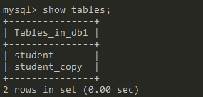

> 查询表结构

```sql
-- 查询表结构
desc 表名;
-- 查询student_copy表结构
desc student_copy;
```

student_copy表结构如下

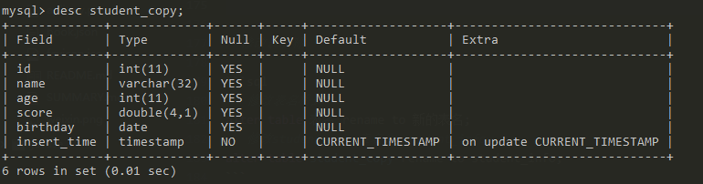

> 删除表

```sql
-- 删除表
drop table 表名;
drop table student_copy;
```

> 修改表名称

```sql
-- 修改表名
alter table 表名 rename to 新的表名;
-- 修改student_copy表名为 student_info
alter table student_copy rename to student_info;
-- 查询所有表
show tables;
```

修改student_copy表名为 student_info。如下图

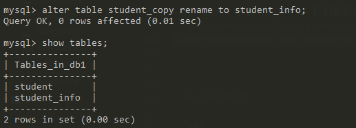

> 修改表的字符集

```sql
-- 修改表的字符集格式
alter table 表名 character set 字符集名称;
-- 把student_info表字符集改为utf8
alter table student_info character set utf8;
```

> 添加一列

```sql
-- 添加一列到表中
alter table 表名 add 列名 数据类型;
-- 在student_info表中添加 high 一列
alter table student_info add high int(10);
-- 显示表结构
desc student_info;
```
添加了high字段，int类型

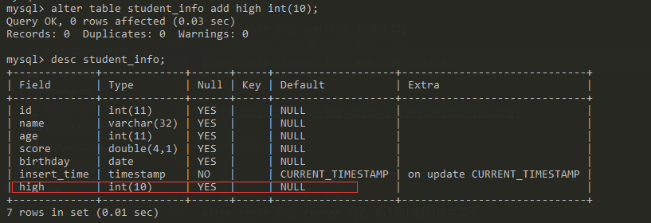

>  修改列名称 类型

```sql
-- 修改列名以及数据类型格式
alter table 表名 change 列名 新列别 新数据类型;
-- 修改student_info表中 high列为 sex列
alter table student_info change high sex varchar(10);
--查看表结构
desc student_info;
```
把high字段 修改为 sex字段 varchar类型

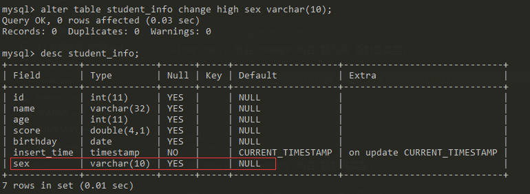

```sql
-- 修改指定列数据类型
alter table 表名 modify 列名 新数据类型;
-- 修改student_info表中score列数据类型为int
alter table student_info modify score int;
--查看表结构
desc student_info;
```
把score列数据类型为int，原来是double类型

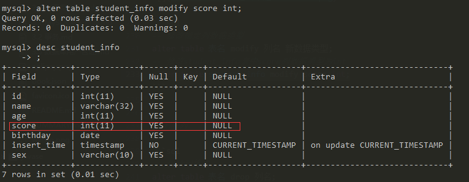

> 删除列

```sql
-- 删除列格式
alter table 表名 drop 列名;
-- 删除student_info表中sex列
alter table student_info drop sex;
--查看表结构
desc student_info;
```

如下图sex列被删除列

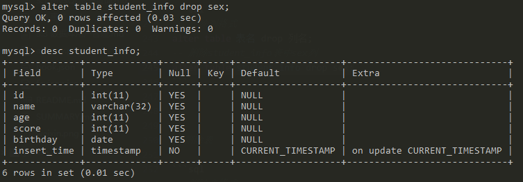

> 删除表

```sql
-- 删除表格式
drop table 表名;
-- 先判断存在，再删除表
drop table  if exists 表名 ;
-- 删除student_info数据表
drop table student_info;
-- 显示所有表
show tables;
```
删除student_info表之后，只剩下student表。如下图

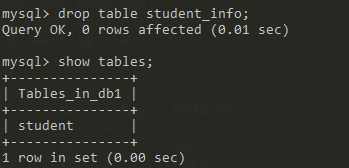

## DML 增删改表记录

> 添加表记录

```sql
-- 列名和值要一一对应。
insert into 表名(列名1,列名2,...列名n) values(值1,值2,...值n);
-- 如果表名后，不定义列名，则默认给所有列添加值
insert into 表名 values(值1,值2,...值n);

-- 向student表中，添加id,name,age列的表记录
INSERT INTO student(id,NAME,age) VALUES(1,"张无忌",18);
INSERT INTO student(id,NAME,age) VALUES(2,"张三丰",20);
-- 向student表中，添加所有列的记录
INSERT INTO student VALUES(3,"赵敏",19,99.9,"2018-09-07",NULL);
```


> 删除表记录

```sql
-- 按条件删除表记录
delete from 表名 where 条件;
-- 删除id为3的记录
delete from student where id=3;
```
删除id为3的记录，如下图

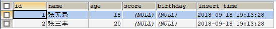

```sql
-- 删除student表中所有记录
delete from student; -- 不推荐，有多少条记录就会执行多少次删除操作
TRUNCATE TABLE student; -- 推荐使用，效率更高 先删除表，然后再创建一张一样的表。
```

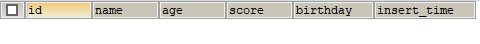


> 修改表记录

```sql
-- 修改指定列的值
update 表名 set 列名1 = 值1, 列名2 = 值2,... [where 条件];
-- 修改student表中id=1的记录 score=100,birthday="1991-06-06"
UPDATE student SET score=100,birthday="1991-06-06" WHERE id=1;
```

修改student表中id=1的记录 score=100,birthday="1991-06-06"

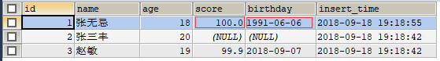

## DQL 基础查询

在查询表记录之前，我们先准备一张表student3，辅助我们学习查询语句。

```sql
CREATE TABLE student (
 id int, -- 编号
 name varchar(20), -- 姓名
 age int, -- 年龄
 sex varchar(5), -- 性别
 address varchar(100), -- 地址
 math int, -- 数学
 english int -- 英语
);
INSERT INTO student(id,NAME,age,sex,address,math,english) VALUES (1,'马云',55,'男','
杭州',66,78),(2,'马化腾',45,'女','深圳',98,87),(3,'马景涛',55,'男','香港',56,77),(4,'柳岩
',20,'女','湖南',76,65),(5,'柳青',20,'男','湖南',86,NULL),(6,'刘德华',57,'男','香港
',99,99),(7,'马德',22,'女','香港',99,99),(8,'德玛西亚',18,'男','南京',56,65);
```
> 查询语句语法

查询语句的语法稍有些复杂，种类也比较多，这里我们先了解一下，然后再逐条学习。
```sql
-- 查询语句的基本语法，where和group by等操作更加需求可选，但是顺序不能乱。
select 字段列表 from 表名列表 where 条件列表 group by 分组字段 having 分组之后的条件 order by 排序 limit 分页限定
```

> 多字段查询

```sql
-- 查询指定列的记录
select 字段列表 from 表名；
-- 查询student表中address列的记录
SELECT address FROM student;

-- 查询表中所有记录
select * from 表名;
-- 查询student表中所有的记录
SELECT * FROM student;
```

查询student表中所有数据，如下图

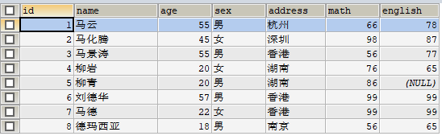

> 去重查询

```sql
-- 查询address列去重后的记录
SELECT DISTINCT address FROM student;
```
查询address列去重后的记录，如下图

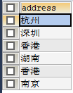

> 计算列查询

```sql
-- 把math+english的和，作为一列进行查询。把math+english取别名为sum
SELECT * ,math+english AS "sum" FROM student;
```
把math+english的和，作为一列进行查询。并取别名为sum

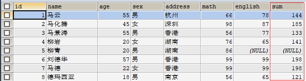

> 条件查询

查询满足条件的记录，条件通过where语句指定

```sql
select 字段列表 from 表名 where 条件;
```

**where语句的运算符**

|运算符|语义|举例|
|--|--|--|
|>|大于|where id>3|
|< |小于|where id<3|
|<=|小于等于|where id<=5|
|>=|大于等于|where id>=2|
|=|等于|where id=2|
|<>|不等于|where id<>3|
|BETWEEN...AND |在...之间|where id BETWEEN 2 AND 4|
|IN( 集合)|在指定几个值中|where id IN(3,6,7)|
|IS NULL | 为NULL值| where score IS NULL|
|AND | 与|where id>3 AND id<8|
|OR | 或|where id>5 OR id<3|
|NOT|非|where id IS NOT NULL|

```sql
-- 查询年龄大于20岁
SELECT * FROM student WHERE age > 20;
SELECT * FROM student WHERE age >= 20;
```
查询年龄大于20岁，如下图

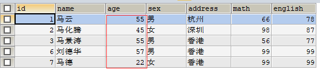

```sql
-- 查询年龄等于20岁的数据
SELECT * FROM student WHERE age=20;
```
查询年龄等于20岁的数据，如下图

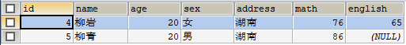

```sql
-- 查询年龄不等于20岁
SELECT * FROM student WHERE age != 20;
SELECT * FROM student WHERE age <> 20;
```
查询年龄不等于20岁，如下图

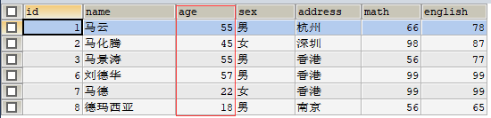

```sql
-- 查询年龄大于等于20 小于等于30
SELECT * FROM student WHERE age >= 20 &&  age <=30;
SELECT * FROM student WHERE age >= 20 AND  age <=30;
SELECT * FROM student WHERE age BETWEEN 20 AND 30;
```
查询年龄在20到30之间的数据

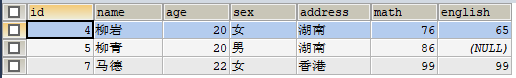

```sql
-- 查询年龄22岁，18岁，25岁的信息
SELECT * FROM student WHERE age = 22 OR age = 18 OR age = 25
SELECT * FROM student WHERE age IN (22,18,25);
```
查询年龄22岁，18岁，25岁的信息

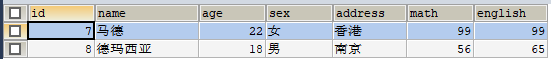

```sql
-- 查询英语成绩为null
SELECT * FROM student WHERE english IS NULL;
```

查询英语成绩为null的数据，如下图

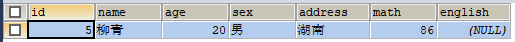


```sql
-- 查询英语成绩不为null
SELECT * FROM student WHERE english  IS NOT NULL;
```
查询英语成绩不为null的数据

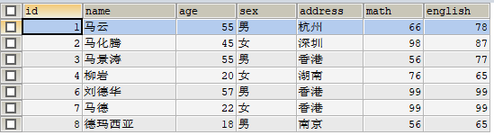

```sql
-- 查询姓马的有哪些？ like
SELECT * FROM student WHERE NAME LIKE '马%';

-- 查询姓名第二个字是化的人
SELECT * FROM student WHERE NAME LIKE "_化%";

-- 查询姓名是3个字的人
SELECT * FROM student WHERE NAME LIKE '___';

-- 查询姓名中包含德的人
SELECT * FROM student WHERE NAME LIKE '%德%';
```
查询姓名中包含德的人，如下图

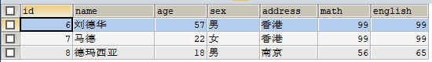
