# 多表查询
多表查询就是结合几张表的数据进行查询，先准备几张表和一些数据。
```sql
-- 创建部门表
create table dept(
 id int primary key auto_increment,
 name varchar(20)
);

-- 添加部门数据
insert into dept (name) values ('开发部'),('市场部'),('财务部');

-- 创建员工表
create table emp (
 id int primary key auto_increment,
 name varchar(10),
 gender char(1), -- 性别
 salary double, -- 工资
 join_date date, -- 入职日期
 dept_id int,
 foreign key (dept_id) references dept(id) -- 外键，关联部门表(部门表的主键)
);

-- 添加员工数据
INSERT INTO emp(NAME,gender,salary,join_date,dept_id) VALUES('孙悟空','男',7200,'2013-02-24',1);
INSERT INTO emp(NAME,gender,salary,join_date,dept_id) VALUES('猪八戒','男',3600,'2010-12-02',2);
INSERT INTO emp(NAME,gender,salary,join_date,dept_id) VALUES('唐僧','男',9000,'2008-08-08',2);
INSERT INTO emp(NAME,gender,salary,join_date,dept_id) VALUES('白骨精','女',5000,'2015-10-07',3);
INSERT INTO emp(NAME,gender,salary,join_date,dept_id) VALUES('蜘蛛精','女',4500,'2011-03-14',1);
INSERT INTO emp(NAME,gender,salary,join_date,dept_id) VALUES('小白龙','男',3000,NULL,NULL);
INSERT INTO emp(NAME,gender,salary,join_date,dept_id) VALUES(NULL,NULL,NULL,NULL,3);
```
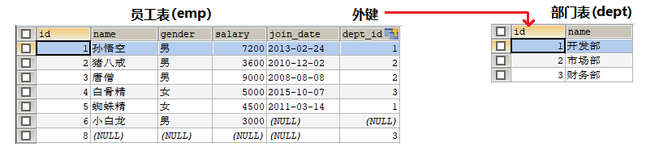

## 多表查询-笛卡尔集
查询两张表中所有数据记录的组合情况，得到的结果集就是笛卡尔集。但是这样查询的结果集，有很多数据是不正确的。

```sql
# 基本的多表查询
SELECT * FROM emp,dept;
```
如下图，只有红色的部分才是正确的数据，其他的数据都是无效的错误的。

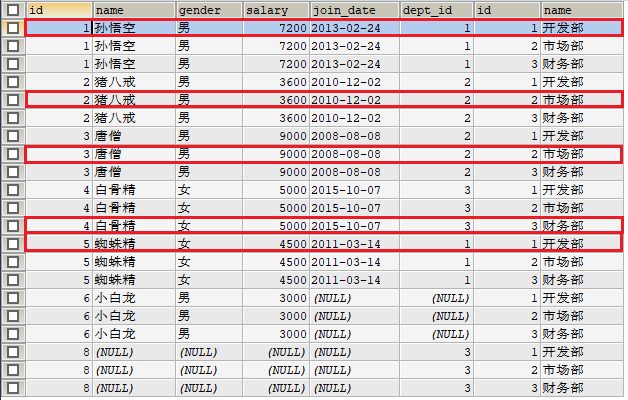

## 多表查询-内连接查询
在笛卡尔结果集的基础之上可以使用where条件消除无效的数据，查询多张表中满足条件的结果集。

> 隐式内连接查询

```sql
# 语法：select 字段列表 from 表1,表2 where 条件
-- 查询两张表中的所有字段
SELECT * FROM emp,dept WHERE emp.`dept_id`=dept.`id`;

-- 查询emp表中id,name,gender字段和dept表中name字段
SELECT emp.id,emp.name,emp.gender,dept.name FROM emp,dept WHERE emp.`dept_id`=dept.`id`;

-- 给表取别名
SELECT t1.id,t1.name,t1.gender,t2.name FROM emp t1,dept t2 WHERE t1.`dept_id`=t2.`id`;
```
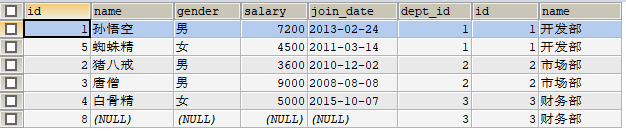
> 显示内连接查询

```sql
# 语法： select 字段列表 from 表名1 [inner] join 表名2 on 条件
-- 查询emp表和dept表中所有的数据
SELECT * FROM emp INNER JOIN dept ON emp.`dept_id` = dept.`id`;

-- 查询emp表中id,name,gender字段和dept表中name字段
SELECT emp.id,emp.name,emp.gender,dept.name FROM emp [INNER] JOIN dept ON emp.`dept_id`=dept.`id`;

-- 给表取别名查询
SELECT t1.id,t1.name,t1.gender,t2.name FROM emp t1 [INNER] JOIN dept t2 ON t1.`dept_id`=t2.`id`;

```


## 多表查询-外连接查询

> 左外连接查询

以左表的非NULL数据为基准，查询两张表满足条件结果集

```sql
# 语法：select 别名1.字段1,别名2.字段2 from 表1 [别名1] LEFT JOIN 表2 [别名2] on 条件
-- 查询emp和dept表中 满足emp.dept_id和dept.id条件的数据
SELECT t1.*,t2.`name` FROM emp t1 LEFT JOIN dept t2 ON t1.`dept_id` = t2.`id`;
```
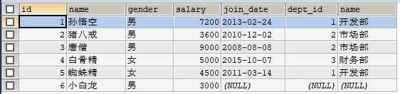
> 右外连接查询

以右表的非NULL数据为基准，查询两张表满足条件的结果集
```sql
# 语法：select 别名1.字段1,别名2.字段2 from 表1 [别名1] RIGHT JOIN 表2 [别名2] on 条件
-- 查询emp表中所有数据和dept表中name字段的数据
SELECT 	t1.*,t2.`name` FROM emp t1 RIGHT JOIN dept t2 ON t1.`dept_id` = t2.`id`;
```
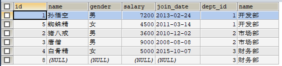

## 子查询
子查询就是利用SQL语句的查询结果，再结合其他SQL条件再次进行查询。
> 子查询结果为一行单列

查询最高工资的员工信息

```sql
-- 先查询最高工资是多少
SELECT MAX(salary) FROM emp;
```


以上查询结果作为，查询工资最高的员工信息的条件
```sql
-- 查询最高工资的员工信息
SELECT *  FROM emp WHERE emp.`salary`=(SELECT MAX(salary) FROM emp);
```
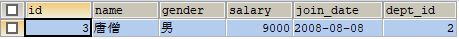

> 子查询的结果为多行单列

查询所有【财务部】和【市场部】的员工信息
```sql
-- 先查询所有【财务部】和【市场部】的员工id
SELECT id FROM dept WHERE dept.name="财务部" OR dept.`name`="市场部";
```


以上查询结果作为 查询【财务部】和【市场部】员工信息的条件
```sql
-- 查询所有【财务部】和【市场部】的员工信息
SELECT * FROM emp WHERE emp.`dept_id` IN (SELECT id FROM dept WHERE dept.`name`="财务部" OR dept.`name`="市场部");
```
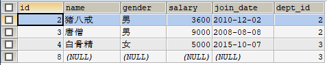

> 子查询结果为多行多列

查询员工入职日期是2011-11-11日之后的员工信息和部门信息

```sql
-- 查询员工入职日期是2011-11-11日之后的员工信息
SELECT * FROM emp WHERE join_date>"2011-11-11";
```
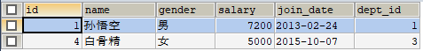

以上查询结果当做一张表，和部门表做内连接查询
```sql
-- 把以上结果当做一张员工表，和部门表做内连接查询
SELECT * FROM dept t1,(SELECT * FROM emp WHERE join_date>"2011-11-11") t2 WHERE t1.`id`=t2.dept_id;
```
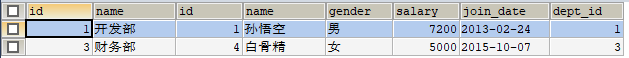

## 多表查询练习
先准备好【部门表】、【职务表】、【员工表】和【工资等级表】，并且添加好数据。
```sql
-- 部门表
CREATE TABLE dept (
  id INT PRIMARY KEY PRIMARY KEY, -- 部门id
  dname VARCHAR(50), -- 部门名称
  loc VARCHAR(50) -- 部门所在地
);
-- 添加4个部门
INSERT INTO dept(id,dname,loc) VALUES
(10,'教研部','北京'),
(20,'学工部','上海'),
(30,'销售部','广州'),
(40,'财务部','深圳');

-- 职务表，职务名称，职务描述
CREATE TABLE job (
  id INT PRIMARY KEY,
  jname VARCHAR(20),
  description VARCHAR(50)
);
-- 添加4个职务
INSERT INTO job (id, jname, description) VALUES
(1, '董事长', '管理整个公司，接单'),
(2, '经理', '管理部门员工'),
(3, '销售员', '向客人推销产品'),
(4, '文员', '使用办公软件');

-- 员工表
CREATE TABLE emp (
  id INT PRIMARY KEY, -- 员工id
  ename VARCHAR(50), -- 员工姓名
  job_id INT, -- 职务id
  mgr INT , -- 上级领导
  joindate DATE, -- 入职日期
  salary DECIMAL(7,2), -- 工资
  bonus DECIMAL(7,2), -- 奖金
  dept_id INT, -- 所在部门编号
  CONSTRAINT emp_jobid_ref_job_id_fk FOREIGN KEY (job_id) REFERENCES job (id),
  CONSTRAINT emp_deptid_ref_dept_id_fk FOREIGN KEY (dept_id) REFERENCES dept (id)
);
-- 添加员工
INSERT INTO emp(id,ename,job_id,mgr,joindate,salary,bonus,dept_id) VALUES
(1001,'孙悟空',4,1004,'2000-12-17','8000.00',NULL,20),
(1002,'卢俊义',3,1006,'2001-02-20','16000.00','3000.00',30),
(1003,'林冲',3,1006,'2001-02-22','12500.00','5000.00',30),
(1004,'唐僧',2,1009,'2001-04-02','29750.00',NULL,20),
(1005,'李逵',4,1006,'2001-09-28','12500.00','14000.00',30),
(1006,'宋江',2,1009,'2001-05-01','28500.00',NULL,30),
(1007,'刘备',2,1009,'2001-09-01','24500.00',NULL,10),
(1008,'猪八戒',4,1004,'2007-04-19','30000.00',NULL,20),
(1009,'罗贯中',1,NULL,'2001-11-17','50000.00',NULL,10),
(1010,'吴用',3,1006,'2001-09-08','15000.00','0.00',30),
(1011,'沙僧',4,1004,'2007-05-23','11000.00',NULL,20),
(1012,'李逵',4,1006,'2001-12-03','9500.00',NULL,30),
(1013,'小白龙',4,1004,'2001-12-03','30000.00',NULL,20),
(1014,'关羽',4,1007,'2002-01-23','13000.00',NULL,10);

-- 工资等级表
CREATE TABLE salarygrade (
  grade INT PRIMARY KEY,   -- 级别
  losalary INT,  -- 最低工资
  hisalary INT -- 最高工资
);
-- 添加5个工资等级
INSERT INTO salarygrade(grade,losalary,hisalary) VALUES
(1,7000,12000),
(2,12010,14000),
(3,14010,20000),
(4,20010,30000),
(5,30010,99990);
```

> 内连接练习1

1.查询员工编号，员工姓名，工资，职务名称，职务描述
```sql
/*
员工编号，员工姓名，工资，需要查询emp表
职务名称，职务描述 需要查询job表
条件 emp.job_id = job.id
*/
SELECT t1.`id`,t1.`ename`,t1.`salary`,t2.`jname`,t2.`description`
FROM emp t1,job t2
WHERE t1.`job_id`=t2.`id`;
```
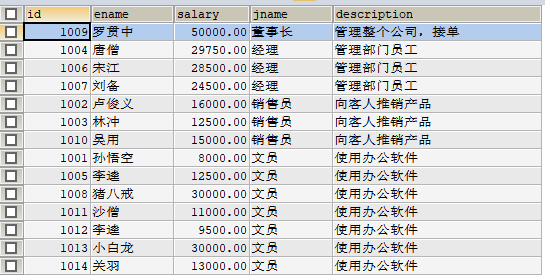

> 内连接练习2

2.查询员工编号，员工姓名，员工工资，职务名称，职务描述，部门名称，部门位置
```sql
/*
员工编号，员工姓名，员工工资  查询员工表(emp)
职务名称、职务描述  查询职务表(job)
部门名称、部门位置  查询部门表(dept)
条件：emp.job_id=job.id AND emp.dept_id=dept.id
*/
SELECT t1.`id`,t1.`ename`,t1.`salary`,t2.`jname`,t2.`description`,t3.`dname`,t3.`loc`
FROM emp t1, job t2, dept t3
WHERE t1.job_id=t2.id AND t1.dept_id=t3.id;
```
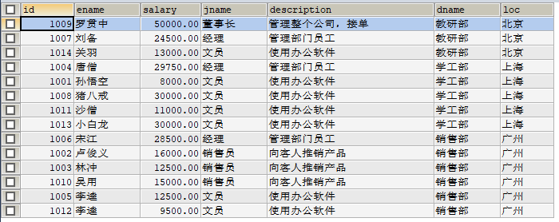

> 内连接查询练习3

3.查询员工姓名，工资，工资等级

```sql
/*
员工姓名，工资 查询员工表(emp)
工资等级 查询工资等级表(salarygrade)
条件：emp.salary BETWEEN salarygrade.losalary AND salarygrade.hisalary
*/
SELECT t1.ename,t1.salary,t2.grade
FROM emp t1,salarygrade t2
WHERE t1.salary BETWEEN t2.losalary AND t2.hisalary;
```
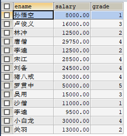

> 内连接查询练习4

4.查询员工姓名，工资，职务名称，职务描述，部门名称，部门位置，工资等级

```sql
/*
员工姓名，工资 查询员工表(emp)
职务名称，职务描述 查询职务表(job)
部门名称，部门位置 查询部门表(dept)
工资等级 查询工资等级表(salarygrade)
条件：emp.job_id = job.id and emp.dept_id = dept.id and emp.salary BETWEEN salarygrade.losalary and salarygrade.hisalary
*/
SELECT t1.`ename`,t1.`salary`,t2.`jname`,t2.`description`,t3.`dname`,t3.`loc`,t4.`grade`
FROM emp t1,job t2,dept t3,salarygrade t4
WHERE t1.`job_id`=t2.`id` AND t1.`dept_id`=t3.`id` AND (t1.`salary` BETWEEN t4.`losalary` AND t4.`hisalary`);
```
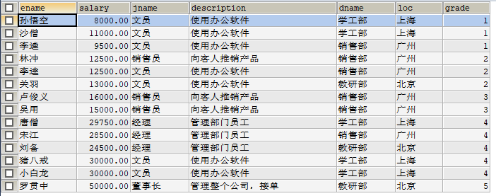

> 子查询练习5

5.查询出部门编号、部门名称、部门位置、部门人数
```sql
/*
对员工表中的数据按照部门(dept_id)进行分组查询
*/
SELECT emp.`dept_id`,COUNT(id) total FROM emp GROUP BY (emp.`dept_id`)
```
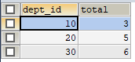

把查询到的结果当做一张表，和dept表进行内连接查询
```sql
/*
把查询到的结果当做一张表，和dept表进行内连接查询
*/
SELECT t1.`id`,t1.`dname`,t1.`loc`,t2.total
FROM dept t1,(SELECT emp.`dept_id`,COUNT(id) total FROM emp GROUP BY (emp.`dept_id`)) t2
WHERE t1.id=t2.dept_id;
```
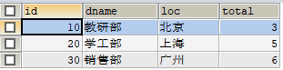
