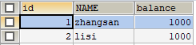
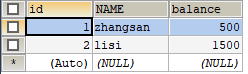
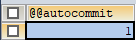
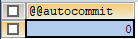

# 事务
> 事务概述

事务处理可以用来维护数据库的完整性，保证成批的 SQL 语句要么全部执行，要么全部不执行。

例如：张三给李四转账500元钱，需要让三账户的余额-500，李四的账户余额+500，转账是一个连续的过程，要么同时成功，要么同时失败。不能出现张三转出了500块，而李四没收到的情况，这将是很严重的问题。


## 事务的基本使用
先准备一张accunt表，添加两个账户信息，如下
```sql
-- 创建一个账户表
CREATE TABLE account (
	id INT PRIMARY KEY AUTO_INCREMENT,
	NAME VARCHAR(10),
	balance DOUBLE
);
-- 添加数据
INSERT INTO account (NAME, balance) VALUES ('zhangsan', 1000), ('lisi', 1000);
-- 查询所有数据
SELECT * FROM account;
```
账户表中的信息如下



> 事务的操作步骤

```sql
START TRANSACTION; --开启事务
--此处执行若干条SQL语句
COMMIT;	-- 提交事物
ROLLBACK; -- 如果有问题，回滚事务
```

张三给李四转账500元钱，需要先开启事物，执行完相关sql语句后再提交事务。

```sql
-- 张三给李四转账 500 元
-- 0. 开启事务
START TRANSACTION;
-- 1. 张三账户 -500
UPDATE account SET balance = balance - 500 WHERE NAME = 'zhangsan';
-- 2. 李四账户 +500
UPDATE account SET balance = balance + 500 WHERE NAME = 'lisi';
-- 发现执行没有问题，提交事务
COMMIT;

-- 发现出问题了，回滚事务（在提交之前回滚）
ROLLBACK;
```
提交完事务之后，结果如下



> MySQL事务的提交方式

事务的提交有方式有两种

- **手动提交**
Oracle默认是手动提交，`START TRANSACTION;`开启事务，然后通过`COMMIT`手动提交事务

- **自动提交**
MySQL默认会自动提交事务，也就是每执行一条DML(增删改)都会提交一次事务。

- **查询、修改MySQL事务的默认提交方式**

```sql
-- 查询当前事务的提交方式
SELECT @@autocommit;  --1 是自动提交 ，0是手动提交
SET @@autocommit=0; -- 修改提交方式为手动提交
```
修改前提交方式 1，意为自动提交事务



修改后提交方式 0，意为手动提交事务



## 事务的四大特征

1. 原子性：是不可分割的最小操作单位，要么同时成功，要么同时失败。
2. 持久性：当事务提交或回滚后，数据库会持久化的保存数据。
3. 隔离性：多个事务之间。相互独立。
4. 一致性：事务操作前后，数据总量不变

## 事务的隔离级别（了解）
多个事务之间是隔离的，相互独立的。但是如果多个事务操作同一批数据，则会引发一些问题，设置不同的隔离级别就可以解决这些问题。
> 存在问题

	1. 脏读：一个事务，读取到另一个事务中没有提交的数据
	2. 不可重复读(虚读)：在同一个事务中，两次读取到的数据不一样。
	3. 幻读：一个事务操作(DML)数据表中所有记录，另一个事务添加了一条数据，则第一个事务查询不到自己的修改。

> 隔离级别

```sql
1. read uncommitted：读未提交
	- 产生的问题：脏读、不可重复读、幻读
2. read committed：读已提交 （Oracle）
	- 产生的问题：不可重复读、幻读
3. repeatable read：可重复读 （MySQL默认）
	- 产生的问题：幻读
4. serializable：串行化
	- 可以解决所有的问题

注意：隔离级别从小到大安全性越来越高，但是效率越来越低
数据库查询隔离级别：
	select @@tx_isolation;
数据库设置隔离级别：
	set global transaction isolation level  级别字符串;
```

> 设置隔离级别演示

```sql
set global transaction isolation level read uncommitted;
start transaction;
-- 转账操作
update account set balance = balance - 500 where id = 1;
update account set balance = balance + 500 where id = 2;
```
