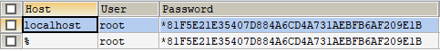
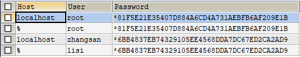
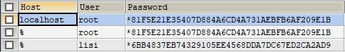
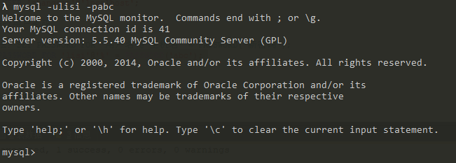

# 数据库用户管理和授权

> SQL分类复习

|SQL分类|具体操作|
|---|---|
|DDL|操作数据库和表|
|DML|增删改表中数据|
|DQL|查询表中数据|
|DCL|管理用户，授权|

 DBA：数据库管理员，专门对数据库进行管理和授权的的相关操作。

## 用户管理
mysql数据库中有一个user表，用来存储用户的信息。

> 查询用户

```sql
-- 1. 切换到mysql数据库
USE myql;
-- 2. 查询user表
SELECT * FROM USER;

* 通配符： % 表示可以在任意主机使用用户登录数据库
```


>  添加用户

```sql
# 语法：CREATE USER '用户名'@'主机名' IDENTIFIED BY '密码';
CREATE USER 'zhangsan'@'localhost' IDENTIFIED BY '123456';
CREATE USER 'lisi'@'%' IDENTIFIED BY '123456';
```


>  删除用户

```sql
# 语法：DROP USER '用户名'@'主机名';
DROP USER 'zhangsan'@'localhost'; -- 删除zhangsan用户
```


> 修改用户密码

```sql

# 语法：SET PASSWORD FOR '用户名'@'主机名' = PASSWORD('新密码');
SET PASSWORD FOR 'lisi'@'%' = PASSWORD('abc'); -- 修改lisi的密码为abc
```
修改完密码，用新密码登录mysql



mysql中忘记了root用户的密码，需要使用管理员权限打开cmd命令进行重置？
```
1. cmd -- > net stop mysql 停止mysql服务
  * 需要管理员运行该cmd

2. 使用无验证方式启动mysql服务： mysqld --skip-grant-tables
3. 打开新的cmd窗口,直接输入mysql命令，敲回车。就可以登录成功
4. use mysql;
5. update user set password = password('你的新密码') where user = 'root';
6. 关闭两个窗口
7. 打开任务管理器，手动结束mysqld.exe 的进程
8. 启动mysql服务
9. 使用新密码登录。
```

## 权限管理
新建的用户默认只有登录权限。需要通过授权才能进行其他操作。

>  查询用户权限

```sql
-- 查询用户权限
# 语法：SHOW GRANTS FOR '用户名'@'主机名';
SHOW GRANTS FOR 'lisi'@'%';
```
`list@%`用户有`USAGE`登录权限


> 授予用户权限

```SQL
-- 授予用户权限
# 语法：grant 权限列表 on 数据库名.表名 to '用户名'@'主机名';
-- 给lisi用户授予 查询,修改,删除 db3数据库的account表数据的权限
GRANT SELECT,UPDATE,DELETE ON db3.`account` TO 'lisi'@'%';
-- 给zhangsan用户授予所有权限
GRANT ALL ON *.* TO 'zhangsan'@'%';
```

>撤销用户权限

```sql
-- 撤销用户权限
# 语法：revoke 权限列表 on 数据库名.表名 from '用户名'@'主机名';
-- 给lisi用户撤销 db3.account 的 UPDATE权限
REVOKE UPDATE ON db3.`account` FROM 'lisi'@'%';
-- 给zhangsan用户取消 所有数据库和表 的 DELETE 和 UPDATE的权限
REVOKE DELETE,UPDATE ON *.* FROM 'zhangsan'@'localhost'
```
