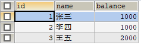
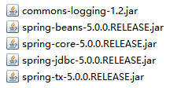
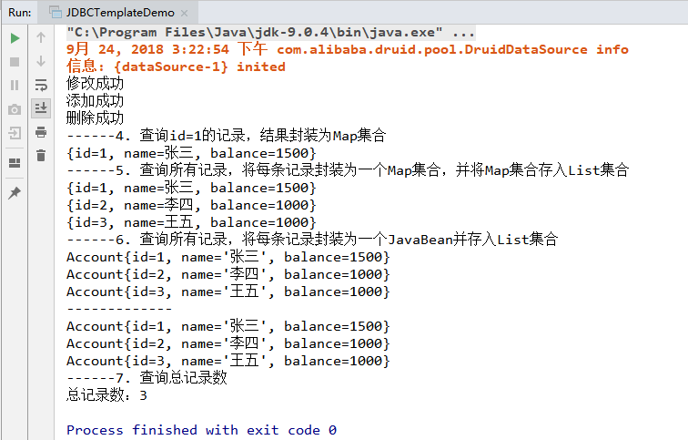

# JDBC连接池

数据库连接池是一个用来存放数据库连接的容器。

当系统初始化好后，容器被创建，容器中会申请一些连接对象，当用户来访问数据库时，从容器中获取连接对象，用户访问完之后，会将连接对象归还给容器。


Java给开发者提供了数据库连接池的标准接口DataSource在javax.sql包下。有很多公司对数据库连接池接口规范进行实现。这里我们介绍两种
1\. C3P0：数据库连接池技术
2\. Druid：数据库连接池实现技术，由阿里巴巴提供的。

## 准备数据库数据
先准备一些数据，在account表中添加2条记录，sql语句如下。方便后面代码演示
```sql
# 创建数据库
CREATE DATABASE db5;

# 创建account表
CREATE TABLE account(
	id INT PRIMARY KEY AUTO_INCREMENT,
	NAME VARCHAR(20),
	balance INT
);
# 添加2条记录
INSERT INTO  account(id,NAME,balance) VALUES(1,"张三",1000);
INSERT INTO  account(id,NAME,balance) VALUES(2,"李四",1000);
```


## C3P0连接池使用步骤

> 导入j相关jar包

c3p0连接池需要下载jar包[下载地址](https://nchc.dl.sourceforge.net/project/c3p0/c3p0-bin/c3p0-0.9.5.2/c3p0-0.9.5.2.bin.zip)

导入c3p0两个jar包如图所示，当然不要忘了MySQL数据库驱动包


> 定义配置文件

配置文件用来定义数据库连接池要访问的数据库地址、用户名、和密码以及最大连接数、超时时间等等。

名称： c3p0.properties 或者 c3p0-config.xml 两种格式都可以
路径：直接将文件放在src目录下即可。

**c3p0-config.xml 格式**

```xml
<c3p0-config>
  <!-- 使用默认的配置读取连接池对象 -->
  <default-config>
  	<!--  连接参数 -->
    <property name="driverClass">com.mysql.jdbc.Driver</property>
    <property name="jdbcUrl">jdbc:mysql://localhost:3306/db5</property>
    <property name="user">root</property>
    <property name="password">root</property>

    <!-- 连接池参数 -->
    <!--初始化申请的连接数量-->
    <property name="initialPoolSize">5</property>
    <!--最大的连接数量-->
    <property name="maxPoolSize">10</property>
    <!--超时时间-->
    <property name="checkoutTimeout">3000</property>
  </default-config>
</c3p0-config>
```

**c3p0-config.properties 格式**

```java
# 数据库驱动类
c3p0.driverClass=com.mysql.jdbc.Driver
# 数据库url地址
c3p0.jdbcUrl=jdbc:mysql://localhost:3306/db5
# 数据库用户名
c3p0.user=root
# 数据库密码
c3p0.password=root
# 初始化连接数量
c3p0.initialPoolSize=5
# 最大的连接数量
c3p0.maxPoolSize=10
# 连接超时时间
c3p0.checkoutTimeout=3000
```

> 创建数据库连接池对象，获取连接

使用默认的配置获取连接池对象

```java
//创建数据库连接池对象
DataSource ds  = new ComboPooledDataSource();
//最大连接数为10个，可以获取10个Connection连接对象
for (int i = 0; i < 10; i++) {
  Connection conn = ds.getConnection();
  System.out.println(conn);
}
//获取第11个连接对象
Connection conn=ds.getConnection();
```

当获取到第11个连接对象时就会连接超时，如图所示


但是采用c3p0-config.xml格式配置，可以提供多个数据源服务，提供default-config和named-config两种配置方式。

```xml
<c3p0-config>
  <!-- 使用默认的配置读取连接池对象 -->
  <default-config>
  	<!-- 连接参数 -->
    <property name="driverClass">com.mysql.jdbc.Driver</property>
    <property name="jdbcUrl">jdbc:mysql://localhost:3306/db5</property>
    <property name="user">root</property>
    <property name="password">root</property>

    <!-- 连接池参数 -->
    <!--初始化申请的连接数量-->
    <property name="initialPoolSize">5</property>
    <!--最大的连接数量 -->
    <property name="maxPoolSize">10</property>
    <!--超时时间-->
    <property name="checkoutTimeout">3000</property>
  </default-config>

  <!--指定名称的连接池配置 mySource -->
  <named-config name="mySource">
    <property name="user">root</property>
    <property name="password">java</property>
    <property name="driverClass">com.mysql.jdbc.Driver</property>
    <property name="jdbcUrl">jdbc:mysql://localhost:3306/db5</property>
    <property name="initialPoolSize">10</property>
    <property name="maxPoolSize">100</property>
    <property name="minPoolSize">10</property>
  </named-config>
</c3p0-config>
```

使用指定的名称配置获取连接池对象

```java
//创建指定名的数据库连接池对象
DataSource ds  = new ComboPooledDataSource("mySource");
//获取连接对象
Connection conn = ds.getConnection();
```

## Druid连接池使用步骤

Druid数据库连接池实现技术，由阿里巴巴提供的。使用步骤如下

> 导入jar包 druid-1.0.9.jar

在libs目录下，导入下面jar包


> 定义druid.properties配置文件

```java
driverClassName=com.mysql.jdbc.Driver
url=jdbc:mysql://localhost/db5
username=root
password=root
# 初始化连接数量
initialSize=5
# 最大连接数
maxActive=10
# 最大等待时间
maxWait=3000
```

> 加载配置文件Properties

```java
//加载配置文件
Properties pro = new Properties();
pro.load(JDBCUtils.class.getClassLoader().getResourceAsStream("druid.properties"));
```

> 创建数据库连接池对象，获取连接

```java
//获取DataSource
DataSource ds = DruidDataSourceFactory.createDataSource(pro);
Connection conn = ds.getConnection();
```

## 封装JDBCUtil工具类封装

为了方便调用，我们可以把获取连接的操作封装成一个工具类JDBCUtils，代码如下。
```java
public class JDBCUtils {
    private static DataSource dataSource;
    //加载配置文件，获取数据库连接池
    static{
        try {
            //读取配置文件到Properties集合
            InputStream ins = JDBCUtils.class.getClassLoader().getResourceAsStream("druid.properties");
            Properties pro=new Properties();
            pro.load(ins);

            //通过配置文件获取数据库连接池
            dataSource = DruidDataSourceFactory.createDataSource(pro);
        } catch (IOException e) {
            e.printStackTrace();
        } catch (Exception e) {
            e.printStackTrace();
        }
    }
    //获取连接
    public static Connection getConnection() throws SQLException {
        return dataSource.getConnection();
    }
    //获取连接池
    public static DataSource getDataSource(){
        return dataSource;
    }
    //释放资源
    public static void close(Connection conn,Statement stmt,ResultSet rs){
        if(conn!=null){
            try {
                conn.close();
            } catch (SQLException e) {
                e.printStackTrace();
            }
        }
        if(stmt!=null){
            try {
                stmt.close();
            } catch (SQLException e) {
                e.printStackTrace();
            }
        }
        if(rs!=null){
            try {
                rs.close();
            } catch (SQLException e) {
                e.printStackTrace();
            }
        }
    }
    //释放资源
    public static void close(Connection conn,Statement st){
        close(conn,st,null);
    }

}
```

使用JBDCUtils工具类，往account表中插入一条记录，代码如下
```java
public class DruidDemo1 {
    public static void main(String[] args) {
        try {
            //获取数据库连接
            Connection conn = JDBCUtils.getConnection();
            //定义sql语句
            String sql="INSERT INTO  account(id,NAME,balance) VALUES(null,?,?)";
            //获取PreparedStatement对象
            PreparedStatement pstam = conn.prepareStatement(sql);
            //给第一个?赋值
            pstam.setString(1,"王五");
            //给第二个?赋值
            pstam.setInt(2,2000);
            //执行sql语句
            int count = pstam.executeUpdate();
            System.out.println(count);
            //释放资源
            JDBCUtils.close(conn,pstam);
        } catch (SQLException e) {
            e.printStackTrace();
        }
    }
}
```
执行完结果，查看account表中数据，多了一条记录。



## Spring JDBC
Spring框架对JDBC的简单封装，提供了一个JDBCTemplate对象简化JDBC的开发。

需要导入Spring jdbc相关的jar包，如图所示



> 使用步骤

```java
1. 导入Spring框架Jar包
2. 创建JdbcTemplate对象。依赖于数据源DataSource
   DataSource ds=JDBCUtils.getDataSource();
   JdbcTemplate template = new JdbcTemplate(ds);
3. 调用JdbcTemplate的方法来完成CRUD的操作
    update():执行DML语句。增、删、改语句
    query():查询结果，将结果封装为JavaBean对象
    queryForMap():查询结果,将结果集封装为map集合，将列名作为key，将值作为value 将这条记录封装为一个map集合
    queryForList():查询结果,将结果集封装为list集合
    queryForObject():查询结果，将结果封装为对象，一般用作聚合函数查询
```

> JdbcTemplate代码演示


```java
/*
1. 修改1号数据的 salary 为 10000
2. 添加一条记录
3. 删除刚才添加的记录
4. 查询id为1的记录，将其封装为Map集合
5. 查询所有记录，将其封装为List
6. 查询所有记录，将其封装为Emp对象的List集合
7. 查询总记录数
 */
public class JDBCTemplateDemo {
    public static void main(String[] args) {
        //获取数据源
        DataSource ds = JDBCUtils.getDataSource();
        //创建JdbcTemplate对象
        JdbcTemplate jdbcTemplate=new JdbcTemplate(ds);

        //1. 修改1号数据的 salary 为 1500
        String sql1="UPDATE account SET balance=? WHERE id=?";
        int count = jdbcTemplate.update(sql1,1500,1);
        System.out.println(count>0?"修改成功":"修改失败");

        //2. 添加一条记录
        String sql2="INSERT INTO  account(id,NAME,balance) VALUES(null ,?,?)";
        count = jdbcTemplate.update(sql2,"赵六",1000);
        System.out.println(count>0?"添加成功":"添加失败");

        //3. 删除刚才添加的记录
        String sql3 = "DELETE FROM account where name=?";
        count = jdbcTemplate.update(sql3,"赵六");
        System.out.println(count>0?"删除成功":"删除失败");


        //4. 查询id为1的记录，将其封装为Map集合
        //注意：只能获取指定的一条记录，并把字段当做Map的Key，字段对应的值，作为Map的value
        String sql4="select * from account where id=?";
        Map<String, Object> map = jdbcTemplate.queryForMap(sql4, 1);
        System.out.println("------4. 查询id=1的记录，结果封装为Map集合");
        System.out.println(map);

        System.out.println("------5. 查询所有记录，将每条记录封装为一个Map集合，并将Map集合存入List集合");
        //5. 查询所有记录，将其封装为List
        String sql5="select * from account";
        List<Map<String, Object>> list = jdbcTemplate.queryForList(sql5);
        for (Map<String, Object> element : list) {
            System.out.println(element);
        }

        System.out.println("------6. 查询所有记录，将每条记录封装为一个JavaBean并存入List集合");
        //6.1 查询所有记录，将其封装为Emp对象的List集合
        String sql6="select * from account";
        List<Account> list2 = jdbcTemplate.query(sql6, new RowMapper<Account>() {
            @Override
            public Account mapRow(ResultSet resultSet, int i) throws SQLException {
                int id = resultSet.getInt("id");
                String name = resultSet.getString("name");
                int balance = resultSet.getInt("balance");
                Account account = new Account(id, name, balance);
                return account;
            }
        });

        for (Account account : list2) {
            System.out.println(account);
        }

        System.out.println("-------------");

        //6.2 上面的代码可以简化为下面的写法
        list2 = jdbcTemplate.query(sql6, new BeanPropertyRowMapper<Account>(Account.class));
        for (Account account : list2) {
            System.out.println(account);
        }
				//7. 查询总记录数
        System.out.println("------7. 查询总记录数");
        String sql7="select count(id) from account";
        Long total = jdbcTemplate.queryForObject(sql7, Long.class);
        System.out.println("总记录数："+total);
    }
}
```

执行上面代码，结果如下


