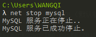
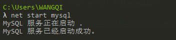
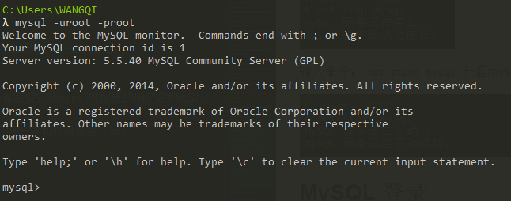
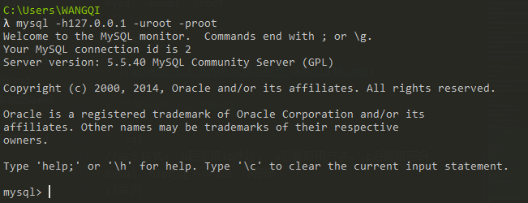
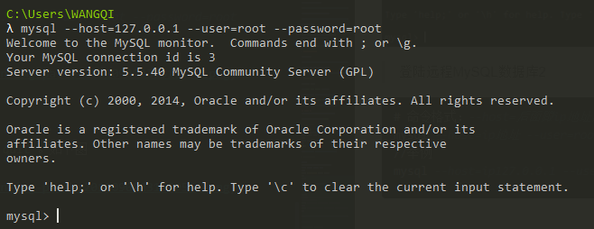
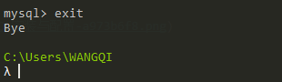

# MySQL安装与配置

## MySQL下载
进入[MySQL的官网](https://downloads.mysql.com/archives/)，看不懂英文不要紧，我们看图


选择对应的版本号、操作系统下载即可。这里我们选择5.5.40版本，其他本部也可以


下载好了是这样的
双击即可安装，别着急点安装下面步骤一步一步安装。

## MySQL 安装
双击进入安装向导，如图所示点击next下一步


勾选协议，点击next下一步


选择custom用户自定义安装


点击Browse 修改安装路径可以修改，我使用默认路径。next进入下一步


点击instll安装MySQL Server


勾选复选框进入配置向导，点击finish完成安装


## MySQL配置
点击finish 完成安装之后，进入配置向导界面。<font color='red'>如果没有进入配置向导界面，去MySQL安装目录找到bin目录 点击`MySQLInstanceConfig.exe`进入配置向导界面</font> 

点击next下一步


选择精确配置，next进入下一步


选择开发这电脑，next进入下一步


选择第一项多用途数据库，next进入下一步


next下一步


选择自定义并发连接上限，我选择20。next进入下一步


MySQL端口号3306，不建议更改


选择自定义默认编码，utf-8


配置MySQL服务到WIndows，如果所示


配置MySQL超级管理员账号和密码，统一使用root，以免忘记


点击Execute 执行配置


<font color='red'>注意：如果无响应，打开任务管理器结束进程，</font>[重新按照步骤开始配置](#MySQL配置)

## MySQL 启动与停止
启动和停止MySQL服务有两种方式，1. Windows服务启动 2. 命令方式启动
> **Windows服务启动**

我的电脑-->右键管理


服务和应用程序-->服务-->MySQL（默认状态是正在运行）


> **命令方式启动**

WIn+R+cmd 打开控制台

输入命令：`net stop mysql` 停止mysql服务



输入命令：`net start mysql` 开启mysql服务



## MySQL 登录
登录MySQL数据库有3中方式，都需要安装mysql时配置的用户名和密码。

我安装mysql数据库时，配置的用户名和密码都是`root`

> 连接本地MySQL数据库

```sql
//命令格式：-u后面跟用户名，-p后面跟密码
mysql -uroot -p密码
//举例
mysql -uroot -proot
```
如下图演示



> 登录远程MySQL数据库1

```sql
# 命令：-h后面跟ip地址，-u后面跟用户名，-p后面跟密码
mysql -hip地址 -uroot -p密码
mysql -h127.0.0.1 -uroot -proot
```
如下图演示



> 登陆远程MySQL数据库2

```sql
# 命令：mysql --host=ip地址 --user=用户名 --password=密码
mysql --host=ip127.0.0.1 --user=root --password=root
```
如下图演示



> MySQL退出

cmd命令：`exit`或 `quit`。如下图



## MySQL目录结构
我的MySQL安装目录：`C:\Program Files\MySQL\MySQL Server 5.5` 如下图


> MySQL配置文件

在`C:\Program Files\MySQL\MySQL Server 5.5\my.ini`文件中有关于MySQL数据库的各种配置信息，如端口号、默认字符编码等。可以直接在配置文件中进行修改


> MySQL数据目录

了解数据库的几个概念，【数据库】、【数据表】和【记录】
```
【数据库】：数据库就是一个文件夹
【数据表】：数据库特定格式的文件
【记录】：数据表中的数据
```

